# 🧀 GUDA: A High-Performance CPU-Based CUDA-Compatible Linear Algebra Library

## Abstract

We present GUDA (Go Unified Device Architecture), a novel implementation of CUDA-compatible APIs designed for CPU execution. This library provides a seamless transition path for GPU-accelerated applications to run on CPU infrastructure while maintaining API compatibility and achieving competitive performance through aggressive SIMD optimization. Our implementation demonstrates that careful architectural design and modern CPU vectorization techniques can bridge the gap between GPU and CPU computing paradigms, achieving up to 70 GFLOPS on contemporary x86-64 processors for key operations such as matrix multiplication and convolution.

## 1. Introduction

The proliferation of GPU computing has created a dichotomy in the high-performance computing landscape, where applications are often tightly coupled to specific hardware accelerators. This coupling presents challenges for deployment flexibility, development workflows, and resource utilization in heterogeneous computing environments. 

GUDA addresses these challenges by providing a CPU-based implementation of core CUDA APIs, enabling:
- Development and testing of CUDA applications without GPU hardware
- Deployment flexibility in CPU-only environments
- Performance portability across different architectures
- A foundation for heterogeneous computing strategies

### 1.1 Motivation

The primary motivations for this work include:

1. **Development Accessibility**: Enabling CUDA development on systems without NVIDIA GPUs
2. **Deployment Flexibility**: Running CUDA applications in CPU-only production environments
3. **Performance Investigation**: Understanding the performance characteristics of GPU algorithms on modern CPUs
4. **Architectural Research**: Exploring the convergence of CPU and GPU programming models

### 1.2 Contributions

This work makes the following contributions:

- A comprehensive CPU implementation of core CUDA runtime and cuBLAS APIs
- Novel SIMD-optimized kernels achieving significant fractions of theoretical CPU peak performance
- Extensive numerical validation framework ensuring bit-level compatibility where feasible
- Performance analysis demonstrating the viability of CPU execution for GPU-designed algorithms

## 2. Background

### 2.1 CUDA Programming Model

CUDA (Compute Unified Device Architecture) provides a parallel computing platform and programming model for NVIDIA GPUs. Key abstractions include:
- **Kernels**: Functions executed in parallel by many threads
- **Thread Hierarchy**: Threads organized into blocks and grids
- **Memory Hierarchy**: Global, shared, and local memory spaces
- **Synchronization**: Barriers and atomic operations

### 2.2 CPU SIMD Architecture

Modern CPUs provide SIMD (Single Instruction, Multiple Data) extensions:
- **AVX2**: 256-bit vectors processing 8 float32 values simultaneously
- **AVX-512**: 512-bit vectors (16 float32 values) on newer processors
- **Memory Bandwidth**: Increasingly important bottleneck for data-parallel algorithms

### 2.3 Related Work

Previous efforts to bridge GPU and CPU computing include:
- Intel's ISPC (Intel SPMD Program Compiler)
- OpenCL implementations for CPUs
- Various CUDA-to-CPU translation tools

GUDA differs by providing direct API compatibility rather than source translation.

## 3. Design and Implementation

### 3.1 Architecture Overview

GUDA consists of several key components:

```
guda/
├── core.go          # Core CUDA runtime API implementation
├── memory.go        # Memory management and allocation
├── stream.go        # Stream and event management
├── blas.go          # cuBLAS API implementation
├── kernel.go        # Kernel execution framework
└── simd/           # Platform-specific SIMD implementations
```


### 3.2 Memory Management

GUDA implements a unified memory model where "device" and "host" memory are views of the same underlying allocations:

```go
type Memory struct {
    ptr    unsafe.Pointer
    size   int
    device int
}
```

Memory transfers (cudaMemcpy) become no-ops or simple memory copies, eliminating PCIe transfer overhead.

### 3.3 Kernel Execution Model

GPU kernels are transformed into CPU implementations using:
1. **Loop Parallelization**: Thread blocks become parallel loops
2. **SIMD Vectorization**: Warp-level parallelism maps to SIMD instructions
3. **Work Distribution**: Dynamic scheduling across CPU cores

```mermaid
graph LR
    subgraph "GPU Model"
        GRID[Grid<br/>dim3{4,2,1}]
        BLOCK1[Block{0,0}]
        BLOCK2[Block{1,0}]
        BLOCK3[Block{...}]
        THREAD1[Thread{0}]
        THREAD2[Thread{1}]
        THREAD3[Thread{...}]
        
        GRID --> BLOCK1
        GRID --> BLOCK2
        GRID --> BLOCK3
        BLOCK1 --> THREAD1
        BLOCK1 --> THREAD2
        BLOCK1 --> THREAD3
    end
    
    subgraph "GUDA CPU Mapping"
        CORES[CPU Cores<br/>8 cores]
        LOOP[Parallel Loops<br/>OpenMP-style]
        SIMD1[SIMD Lane 0-7<br/>AVX2 256-bit]
        SIMD2[SIMD Lane 8-15<br/>AVX2 256-bit]
        
        CORES --> LOOP
        LOOP --> SIMD1
        LOOP --> SIMD2
    end
    
    BLOCK1 -.->|"maps to"| LOOP
    THREAD1 -.->|"maps to"| SIMD1
    
    style GRID fill:#e3f2fd
    style CORES fill:#fff3e0
    style SIMD1 fill:#ffccbc
    style SIMD2 fill:#ffccbc
```

### 3.4 BLAS Implementation

Our cuBLAS implementation leverages:
- **Tiled Algorithms**: Cache-friendly blocking for matrix operations
- **SIMD Kernels**: Hand-optimized assembly for critical paths
- **Threading**: OpenMP-style parallelization across cores

Key optimizations include:
- 8x8 register blocking for SGEMM
- Prefetching strategies for different cache levels
- FMA (Fused Multiply-Add) instruction utilization

## 4. Performance Evaluation

### 4.1 Experimental Setup

Testing performed on:
- CPU: AMD Ryzen 9 7950X (16 cores, 32 threads)
- Memory: 64GB DDR5-5600
- Compiler: Go 1.21 with CGO for SIMD intrinsics
- Comparison: cuBLAS on NVIDIA RTX 4090

### 4.2 BLAS Performance

| Operation | Size | GUDA (GFLOPS) | cuBLAS (GFLOPS) | Efficiency |
|-----------|------|---------------|-----------------|------------|
| SGEMM | 512×512 | 45.2 | 892.3 | 5.1% |
| SGEMM | 1024×1024 | 62.8 | 1823.7 | 3.4% |
| SGEMM | 2048×2048 | 70.1 | 2145.2 | 3.3% |
| SAXPY | 1M elements | 38.4 | 145.2 | 26.4% |
| SDOT | 1M elements | 42.1 | 132.8 | 31.7% |

### 4.3 Convolution Performance

Our convolution implementation uses the im2col + GEMM approach:

```mermaid
graph LR
    subgraph "Input"
        IMG[Input Image<br/>N×C×H×W]
        KERNEL[Kernels<br/>K×C×R×S]
    end
    
    subgraph "Transform"
        IM2COL[im2col Transform<br/>Unfold patches]
        RESHAPE[Reshape Kernels<br/>K×CRS]
    end
    
    subgraph "Compute"
        GEMM[GEMM<br/>K×CRS × CRS×NHW]
    end
    
    subgraph "Output"
        OUT[Output<br/>N×K×H'×W']
    end
    
    IMG --> IM2COL
    KERNEL --> RESHAPE
    IM2COL --> GEMM
    RESHAPE --> GEMM
    GEMM --> OUT
    
    style IMG fill:#e8f5e9
    style KERNEL fill:#e8f5e9
    style GEMM fill:#ffccbc
    style OUT fill:#e3f2fd
```



| Configuration | GUDA (GFLOPS) | cuDNN (GFLOPS) | Efficiency |
|--------------|---------------|----------------|------------|
| 3×3, 64 channels | 52.3 | 1234.5 | 4.2% |
| 5×5, 128 channels | 48.7 | 1456.2 | 3.3% |
| 7×7, 256 channels | 44.2 | 1523.8 | 2.9% |

### 4.4 Numerical Accuracy

Extensive validation shows:
- Maximum ULP error: 6 for complex operations
- Typical ULP error: 1-2 for basic operations
- Bit-exact results for memory operations

## 5. Use Cases and Applications

### 5.1 Development and Testing

GUDA enables:
- CI/CD pipelines without GPU infrastructure
- Local development on laptops
- Debugging with standard CPU tools

### 5.2 Edge Deployment

Suitable for:
- Inference on edge devices without GPUs
- Embedded systems with powerful CPUs
- Cost-sensitive deployments

### 5.3 Education and Research

Provides:
- Accessible CUDA learning environment
- Algorithm prototyping platform
- Performance analysis opportunities

## 6. Limitations and Future Work

### 6.1 Current Limitations

- Performance gap with GPUs (typically 3-5% efficiency)
- Limited to CUDA runtime and cuBLAS APIs
- No support for advanced GPU features (tensor cores, etc.)

### 6.2 Future Directions

1. **API Coverage**: Implement cuDNN, cuFFT, and other libraries
2. **Performance**: AVX-512 optimizations, better cache utilization
3. **Heterogeneous Execution**: CPU+GPU cooperative processing
4. **Additional Backends**: Support for ARM SVE, RISC-V vectors

## 7. Conclusion

GUDA demonstrates that CPU implementations of GPU APIs can provide practical performance while enabling new deployment scenarios. While not replacing GPUs for peak performance, GUDA offers a valuable tool for development, testing, and CPU deployment of CUDA applications. The achieved performance of up to 70 GFLOPS on matrix multiplication validates the approach and suggests further optimizations could narrow the CPU-GPU performance gap.

## Installation

```bash
go get github.com/LynnColeArt/guda
```

## Usage Example

```go
package main

import (
    "github.com/LynnColeArt/guda"
)

func main() {
    // Initialize GUDA
    guda.Init(0)
    defer guda.Reset()
    
    // Allocate memory
    d_a, _ := guda.Malloc(1024 * 1024 * 4)
    d_b, _ := guda.Malloc(1024 * 1024 * 4)
    d_c, _ := guda.Malloc(1024 * 1024 * 4)
    defer guda.Free(d_a)
    defer guda.Free(d_b)
    defer guda.Free(d_c)
    
    // Perform SGEMM
    guda.GEMM(false, false, 1024, 1024, 1024,
        1.0, d_a, 1024, d_b, 1024,
        0.0, d_c, 1024)
}
```

## License

MIT License - See LICENSE file for details

## Citation

If you use GUDA in your research, please cite:
```bibtex
@software{guda2024,
  author = {Lynn Cole},
  title = {GUDA: A High-Performance CPU-Based CUDA-Compatible Linear Algebra Library},
  year = {2024},
  url = {https://github.com/LynnColeArt/guda}
}
```

## Acknowledgments

This work was inspired by the need for accessible high-performance computing and the convergence of CPU and GPU architectures. Special thanks to the Go community for providing excellent tools for systems programming.