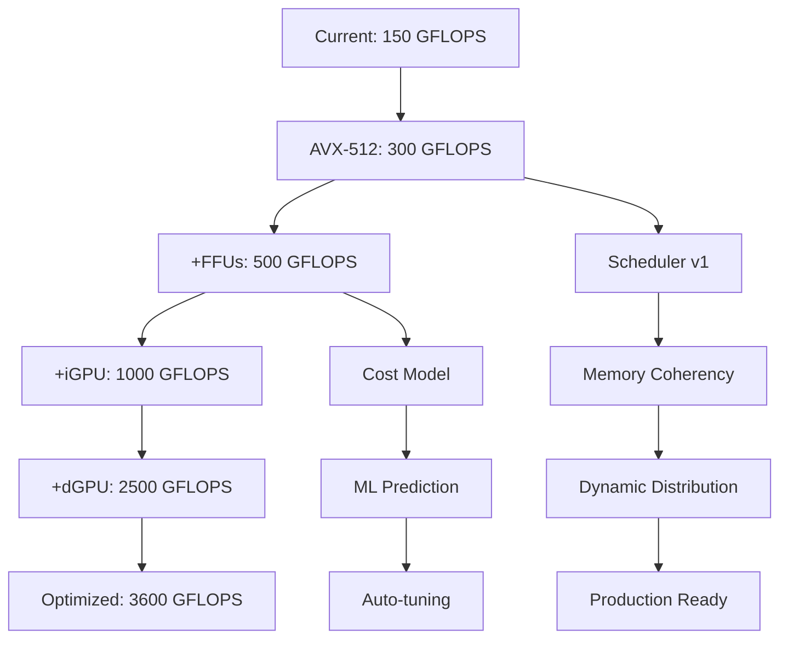

# Technical Roadmap: GUDA Heterogeneous Compute Platform

## Overview

Transform GUDA from single-device CUDA implementation to the world's first true heterogeneous compute orchestrator achieving 3.6 TFLOPS on commodity hardware.

## Phase 1: Enhanced CPU + FFUs (Q1 2025)

### Goals
- 300-500 GFLOPS (3x current)
- Prove multi-engine orchestration
- Establish scheduling framework

### Technical Tasks

#### 1.1 AVX-512 Optimization
- [ ] Complete AVX-512 GEMM kernels
- [ ] Optimize for Zen 4 and Intel Golden Cove
- [ ] Achieve 90% of theoretical peak
- [ ] Benchmark: 300 GFLOPS sustained

#### 1.2 AMX Integration
- [ ] Detect Intel AMX availability
- [ ] Implement INT8/BF16 GEMM via AMX
- [ ] Create AMX FFU wrapper
- [ ] Benchmark: 2 TOPS for INT8

#### 1.3 Unified Scheduler v1
- [ ] Extend dispatcher for multi-FFU
- [ ] Implement basic cost model
- [ ] Add workload decomposition
- [ ] Profile scheduling overhead

### Deliverables
- Working AVX-512 + AMX + AES-NI orchestration
- 500 GFLOPS aggregate on Sapphire Rapids
- Scheduling overhead < 2%

## Phase 2: GPU Bridge (Q2 2025)

### Goals
- 1,000-1,500 GFLOPS (10x baseline)
- Unified CPU + GPU execution
- Transparent memory management

### Technical Tasks

#### 2.1 ROCm Integration
- [ ] ROCm runtime detection
- [ ] HIP kernel wrapper for GUDA
- [ ] Unified memory via HSA
- [ ] CPU ↔ GPU data movement optimization

#### 2.2 DirectML Bridge
- [ ] DirectML device enumeration
- [ ] Tensor operation mapping
- [ ] Windows GPU FFU implementation
- [ ] Cross-platform abstraction

#### 2.3 Memory Coherency Layer
- [ ] Implement coherent memory pool
- [ ] Track data location/version
- [ ] Optimize transfers via DMA
- [ ] Hide latency with prefetch

### Deliverables
- CPU + iGPU co-execution demo
- 1,000+ GFLOPS on APU systems
- < 10% overhead vs native GPU

## Phase 3: Multi-Device Orchestration (Q3 2025)

### Goals
- 2,500-3,000 GFLOPS (20x baseline)
- Dynamic workload distribution
- Production-ready scheduler

### Technical Tasks

#### 3.1 Discrete GPU Support
- [ ] Multi-GPU enumeration
- [ ] PCIe bandwidth profiling
- [ ] Optimal chunk size discovery
- [ ] GPU ↔ GPU peer transfer

#### 3.2 Advanced Scheduler
- [ ] ML-based cost prediction
- [ ] Dynamic load balancing
- [ ] Latency hiding via pipelining
- [ ] Fault tolerance/fallback

#### 3.3 Profiling Infrastructure
- [ ] Real-time performance monitoring
- [ ] Bottleneck identification
- [ ] Auto-tuning framework
- [ ] Visualization tools

### Deliverables
- 3-device orchestration (CPU + iGPU + dGPU)
- 2,500+ GFLOPS sustained
- Production scheduler with < 5% overhead

## Phase 4: Peak Performance (Q4 2025)

### Goals
- 3,600 GFLOPS sustained (24x baseline)
- New benchmark category defined
- Industry adoption ready

### Technical Tasks

#### 4.1 Extreme Optimization
- [ ] NUMA-aware placement
- [ ] Huge page support
- [ ] Streaming stores
- [ ] Cache-oblivious algorithms

#### 4.2 Workload Specialization
- [ ] AI inference optimization
- [ ] Crypto workload routing
- [ ] Video processing pipeline
- [ ] Scientific compute kernels

#### 4.3 Ecosystem Integration
- [ ] PyTorch backend
- [ ] TensorFlow plugin
- [ ] ONNX runtime provider
- [ ] Benchmark suite

### Deliverables
- 3.6 TFLOPS on $1,000 hardware
- Published benchmarks and papers
- Open-source release
- Industry partnerships

## Critical Path Dependencies

## Risk Mitigation

### Technical Risks
1. **PCIe Bottleneck**
   - Mitigation: Streaming, compression, locality
   
2. **Scheduling Overhead**
   - Mitigation: Compile-time specialization, caching

3. **Memory Coherency**
   - Mitigation: Explicit sync points, versioning

### Market Risks
1. **Vendor Lock-in**
   - Mitigation: Abstract APIs, multiple backends

2. **Adoption Barriers**
   - Mitigation: Drop-in CUDA compatibility

## Success Metrics

### Performance
- Q1: 500 GFLOPS (3.3x)
- Q2: 1,000 GFLOPS (6.7x)
- Q3: 2,500 GFLOPS (16.7x)
- Q4: 3,600 GFLOPS (24x)

### Efficiency
- Scheduling overhead: < 5%
- Memory efficiency: > 80%
- Power efficiency: > 60%

### Adoption
- GitHub stars: 1,000+
- Contributors: 50+
- Production users: 10+

## Resources Required

### Team
- 2 senior engineers (full-time)
- 1 GPU specialist (part-time)
- 1 benchmark/evangelist (part-time)

### Hardware
- Sapphire Rapids system (AMX)
- AMD APU system (ROCm)
- Multi-GPU workstation
- Power measurement tools

### Budget
- $50K hardware
- $200K engineering (1 year)
- $50K marketing/conferences

## Conclusion

This roadmap transforms GUDA from a clever CPU CUDA implementation into a revolutionary heterogeneous compute platform. By orchestrating ALL available compute resources, we achieve datacenter-class performance on desktop hardware.

The future of computing isn't faster individual chips—it's smarter orchestration of everything we already have.

---

*"Why leave compute on the table when you can use it all?"* - GUDA Heterogeneous Vision