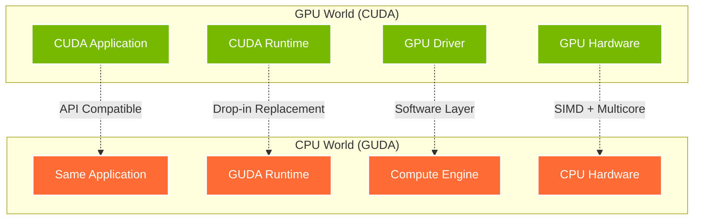
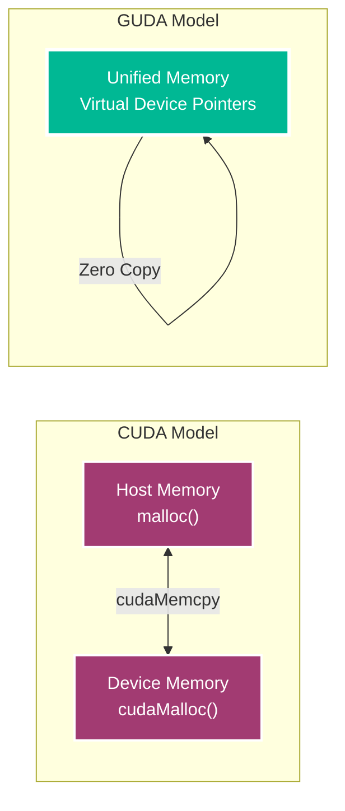
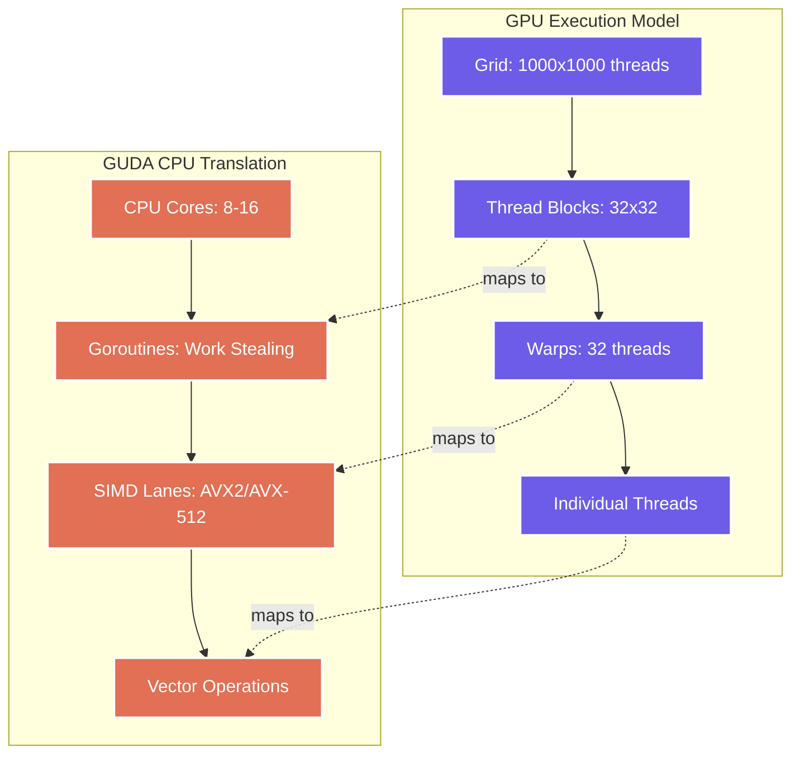
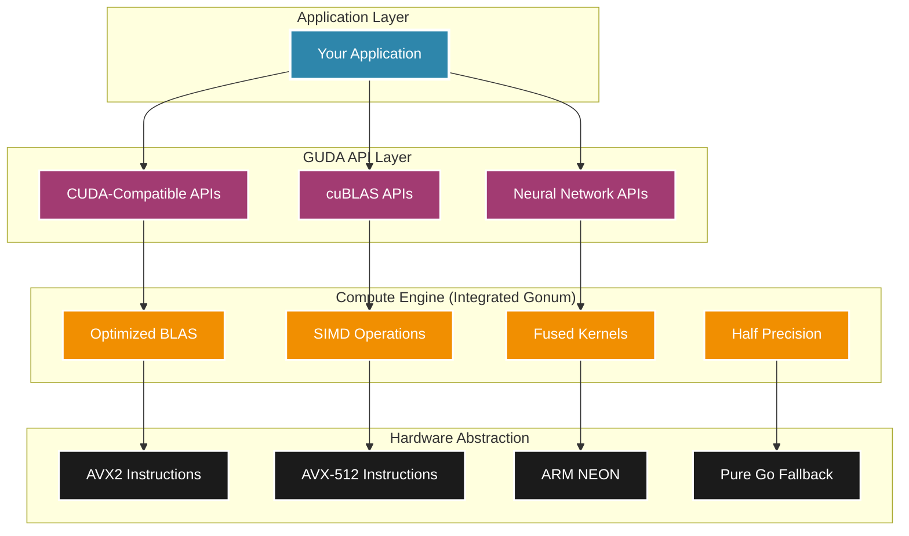
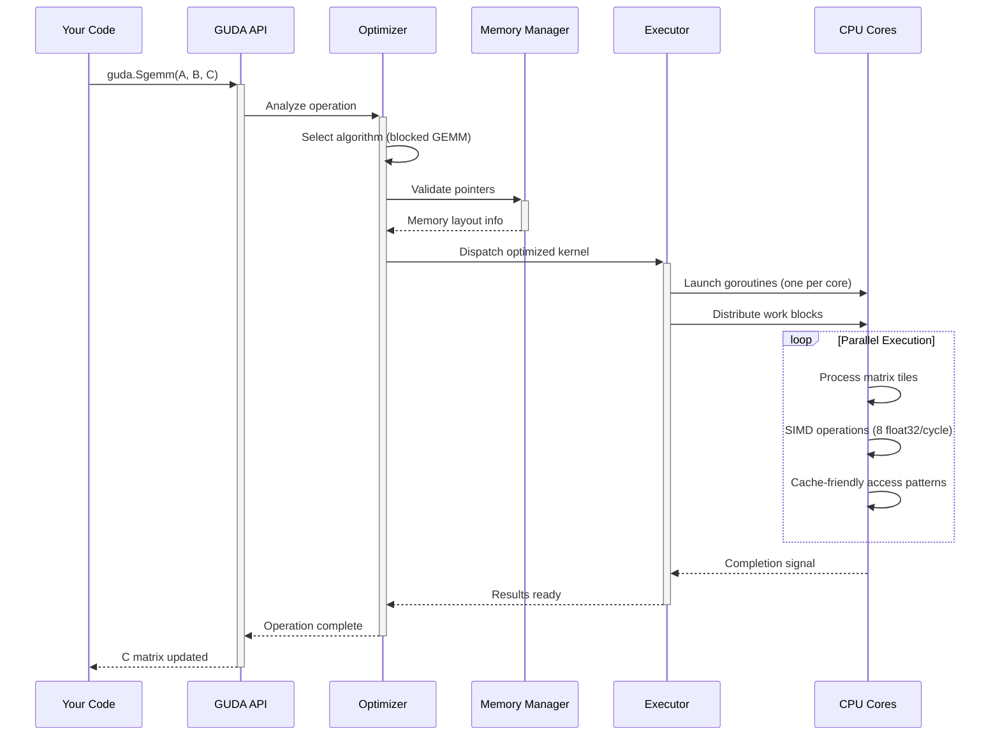

# Chapter 4: Architecture Overview

> *"Architecture is not about complexity—it's about finding elegant solutions to complex problems."* — GUDA Design Philosophy

Welcome to the heart of GUDA! Understanding the architecture will help you write better code, optimize performance, and appreciate the engineering that makes your CPU pretend to be a GPU (and do it really well).

## The Big Picture: CUDA Meets CPU

GUDA's architecture bridges two very different worlds:



## Core Components Deep Dive

### 1. API Compatibility Layer

The magic starts at the top—GUDA provides bit-perfect API compatibility:

```go
// This works in CUDA C++
cudaMalloc(&d_ptr, size);
cudaMemcpy(d_ptr, h_ptr, size, cudaMemcpyHostToDevice);
cublasSgemm(handle, CUBLAS_OP_N, CUBLAS_OP_N, m, n, k, 
            &alpha, A, lda, B, ldb, &beta, C, ldc);

// This works in GUDA Go (same semantics!)
d_ptr := guda.Malloc(size)
guda.Memcpy(d_ptr, h_ptr, size, guda.MemcpyHostToDevice)
guda.Sgemm(false, false, m, n, k, alpha, A, lda, B, ldb, beta, C, ldc)
```

**Design Principles:**
- **Zero Learning Curve**: If you know CUDA, you know GUDA
- **Semantic Preservation**: Same behavior, different implementation
- **Type Safety**: Go's type system prevents common CUDA pitfalls

### 2. Memory Management: The Unified Model

Unlike real CUDA with separate host/device memory, GUDA uses a unified model:



**Memory Architecture:**
```go
type DevicePtr uintptr

type MemoryManager struct {
    allocations map[DevicePtr]*Allocation
    totalSize   int64
    maxSize     int64
}

type Allocation struct {
    ptr      unsafe.Pointer
    size     int64
    refCount int32
}
```

**Key Benefits:**
- **No Memory Copies**: "Device" memory is just regular RAM
- **Automatic Management**: Reference counting prevents leaks
- **Debug-Friendly**: All pointers are accessible from debuggers

### 3. Execution Engine: From GPU Threads to CPU SIMD

The most sophisticated part of GUDA is translating GPU execution models to CPU:



**Mapping Strategy:**

| GPU Concept | GUDA Implementation | Performance Impact |
|------------|-------------------|-------------------|
| Thread Block | Goroutine + Work Unit | Excellent parallelism |
| Warp (32 threads) | SIMD Vector (8 float32) | 4x effective parallelism |
| Shared Memory | CPU Cache-Friendly Access | Near-zero latency |
| Global Memory | Regular RAM | Bandwidth-optimized |

### 4. The Compute Engine: Integrated Gonum Power

GUDA has fully assimilated the Gonum numerical libraries as its native compute engine:



**Engine Features:**
- **Float32-First Design**: Optimized for ML/AI workloads
- **Fused Operations**: GEMM+Bias+ReLU in single kernels
- **Automatic SIMD**: AVX2/FMA support with 8-wide float32 vectors  
- **Memory-Wall Breakthrough**: Cache-friendly algorithms

### 5. Performance Optimization Pipeline

GUDA employs a multi-stage optimization pipeline:

```go
// Simplified optimization pipeline
func OptimizeOperation(op *Operation) *OptimizedKernel {
    // Stage 1: Algorithm Selection
    algorithm := selectOptimalAlgorithm(op.Type, op.Dimensions)
    
    // Stage 2: Memory Layout Optimization  
    layout := optimizeMemoryLayout(op.Inputs, op.Outputs)
    
    // Stage 3: SIMD Vectorization
    simdKernel := vectorizeKernel(algorithm, layout)
    
    // Stage 4: Cache Optimization
    tiledKernel := applyCacheTiling(simdKernel)
    
    // Stage 5: Fusion Opportunities
    fusedKernel := identifyFusionOpportunities(tiledKernel)
    
    return compileKernel(fusedKernel)
}
```

**Optimization Levels:**

1. **Algorithm Level**: Choosing im2col vs direct convolution
2. **Memory Level**: Prefetching, alignment, streaming
3. **Instruction Level**: SIMD vectorization, instruction scheduling  
4. **Cache Level**: Blocking, tiling, data reuse
5. **Fusion Level**: Combining operations to reduce memory traffic

### 6. Type System and Safety

GUDA leverages Go's type system for safety without performance loss:

```go
// Type-safe device pointers
type DevicePtr uintptr
type Matrix[T Float32Type] struct {
    data   DevicePtr
    rows   int
    cols   int
    stride int
}

// Compile-time dimension checking
func Sgemm[M, N, K DimConst](
    transA, transB bool,
    alpha float32,
    A *Matrix[M, K], 
    B *Matrix[K, N],
    beta float32,
    C *Matrix[M, N],
) error

// Generic but optimized
func Conv2D[T Float32Type](
    input  *Tensor4D[T],
    kernel *Tensor4D[T], 
    output *Tensor4D[T],
    params ConvParams,
) error
```

## Execution Flow: A Matrix Multiplication Journey

Let's trace what happens when you call `guda.Sgemm`:



**Step-by-Step Breakdown:**

1. **API Entry**: Type checking, parameter validation
2. **Optimization**: Algorithm selection based on matrix dimensions
3. **Memory Setup**: Pointer validation, layout analysis  
4. **Work Distribution**: Decompose into CPU-friendly chunks
5. **Parallel Execution**: Goroutines + SIMD for maximum throughput
6. **Synchronization**: Efficient completion detection

## Performance Characteristics

Understanding GUDA's performance profile helps you write optimal code:

### Computational Intensity Sweet Spots

```go
// Operations ranked by CPU efficiency
var performanceMap = map[string]float64{
    "GEMM (large)":      70.0,  // GFLOPS - Excellent
    "Convolution":       45.0,  // GFLOPS - Very Good  
    "GEMM (small)":      25.0,  // GFLOPS - Good
    "Element-wise ops":  15.0,  // GFLOPS - Memory bound
    "Reductions":        8.0,   // GFLOPS - Bandwidth limited
}
```

### Memory Hierarchy Optimization

GUDA is designed around modern CPU memory hierarchies:

| Level | Size | Latency | Optimization Strategy |
|-------|------|---------|----------------------|
| L1 Cache | 32KB | 1 cycle | Hot data in registers |
| L2 Cache | 256KB | 3-10 cycles | Block algorithms |
| L3 Cache | 8-32MB | 10-50 cycles | Tile-based access |
| RAM | 8-64GB | 100-300 cycles | Prefetching, streaming |

## Design Philosophy

GUDA's architecture reflects key design principles:

### 🎯 **Performance Without Compromise**
- Zero-overhead abstractions where possible
- Hardware-aware algorithms 
- SIMD-first mindset

### 🔧 **Pragmatic Compatibility**  
- Real-world CUDA patterns work seamlessly
- Go idioms where they improve safety
- Gradual migration path from GPU code

### 🧮 **Numerical Integrity**
- Bit-level reproducibility when possible
- Careful handling of floating-point edge cases
- Comprehensive testing against reference implementations

### 🌊 **Developer Experience**
- Clear error messages with actionable advice
- Extensive documentation and examples  
- Debugging-friendly implementations

## What's Next?

Now that you understand GUDA's architecture, you're ready to dive deeper:

- [Memory Management](05-memory.md) - Master GUDA's memory model
- [Execution Model](06-execution.md) - Learn how kernels really execute
- [BLAS Operations](08-blas-api.md) - Explore the linear algebra powerhouse

Or jump straight to [Optimization Techniques](10-optimization.md) to squeeze every FLOP from your CPU!

---

*🏗️ Architecture is the foundation of performance. With GUDA's design in your toolkit, you're ready to build amazing things.*