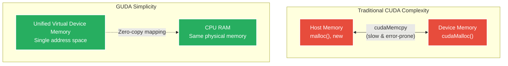

# Chapter 5: Memory Management

> *"Memory is the canvas upon which all computation is painted."* — The Art of High Performance Computing

GUDA's memory model is one of its most elegant features—it provides CUDA semantics while leveraging the unified nature of CPU memory. Understanding this system will help you write efficient, bug-free code and avoid common pitfalls. Let's dive into the memory mastery!

## The Unified Memory Revolution

Traditional CUDA forces you to think about two separate memory spaces. GUDA eliminates this complexity while preserving familiar APIs:



**Key Benefits:**
- **No Memory Copies**: "Device" memory is just regular CPU RAM
- **Instant Transfers**: `cudaMemcpy` is essentially free
- **Unified Debugging**: All pointers accessible in debuggers
- **Simplified Error Handling**: No complex synchronization

## Memory Allocation Patterns

### Basic Allocation and Deallocation

```go
// GUDA provides familiar CUDA memory APIs
func basicMemoryExample() {
    const size = 1024 * 1024 * 4 // 4MB

    // Allocate device memory (actually CPU RAM)
    devicePtr := guda.Malloc(size)
    if devicePtr == 0 {
        log.Fatal("Failed to allocate device memory")
    }
    defer guda.Free(devicePtr) // Always clean up!

    // Allocate host memory for comparison
    hostData := make([]float32, size/4)
    
    // Fill host data
    for i := range hostData {
        hostData[i] = float32(i % 100)
    }

    // Copy to device (zero-cost in GUDA)
    guda.MemcpyHtoD(devicePtr, unsafe.Pointer(&hostData[0]), size)

    // Use device memory in computations
    guda.Sscal(len(hostData), 2.0, devicePtr, 1) // Scale by 2.0

    // Copy back to host (again, zero-cost)
    result := make([]float32, len(hostData))
    guda.MemcpyDtoH(unsafe.Pointer(&result[0]), devicePtr, size)

    fmt.Printf("First few scaled values: %.1f, %.1f, %.1f\n", 
               result[0], result[1], result[2])
}
```

### Memory Pool Management

For high-performance applications, avoid frequent allocations:

```go
type MemoryPool struct {
    pools     map[int][]guda.DevicePtr
    allocated map[guda.DevicePtr]int
    mutex     sync.Mutex
}

func NewMemoryPool() *MemoryPool {
    return &MemoryPool{
        pools:     make(map[int][]guda.DevicePtr),
        allocated: make(map[guda.DevicePtr]int),
    }
}

func (mp *MemoryPool) Allocate(size int) guda.DevicePtr {
    mp.mutex.Lock()
    defer mp.mutex.Unlock()
    
    // Round up to next power of 2 for efficient pooling
    poolSize := nextPowerOf2(size)
    
    // Try to reuse from pool
    if pool, exists := mp.pools[poolSize]; exists && len(pool) > 0 {
        ptr := pool[len(pool)-1]
        mp.pools[poolSize] = pool[:len(pool)-1]
        mp.allocated[ptr] = poolSize
        return ptr
    }
    
    // Allocate new memory
    ptr := guda.Malloc(poolSize)
    if ptr == 0 {
        return 0 // Allocation failed
    }
    
    mp.allocated[ptr] = poolSize
    return ptr
}

func (mp *MemoryPool) Free(ptr guda.DevicePtr) {
    mp.mutex.Lock()
    defer mp.mutex.Unlock()
    
    size, exists := mp.allocated[ptr]
    if !exists {
        return // Not from this pool
    }
    
    delete(mp.allocated, ptr)
    
    // Return to pool for reuse
    mp.pools[size] = append(mp.pools[size], ptr)
}

func (mp *MemoryPool) Cleanup() {
    mp.mutex.Lock()
    defer mp.mutex.Unlock()
    
    // Free all pooled memory
    for _, pool := range mp.pools {
        for _, ptr := range pool {
            guda.Free(ptr)
        }
    }
    
    mp.pools = make(map[int][]guda.DevicePtr)
}

// Usage example
func demonstrateMemoryPool() {
    pool := NewMemoryPool()
    defer pool.Cleanup()
    
    // Allocate many temporary buffers efficiently
    var ptrs []guda.DevicePtr
    
    for i := 0; i < 100; i++ {
        size := 1024 * (i%10 + 1) // Variable sizes
        ptr := pool.Allocate(size)
        ptrs = append(ptrs, ptr)
        
        // Use the memory...
        guda.Memset(ptr, 0, size)
    }
    
    // Return all memory to pool
    for _, ptr := range ptrs {
        pool.Free(ptr)
    }
    
    // Subsequent allocations reuse pooled memory
    ptr := pool.Allocate(2048) // Very fast - reused from pool
    defer pool.Free(ptr)
}
```

## Memory Transfer Patterns

### Zero-Copy Operations

GUDA's unified memory model makes transfers essentially free:

```go
// Demonstrate zero-copy efficiency
func benchmarkMemoryTransfers() {
    const size = 64 * 1024 * 1024 // 64MB
    
    hostData := make([]float32, size/4)
    devicePtr := guda.Malloc(size)
    defer guda.Free(devicePtr)
    
    // Fill with test data
    for i := range hostData {
        hostData[i] = rand.Float32()
    }
    
    // Traditional CUDA would require expensive copies
    // GUDA makes this virtually free
    
    start := time.Now()
    for i := 0; i < 1000; i++ {
        guda.MemcpyHtoD(devicePtr, unsafe.Pointer(&hostData[0]), size)
        guda.MemcpyDtoH(unsafe.Pointer(&hostData[0]), devicePtr, size)
    }
    duration := time.Since(start)
    
    bandwidth := float64(size*2*1000) / duration.Seconds() / 1e9
    fmt.Printf("Memory bandwidth: %.2f GB/s\n", bandwidth)
    // Expect very high numbers since it's just pointer operations!
}
```

### Pinned Memory for Performance

When you need maximum performance with external libraries:

```go
// Pinned memory allocation for optimal performance
func allocatePinnedMemory(size int) (unsafe.Pointer, error) {
    // On Linux, use mlock for pinned memory
    ptr := C.malloc(C.size_t(size))
    if ptr == nil {
        return nil, fmt.Errorf("failed to allocate memory")
    }
    
    // Pin the memory to prevent swapping
    err := unix.Mlock((*[1 << 30]byte)(ptr)[:size])
    if err != nil {
        C.free(ptr)
        return nil, fmt.Errorf("failed to pin memory: %v", err)
    }
    
    return ptr, nil
}

func freePinnedMemory(ptr unsafe.Pointer, size int) {
    if ptr != nil {
        unix.Munlock((*[1 << 30]byte)(ptr)[:size])
        C.free(ptr)
    }
}

// High-performance buffer for intensive operations
type PinnedBuffer struct {
    ptr  unsafe.Pointer
    size int
    data []float32
}

func NewPinnedBuffer(elements int) (*PinnedBuffer, error) {
    size := elements * 4 // float32 size
    
    ptr, err := allocatePinnedMemory(size)
    if err != nil {
        return nil, err
    }
    
    // Create slice backed by pinned memory
    data := (*[1 << 28]float32)(ptr)[:elements:elements]
    
    return &PinnedBuffer{
        ptr:  ptr,
        size: size,
        data: data,
    }, nil
}

func (pb *PinnedBuffer) Data() []float32 {
    return pb.data
}

func (pb *PinnedBuffer) DevicePtr() guda.DevicePtr {
    return guda.DevicePtr(uintptr(pb.ptr))
}

func (pb *PinnedBuffer) Close() error {
    if pb.ptr != nil {
        freePinnedMemory(pb.ptr, pb.size)
        pb.ptr = nil
    }
    return nil
}
```

## Advanced Memory Patterns

### Memory-Mapped Files for Large Datasets

Handle datasets larger than RAM efficiently:

```go
// Memory-mapped file handling for large datasets
type MappedDataset struct {
    file   *os.File
    mapped []byte
    data   []float32
}

func OpenMappedDataset(filename string) (*MappedDataset, error) {
    file, err := os.Open(filename)
    if err != nil {
        return nil, err
    }
    
    stat, err := file.Stat()
    if err != nil {
        file.Close()
        return nil, err
    }
    
    // Memory-map the file
    mapped, err := syscall.Mmap(int(file.Fd()), 0, int(stat.Size()),
                               syscall.PROT_READ, syscall.MAP_SHARED)
    if err != nil {
        file.Close()
        return nil, err
    }
    
    // Create float32 view of the mapped data
    data := (*[1 << 28]float32)(unsafe.Pointer(&mapped[0]))[:stat.Size()/4]
    
    return &MappedDataset{
        file:   file,
        mapped: mapped,
        data:   data,
    }, nil
}

func (md *MappedDataset) GetBatch(start, count int) []float32 {
    if start+count > len(md.data) {
        count = len(md.data) - start
    }
    return md.data[start : start+count]
}

func (md *MappedDataset) Close() error {
    if md.mapped != nil {
        syscall.Munmap(md.mapped)
        md.mapped = nil
    }
    if md.file != nil {
        md.file.Close()
        md.file = nil
    }
    return nil
}

// Process large dataset in chunks
func processLargeDataset(filename string) error {
    dataset, err := OpenMappedDataset(filename)
    if err != nil {
        return err
    }
    defer dataset.Close()
    
    const batchSize = 1024 * 1024 // 1M elements per batch
    deviceBuffer := guda.Malloc(batchSize * 4)
    defer guda.Free(deviceBuffer)
    
    totalElements := len(dataset.data)
    
    for offset := 0; offset < totalElements; offset += batchSize {
        batch := dataset.GetBatch(offset, batchSize)
        
        // Copy batch to device memory
        guda.MemcpyHtoD(deviceBuffer, unsafe.Pointer(&batch[0]), len(batch)*4)
        
        // Process the batch
        guda.Sscal(len(batch), 1.1, deviceBuffer, 1) // Scale by 1.1
        
        // Could copy back if needed, or accumulate results
    }
    
    return nil
}
```

### Cache-Aware Memory Layout

Structure your data for optimal cache performance:

```go
// Demonstrate Array of Structures vs Structure of Arrays
type Particle_AoS struct {
    X, Y, Z    float32
    VX, VY, VZ float32
    Mass       float32
    _          float32 // Padding for alignment
}

type Particles_SoA struct {
    X, Y, Z       []float32
    VX, VY, VZ    []float32
    Mass          []float32
    count         int
}

func NewParticles_SoA(count int) *Particles_SoA {
    return &Particles_SoA{
        X:     make([]float32, count),
        Y:     make([]float32, count),
        Z:     make([]float32, count),
        VX:    make([]float32, count),
        VY:    make([]float32, count),
        VZ:    make([]float32, count),
        Mass:  make([]float32, count),
        count: count,
    }
}

// AoS version - poor cache utilization
func updateParticles_AoS(particles []Particle_AoS, dt float32) {
    for i := range particles {
        // Each iteration accesses scattered memory locations
        particles[i].X += particles[i].VX * dt
        particles[i].Y += particles[i].VY * dt
        particles[i].Z += particles[i].VZ * dt
    }
}

// SoA version - excellent cache utilization
func updateParticles_SoA(particles *Particles_SoA, dt float32) {
    // Process each array sequentially for better cache usage
    guda.Saxpy(particles.count, dt, particles.VX, 1, particles.X, 1)
    guda.Saxpy(particles.count, dt, particles.VY, 1, particles.Y, 1)
    guda.Saxpy(particles.count, dt, particles.VZ, 1, particles.Z, 1)
}

// Benchmark the difference
func benchmarkMemoryLayouts() {
    const numParticles = 1000000
    const dt = 0.016 // 60 FPS

    // AoS benchmark
    particles_aos := make([]Particle_AoS, numParticles)
    start := time.Now()
    for i := 0; i < 1000; i++ {
        updateParticles_AoS(particles_aos, dt)
    }
    aosTime := time.Since(start)

    // SoA benchmark
    particles_soa := NewParticles_SoA(numParticles)
    start = time.Now()
    for i := 0; i < 1000; i++ {
        updateParticles_SoA(particles_soa, dt)
    }
    soaTime := time.Since(start)

    fmt.Printf("AoS time: %v\n", aosTime)
    fmt.Printf("SoA time: %v (%.2fx faster)\n", soaTime, float64(aosTime)/float64(soaTime))
}
```

## Memory Debugging and Profiling

### Memory Leak Detection

```go
// Memory leak detection wrapper
type MemoryTracker struct {
    allocations map[guda.DevicePtr]AllocationInfo
    mutex       sync.Mutex
}

type AllocationInfo struct {
    size      int
    timestamp time.Time
    stack     []byte
}

func NewMemoryTracker() *MemoryTracker {
    return &MemoryTracker{
        allocations: make(map[guda.DevicePtr]AllocationInfo),
    }
}

func (mt *MemoryTracker) Malloc(size int) guda.DevicePtr {
    ptr := guda.Malloc(size)
    
    if ptr != 0 {
        mt.mutex.Lock()
        mt.allocations[ptr] = AllocationInfo{
            size:      size,
            timestamp: time.Now(),
            stack:     make([]byte, 4096),
        }
        // Capture stack trace
        n := runtime.Stack(mt.allocations[ptr].stack, false)
        mt.allocations[ptr] = AllocationInfo{
            size:      size,
            timestamp: time.Now(),
            stack:     mt.allocations[ptr].stack[:n],
        }
        mt.mutex.Unlock()
    }
    
    return ptr
}

func (mt *MemoryTracker) Free(ptr guda.DevicePtr) {
    guda.Free(ptr)
    
    mt.mutex.Lock()
    delete(mt.allocations, ptr)
    mt.mutex.Unlock()
}

func (mt *MemoryTracker) ReportLeaks() {
    mt.mutex.Lock()
    defer mt.mutex.Unlock()
    
    if len(mt.allocations) == 0 {
        fmt.Println("✅ No memory leaks detected!")
        return
    }
    
    fmt.Printf("⚠️  Found %d memory leaks:\n", len(mt.allocations))
    
    totalLeaked := 0
    for ptr, info := range mt.allocations {
        totalLeaked += info.size
        fmt.Printf("Leaked %d bytes allocated at %v (ptr: %x)\n",
                  info.size, info.timestamp, ptr)
        fmt.Printf("Stack trace:\n%s\n", string(info.stack))
    }
    
    fmt.Printf("Total leaked memory: %d bytes (%.2f MB)\n",
              totalLeaked, float64(totalLeaked)/1024/1024)
}
```

### Memory Usage Profiling

```go
// Memory usage profiler
type MemoryProfiler struct {
    samples []MemorySample
    ticker  *time.Ticker
    done    chan bool
}

type MemorySample struct {
    timestamp   time.Time
    allocations int64
    totalSize   int64
}

func StartMemoryProfiling(interval time.Duration) *MemoryProfiler {
    profiler := &MemoryProfiler{
        ticker: time.NewTicker(interval),
        done:   make(chan bool),
    }
    
    go func() {
        for {
            select {
            case <-profiler.ticker.C:
                var m runtime.MemStats
                runtime.ReadMemStats(&m)
                
                sample := MemorySample{
                    timestamp:   time.Now(),
                    allocations: int64(m.Mallocs - m.Frees),
                    totalSize:   int64(m.Alloc),
                }
                
                profiler.samples = append(profiler.samples, sample)
                
            case <-profiler.done:
                return
            }
        }
    }()
    
    return profiler
}

func (mp *MemoryProfiler) Stop() {
    mp.ticker.Stop()
    mp.done <- true
}

func (mp *MemoryProfiler) GenerateReport() {
    fmt.Println("Memory Usage Report")
    fmt.Println("==================")
    
    if len(mp.samples) == 0 {
        fmt.Println("No samples collected")
        return
    }
    
    maxMem := int64(0)
    minMem := int64(math.MaxInt64)
    
    for _, sample := range mp.samples {
        if sample.totalSize > maxMem {
            maxMem = sample.totalSize
        }
        if sample.totalSize < minMem {
            minMem = sample.totalSize
        }
    }
    
    fmt.Printf("Peak memory usage: %.2f MB\n", float64(maxMem)/1024/1024)
    fmt.Printf("Minimum memory usage: %.2f MB\n", float64(minMem)/1024/1024)
    fmt.Printf("Samples collected: %d\n", len(mp.samples))
}
```

## Best Practices and Common Pitfalls

### ✅ **DO: Memory Management Best Practices**

```go
// 1. Always pair malloc with free
func goodMemoryManagement() {
    ptr := guda.Malloc(1024)
    defer guda.Free(ptr) // Use defer for automatic cleanup
    
    // Use the memory...
}

// 2. Use memory pools for frequent allocations
func goodPoolUsage() {
    pool := NewMemoryPool()
    defer pool.Cleanup()
    
    // Efficient repeated allocations
    for i := 0; i < 1000; i++ {
        ptr := pool.Allocate(512)
        // Use memory...
        pool.Free(ptr)
    }
}

// 3. Prefer batch operations
func goodBatchOperations(inputs [][]float32) {
    // Allocate once for all operations
    batchSize := len(inputs[0])
    temp := guda.Malloc(batchSize * 4)
    defer guda.Free(temp)
    
    for _, input := range inputs {
        guda.MemcpyHtoD(temp, unsafe.Pointer(&input[0]), batchSize*4)
        // Process batch...
    }
}
```

### ❌ **DON'T: Common Memory Mistakes**

```go
// 1. DON'T forget to free memory
func badMemoryManagement() {
    for i := 0; i < 1000; i++ {
        ptr := guda.Malloc(1024)
        // Missing guda.Free(ptr) - MEMORY LEAK!
    }
}

// 2. DON'T allocate in hot loops
func badAllocation(data []float32) {
    for i := 0; i < len(data); i++ {
        temp := guda.Malloc(256) // SLOW: allocation per iteration
        defer guda.Free(temp)
        // Process...
    }
}

// 3. DON'T ignore alignment for SIMD
func badAlignment() {
    // Unaligned allocation may hurt SIMD performance
    data := make([]float32, 1000) // May not be aligned
    
    // Process with SIMD operations - potentially slower
    guda.Sscal(len(data), 2.0, unsafe.Pointer(&data[0]), 1)
}
```

## Memory Performance Tuning

### Optimal Memory Access Patterns

```go
// Demonstrate different memory access patterns
func compareMemoryPatterns() {
    const N = 1024
    matrix := make([][]float32, N)
    for i := range matrix {
        matrix[i] = make([]float32, N)
    }
    
    // Pattern 1: Row-major access (cache-friendly)
    start := time.Now()
    for i := 0; i < N; i++ {
        for j := 0; j < N; j++ {
            matrix[i][j] = float32(i + j)
        }
    }
    rowMajorTime := time.Since(start)
    
    // Pattern 2: Column-major access (cache-unfriendly)  
    start = time.Now()
    for j := 0; j < N; j++ {
        for i := 0; i < N; i++ {
            matrix[i][j] = float32(i + j)
        }
    }
    colMajorTime := time.Since(start)
    
    fmt.Printf("Row-major access: %v\n", rowMajorTime)
    fmt.Printf("Column-major access: %v (%.2fx slower)\n", 
              colMajorTime, float64(colMajorTime)/float64(rowMajorTime))
}
```

## What's Next?

You now understand GUDA's memory architecture and best practices! Ready to explore more?

- [Execution Model](06-execution.md) - Learn how GUDA maps GPU concepts to CPUs
- [Runtime API](07-runtime-api.md) - Master all of GUDA's core functions
- [Optimization Techniques](10-optimization.md) - Apply memory knowledge to boost performance

Memory management is the foundation of high-performance computing. With these patterns and practices, you're ready to build memory-efficient GUDA applications that scale beautifully!

---

*🧠 Memory is the foundation of all computation. Master it, and your programs will thank you with blazing performance.*