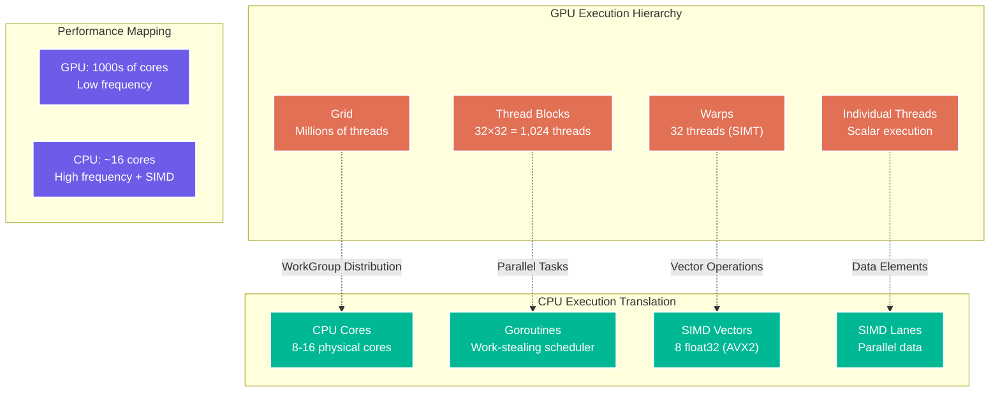

# Chapter 6: Execution Model

> *"The secret to going fast is not to rush—it's to orchestrate parallel harmony."* — GUDA Performance Philosophy

Understanding how GUDA transforms GPU execution patterns into CPU performance is key to writing optimal code. This chapter reveals the magic behind kernel execution, thread mapping, and parallel orchestration that makes GUDA sing on multicore processors.

## From GPU Threads to CPU Cores

GUDA performs an elegant translation from GPU's massively parallel model to CPU's fewer-but-mightier cores:



## Work Distribution Strategies

### Thread Block to Goroutine Mapping

```go
// GPU kernel concept
/*
__global__ void vectorAdd(float* a, float* b, float* c, int n) {
    int idx = blockIdx.x * blockDim.x + threadIdx.x;
    if (idx < n) {
        c[idx] = a[idx] + b[idx];
    }
}

// Launch: vectorAdd<<<(n+255)/256, 256>>>(a, b, c, n);
*/

// GUDA equivalent with explicit work distribution
func VectorAdd(a, b, c []float32) {
    n := len(a)
    numCores := runtime.NumCPU()
    
    // Calculate optimal work distribution
    workPerCore := (n + numCores - 1) / numCores
    
    var wg sync.WaitGroup
    
    for core := 0; core < numCores; core++ {
        wg.Add(1)
        
        go func(coreID int) {
            defer wg.Done()
            
            // Calculate this core's work range
            start := coreID * workPerCore
            end := start + workPerCore
            if end > n {
                end = n
            }
            
            // Process chunk with SIMD optimization
            guda.Saxpy(end-start, 1.0, a[start:end], 1, c[start:end], 1)
        }(core)
    }
    
    wg.Wait()
}

// Advanced work distribution with load balancing
type WorkScheduler struct {
    workQueue chan WorkItem
    workers   int
    wg        sync.WaitGroup
}

type WorkItem struct {
    start, end int
    taskFunc   func(int, int)
}

func NewWorkScheduler(numWorkers int) *WorkScheduler {
    return &WorkScheduler{
        workQueue: make(chan WorkItem, numWorkers*2),
        workers:   numWorkers,
    }
}

func (ws *WorkScheduler) Start() {
    for i := 0; i < ws.workers; i++ {
        ws.wg.Add(1)
        go func() {
            defer ws.wg.Done()
            
            for item := range ws.workQueue {
                item.taskFunc(item.start, item.end)
            }
        }()
    }
}

func (ws *WorkScheduler) Submit(start, end int, task func(int, int)) {
    ws.workQueue <- WorkItem{start: start, end: end, taskFunc: task}
}

func (ws *WorkScheduler) Wait() {
    close(ws.workQueue)
    ws.wg.Wait()
}

// Usage: Dynamic load balancing for irregular workloads
func parallelProcessWithLoadBalancing(data []float32, processFunc func(float32) float32) {
    scheduler := NewWorkScheduler(runtime.NumCPU())
    scheduler.Start()
    
    // Submit work in smaller chunks for better load balancing
    chunkSize := 1024
    for i := 0; i < len(data); i += chunkSize {
        end := i + chunkSize
        if end > len(data) {
            end = len(data)
        }
        
        scheduler.Submit(i, end, func(start, end int) {
            for j := start; j < end; j++ {
                data[j] = processFunc(data[j])
            }
        })
    }
    
    scheduler.Wait()
}
```

## SIMD Vectorization Patterns

### Automatic Vectorization

GUDA automatically vectorizes operations when possible:

```go
// Understanding GUDA's SIMD mapping
func demonstrateSIMDMapping() {
    const N = 1024
    a := make([]float32, N)
    b := make([]float32, N)
    c := make([]float32, N)
    
    // Initialize test data
    for i := range a {
        a[i] = float32(i)
        b[i] = float32(i * 2)
    }
    
    // GUDA automatically vectorizes this operation
    // Internally becomes: AVX2 instructions processing 8 elements at once
    start := time.Now()
    guda.VectorAdd(a, b, c) // c = a + b, vectorized
    duration := time.Since(start)
    
    // Compare with scalar equivalent
    c_scalar := make([]float32, N)
    start = time.Now()
    for i := 0; i < N; i++ {
        c_scalar[i] = a[i] + b[i] // Scalar, one element at a time
    }
    scalarDuration := time.Since(start)
    
    fmt.Printf("SIMD vectorized: %v\n", duration)
    fmt.Printf("Scalar version: %v (%.2fx slower)\n", 
              scalarDuration, float64(scalarDuration)/float64(duration))
}

// Custom SIMD-friendly algorithms
func matrixMultiplyBatched(A, B, C [][]float32) {
    rows, cols, inner := len(A), len(B[0]), len(B)
    
    // Process in SIMD-friendly chunks
    const vectorWidth = 8 // AVX2 float32 vector width
    
    for i := 0; i < rows; i++ {
        for j := 0; j < cols; j += vectorWidth {
            // Process vectorWidth columns at once
            endJ := j + vectorWidth
            if endJ > cols {
                endJ = cols
            }
            
            // Initialize accumulator
            for jj := j; jj < endJ; jj++ {
                C[i][jj] = 0.0
            }
            
            // Inner product with vectorization
            for k := 0; k < inner; k++ {
                aVal := A[i][k]
                
                // This loop vectorizes well
                for jj := j; jj < endJ; jj++ {
                    C[i][jj] += aVal * B[k][jj]
                }
            }
        }
    }
}
```

### Explicit SIMD Control

For maximum performance, control SIMD explicitly:

```go
// Low-level SIMD control for critical paths
func optimizedDotProduct(a, b []float32) float32 {
    n := len(a)
    
    // Ensure we have enough data for SIMD
    if n < 8 {
        return scalarDotProduct(a, b)
    }
    
    // Process SIMD-aligned chunks
    simdChunks := (n / 8) * 8
    
    // Use GUDA's optimized SIMD dot product
    result := guda.SdotSIMD(simdChunks, a, 1, b, 1)
    
    // Handle remainder with scalar operations
    for i := simdChunks; i < n; i++ {
        result += a[i] * b[i]
    }
    
    return result
}

func scalarDotProduct(a, b []float32) float32 {
    var sum float32
    for i := range a {
        sum += a[i] * b[i]
    }
    return sum
}

// SIMD-aware memory alignment
func createAlignedBuffer(size int) []float32 {
    // Allocate extra space for alignment
    const alignment = 32 // 32-byte alignment for AVX2
    
    raw := make([]byte, size*4+alignment)
    
    // Find aligned offset
    addr := uintptr(unsafe.Pointer(&raw[0]))
    aligned := (addr + alignment - 1) &^ (alignment - 1)
    offset := aligned - addr
    
    // Create aligned slice
    alignedBytes := raw[offset : offset+uintptr(size*4)]
    return (*[1 << 28]float32)(unsafe.Pointer(&alignedBytes[0]))[:size:size]
}
```

## Synchronization and Coordination

### CPU-Friendly Synchronization

```go
// GPU-style synchronization adapted for CPUs
type GPUSync struct {
    barriers []chan struct{}
    workers  int
}

func NewGPUSync(numWorkers int) *GPUSync {
    barriers := make([]chan struct{}, numWorkers)
    for i := range barriers {
        barriers[i] = make(chan struct{})
    }
    
    return &GPUSync{
        barriers: barriers,
        workers:  numWorkers,
    }
}

// Equivalent to __syncthreads() in CUDA
func (gs *GPUSync) SyncThreads(workerID int) {
    // Signal this worker is ready
    gs.barriers[workerID] <- struct{}{}
    
    // Wait for all workers
    for i := 0; i < gs.workers; i++ {
        <-gs.barriers[i]
    }
}

// Lock-free coordination using atomics
type AtomicCounter struct {
    value int64
}

func (ac *AtomicCounter) Increment() int64 {
    return atomic.AddInt64(&ac.value, 1)
}

func (ac *AtomicCounter) Get() int64 {
    return atomic.LoadInt64(&ac.value)
}

// Example: Parallel reduction with coordination
func parallelReduction(data []float32) float32 {
    numWorkers := runtime.NumCPU()
    partialSums := make([]float32, numWorkers)
    
    var wg sync.WaitGroup
    chunkSize := len(data) / numWorkers
    
    for i := 0; i < numWorkers; i++ {
        wg.Add(1)
        
        go func(workerID int) {
            defer wg.Done()
            
            start := workerID * chunkSize
            end := start + chunkSize
            if workerID == numWorkers-1 {
                end = len(data) // Last worker handles remainder
            }
            
            // Local reduction
            var sum float32
            for j := start; j < end; j++ {
                sum += data[j]
            }
            
            partialSums[workerID] = sum
        }(i)
    }
    
    wg.Wait()
    
    // Final reduction
    var total float32
    for _, sum := range partialSums {
        total += sum
    }
    
    return total
}
```

## Memory Hierarchies and Cache Optimization

### Cache-Aware Execution Patterns

```go
// Cache-friendly matrix operations
func cacheOptimizedGEMM(A, B, C [][]float32) {
    M, N, K := len(A), len(B[0]), len(B)
    
    // Tile sizes optimized for CPU cache hierarchy
    const (
        L1_TILE = 64   // L1 cache tile
        L2_TILE = 256  // L2 cache tile  
        L3_TILE = 1024 // L3 cache tile
    )
    
    // Three-level tiling for cache optimization
    for ii := 0; ii < M; ii += L3_TILE {
        for jj := 0; jj < N; jj += L3_TILE {
            for kk := 0; kk < K; kk += L3_TILE {
                
                // L2 tile
                for i := ii; i < min(ii+L3_TILE, M); i += L2_TILE {
                    for j := jj; j < min(jj+L3_TILE, N); j += L2_TILE {
                        for k := kk; k < min(kk+L3_TILE, K); k += L2_TILE {
                            
                            // L1 tile - innermost computation
                            matrixMultiplyBlock(A, B, C, 
                                               i, min(i+L2_TILE, M),
                                               j, min(j+L2_TILE, N),
                                               k, min(k+L2_TILE, K))
                        }
                    }
                }
            }
        }
    }
}

func matrixMultiplyBlock(A, B, C [][]float32, 
                        startI, endI, startJ, endJ, startK, endK int) {
    for i := startI; i < endI; i++ {
        for j := startJ; j < endJ; j++ {
            var sum float32
            
            // This inner loop is SIMD-vectorizable
            for k := startK; k < endK; k++ {
                sum += A[i][k] * B[k][j]
            }
            
            C[i][j] += sum
        }
    }
}
```

### Prefetching and Memory Streaming

```go
// Memory prefetching for predictable access patterns
func streamingComputation(input, output []float32, kernel []float32) {
    const prefetchDistance = 64 // Cache lines ahead
    
    kernelSize := len(kernel)
    n := len(input) - kernelSize + 1
    
    for i := 0; i < n; i++ {
        // Prefetch future data
        if i+prefetchDistance < n {
            // Hint to processor to prefetch data
            prefetchDataForRead(unsafe.Pointer(&input[i+prefetchDistance]))
        }
        
        // Compute convolution at position i
        var result float32
        for j := 0; j < kernelSize; j++ {
            result += input[i+j] * kernel[j]
        }
        output[i] = result
    }
}

// Platform-specific prefetch hints
func prefetchDataForRead(addr unsafe.Pointer) {
    // On x86-64, use PREFETCHT0 instruction
    // This would typically be implemented in assembly
    // For demo purposes, shown as Go function
    
    // In real implementation:
    // asm("prefetcht0 %0" : : "m"(*(char*)addr))
}
```

## Performance Profiling and Optimization

### Execution Profiling

```go
// Detailed execution profiler for GUDA operations
type ExecutionProfiler struct {
    metrics map[string]*ExecutionMetrics
    mutex   sync.RWMutex
}

type ExecutionMetrics struct {
    totalTime    time.Duration
    callCount    int64
    minTime      time.Duration
    maxTime      time.Duration
    parallelism  float64
    cacheHits    int64
    cacheMisses  int64
}

func NewExecutionProfiler() *ExecutionProfiler {
    return &ExecutionProfiler{
        metrics: make(map[string]*ExecutionMetrics),
    }
}

func (ep *ExecutionProfiler) Profile(name string, fn func()) {
    start := time.Now()
    fn()
    duration := time.Since(start)
    
    ep.mutex.Lock()
    defer ep.mutex.Unlock()
    
    if _, exists := ep.metrics[name]; !exists {
        ep.metrics[name] = &ExecutionMetrics{
            minTime: duration,
            maxTime: duration,
        }
    }
    
    metrics := ep.metrics[name]
    metrics.totalTime += duration
    metrics.callCount++
    
    if duration < metrics.minTime {
        metrics.minTime = duration
    }
    if duration > metrics.maxTime {
        metrics.maxTime = duration
    }
}

func (ep *ExecutionProfiler) Report() {
    ep.mutex.RLock()
    defer ep.mutex.RUnlock()
    
    fmt.Println("Execution Profile Report")
    fmt.Println("========================")
    
    for name, metrics := range ep.metrics {
        avgTime := metrics.totalTime / time.Duration(metrics.callCount)
        
        fmt.Printf("%s:\n", name)
        fmt.Printf("  Calls: %d\n", metrics.callCount)
        fmt.Printf("  Total: %v\n", metrics.totalTime)
        fmt.Printf("  Average: %v\n", avgTime)
        fmt.Printf("  Min: %v\n", metrics.minTime)
        fmt.Printf("  Max: %v\n", metrics.maxTime)
        fmt.Println()
    }
}

// Usage example
func benchmarkExecutionPatterns() {
    profiler := NewExecutionProfiler()
    
    const N = 1000000
    data := make([]float32, N)
    
    // Profile different execution patterns
    profiler.Profile("Sequential", func() {
        for i := range data {
            data[i] = float32(math.Sin(float64(i)))
        }
    })
    
    profiler.Profile("Parallel", func() {
        var wg sync.WaitGroup
        numWorkers := runtime.NumCPU()
        chunkSize := N / numWorkers
        
        for worker := 0; worker < numWorkers; worker++ {
            wg.Add(1)
            go func(start int) {
                defer wg.Done()
                end := start + chunkSize
                if end > N {
                    end = N
                }
                
                for i := start; i < end; i++ {
                    data[i] = float32(math.Sin(float64(i)))
                }
            }(worker * chunkSize)
        }
        
        wg.Wait()
    })
    
    profiler.Profile("SIMD_Vectorized", func() {
        guda.VectorSin(data, data) // Hypothetical SIMD sin function
    })
    
    profiler.Report()
}
```

## Advanced Execution Patterns

### Dynamic Load Balancing

```go
// Work-stealing scheduler for irregular workloads
type WorkStealingScheduler struct {
    queues   []chan WorkUnit
    workers  int
    stealing sync.Map // Map worker ID to steal attempts
}

type WorkUnit struct {
    ID       int
    DataFunc func() interface{}
    Work     func(interface{}) interface{}
}

func NewWorkStealingScheduler(numWorkers int) *WorkStealingScheduler {
    queues := make([]chan WorkUnit, numWorkers)
    for i := range queues {
        queues[i] = make(chan WorkUnit, 100) // Buffered queues
    }
    
    return &WorkStealingScheduler{
        queues:  queues,
        workers: numWorkers,
    }
}

func (wss *WorkStealingScheduler) Start() {
    for i := 0; i < wss.workers; i++ {
        go wss.worker(i)
    }
}

func (wss *WorkStealingScheduler) worker(workerID int) {
    myQueue := wss.queues[workerID]
    
    for {
        select {
        case work := <-myQueue:
            // Process local work
            data := work.DataFunc()
            work.Work(data)
            
        default:
            // Try to steal work from other workers
            if wss.tryStealWork(workerID) {
                continue
            }
            
            // If no work available, short sleep
            time.Sleep(time.Microsecond)
        }
    }
}

func (wss *WorkStealingScheduler) tryStealWork(workerID int) bool {
    // Try to steal from a random worker
    victimID := (workerID + 1 + rand.Intn(wss.workers-1)) % wss.workers
    victimQueue := wss.queues[victimID]
    
    select {
    case work := <-victimQueue:
        // Successfully stole work
        data := work.DataFunc()
        work.Work(data)
        return true
    default:
        return false
    }
}

func (wss *WorkStealingScheduler) Submit(work WorkUnit) {
    // Submit to least loaded queue
    minQueue := 0
    minLen := len(wss.queues[0])
    
    for i := 1; i < wss.workers; i++ {
        if len(wss.queues[i]) < minLen {
            minQueue = i
            minLen = len(wss.queues[i])
        }
    }
    
    wss.queues[minQueue] <- work
}
```

## Execution Model Best Practices

### ✅ **Efficient Execution Patterns**

```go
// 1. Right-size your parallelism
func rightSizedParallelism(data []float32, operation func(float32) float32) {
    // Don't over-parallelize small workloads
    threshold := 10000
    
    if len(data) < threshold {
        // Sequential for small data
        for i, val := range data {
            data[i] = operation(val)
        }
        return
    }
    
    // Parallel for large data
    parallelProcess(data, operation)
}

// 2. Minimize synchronization overhead
func efficientReduction(data []float32) float32 {
    // Use atomic operations sparingly
    numWorkers := runtime.NumCPU()
    partialResults := make([]float32, numWorkers)
    
    var wg sync.WaitGroup
    
    // Each worker computes local result (no synchronization)
    for i := 0; i < numWorkers; i++ {
        wg.Add(1)
        go func(workerID int) {
            defer wg.Done()
            
            start := workerID * len(data) / numWorkers
            end := (workerID + 1) * len(data) / numWorkers
            
            var sum float32
            for j := start; j < end; j++ {
                sum += data[j]
            }
            
            partialResults[workerID] = sum
        }(i)
    }
    
    wg.Wait()
    
    // Single-threaded final reduction
    var total float32
    for _, sum := range partialResults {
        total += sum
    }
    
    return total
}

// 3. Cache-conscious data layout
func processMatrixCacheOptimal(matrix [][]float32) {
    rows, cols := len(matrix), len(matrix[0])
    
    // Process in cache-friendly blocks
    const blockSize = 64 // Fits in L1 cache
    
    for i := 0; i < rows; i += blockSize {
        for j := 0; j < cols; j += blockSize {
            // Process block
            maxI := min(i+blockSize, rows)
            maxJ := min(j+blockSize, cols)
            
            for ii := i; ii < maxI; ii++ {
                for jj := j; jj < maxJ; jj++ {
                    matrix[ii][jj] *= 2.0 // Some operation
                }
            }
        }
    }
}
```

### ❌ **Execution Anti-patterns**

```go
// DON'T: Over-parallelize small workloads
func badSmallWorkload(data []int) {
    var wg sync.WaitGroup
    
    // Creating goroutines for tiny work items
    for i := range data {
        wg.Add(1)
        go func(index int) {
            defer wg.Done()
            data[index] *= 2 // Tiny work, huge overhead
        }(i)
    }
    
    wg.Wait()
}

// DON'T: Excessive synchronization
func badSynchronization(data []float32) float32 {
    var (
        result float32
        mutex  sync.Mutex
    )
    
    var wg sync.WaitGroup
    
    for i := range data {
        wg.Add(1)
        go func(val float32) {
            defer wg.Done()
            
            processed := val * 2.0
            
            // Mutex for every element - terrible performance
            mutex.Lock()
            result += processed
            mutex.Unlock()
        }(data[i])
    }
    
    wg.Wait()
    return result
}
```

## What's Next?

You now understand how GUDA orchestrates parallel execution on CPUs! Ready for more?

- [Runtime API](07-runtime-api.md) - Complete reference to GUDA's core functions
- [Neural Network Operations](09-nn-api.md) - High-level ML building blocks
- [Benchmarking](11-benchmarking.md) - Measure your execution efficiency

The execution model is where algorithmic elegance meets hardware reality. Master these patterns, and you'll write GUDA code that scales beautifully across any CPU configuration!

---

*⚡ Parallel execution is an art form. When done right, it's a symphony of computational harmony.*