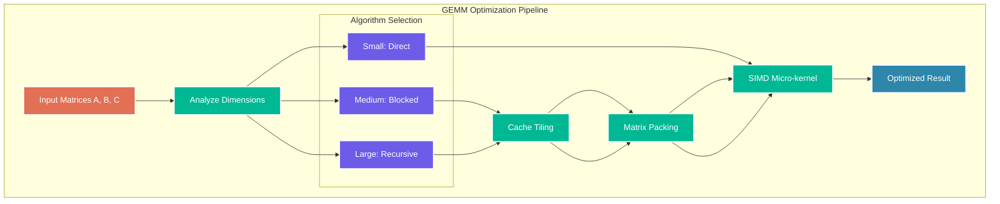

# Chapter 8: BLAS Operations

> *"In the beginning was the Word, and the Word was BLAS."* — The Gospel According to High Performance Computing

BLAS (Basic Linear Algebra Subprograms) is the foundation of all high-performance computing. GUDA provides a complete, optimized implementation that will make your matrices sing and your vectors dance. Let's explore the powerhouse behind modern machine learning!

## The BLAS Hierarchy: Your Computational Toolkit

BLAS operations are organized into three levels, each with distinct performance characteristics:

```mermaid
graph TB
    subgraph "Level 1: Vector Operations"
        AXPY[AXPY: y = αx + y]
        DOT[DOT: x·y]
        NRM2[NRM2: ||x||₂]
        SCAL[SCAL: x = αx]
    end
    
    subgraph "Level 2: Matrix-Vector Operations"
        GEMV[GEMV: y = αAx + βy]
        GER[GER: A = αxy^T + A]
        TRMV[TRMV: x = Tx]
    end
    
    subgraph "Level 3: Matrix-Matrix Operations"
        GEMM[GEMM: C = αAB + βC]
        SYMM[SYMM: C = αAB + βC (A symmetric)]
        TRMM[TRMM: B = αAB (A triangular)]
    end
    
    Level1 --> Level2
    Level2 --> Level3
    
    %% Performance styling
    classDef level1 fill:#74B9FF,stroke:#ffffff,stroke-width:2px,color:#ffffff
    classDef level2 fill:#0984E3,stroke:#ffffff,stroke-width:2px,color:#ffffff  
    classDef level3 fill:#2D3436,stroke:#ffffff,stroke-width:2px,color:#ffffff
    
    class AXPY,DOT,NRM2,SCAL level1
    class GEMV,GER,TRMV level2
    class GEMM,SYMM,TRMM level3
```

**Performance Rule of Thumb:**
- **Level 1**: Memory bandwidth bound (~10-20 GFLOPS)
- **Level 2**: Moderate arithmetic intensity (~20-40 GFLOPS)
- **Level 3**: Compute bound, highest performance (~50-100 GFLOPS)

## Level 1: Vector Operations - The Building Blocks

### AXPY: The Fundamental Building Block

AXPY (Alpha X Plus Y) is the most important vector operation you'll use:

```go
// y = alpha * x + y
func Saxpy(n int, alpha float32, x []float32, incX int, y []float32, incY int)

// Example: Neural network parameter updates
func updateWeights(weights, gradients []float32, learningRate float32) {
    // weights = weights - learningRate * gradients
    guda.Saxpy(len(weights), -learningRate, gradients, 1, weights, 1)
}

// Batch processing example
func batchNormalization(data []float32, mean, variance []float32, 
                       gamma, beta float32) {
    // data = gamma * (data - mean) / sqrt(variance) + beta
    for i := 0; i < len(data); i += batchSize {
        end := min(i+batchSize, len(data))
        batch := data[i:end]
        
        // Subtract mean
        guda.Saxpy(len(batch), -1.0, mean, 1, batch, 1)
        
        // Scale by gamma/sqrt(variance)
        scale := gamma / float32(math.Sqrt(float64(variance[i/batchSize])))
        guda.Sscal(len(batch), scale, batch, 1)
        
        // Add beta
        guda.Saxpy(len(batch), beta, ones, 1, batch, 1)
    }
}
```

**Performance Tips:**
- **Vector Length**: Optimal performance at multiples of 8 (AVX2) or 16 (AVX-512)
- **Memory Layout**: Contiguous memory (`incX = incY = 1`) is fastest
- **Cache Locality**: Process related vectors together

### DOT: Inner Products and Similarity

```go
// Compute inner product: result = x · y
func Sdot(n int, x []float32, incX int, y []float32, incY int) float32

// Machine learning applications
func cosineSimilarity(a, b []float32) float32 {
    dotProduct := guda.Sdot(len(a), a, 1, b, 1)
    normA := guda.Snrm2(len(a), a, 1)
    normB := guda.Snrm2(len(b), b, 1) 
    return dotProduct / (normA * normB)
}

// Attention mechanism (simplified)
func computeAttention(query, key []float32) float32 {
    // Scaled dot-product attention
    attention := guda.Sdot(len(query), query, 1, key, 1)
    scale := 1.0 / float32(math.Sqrt(float64(len(query))))
    return attention * scale
}

// L2 distance (using dot product identity)
func l2Distance(a, b []float32) float32 {
    // ||a - b||² = ||a||² + ||b||² - 2(a·b)
    dotAB := guda.Sdot(len(a), a, 1, b, 1)
    normA2 := guda.Sdot(len(a), a, 1, a, 1)  // ||a||²
    normB2 := guda.Sdot(len(b), b, 1, b, 1)  // ||b||²
    
    distance2 := normA2 + normB2 - 2*dotAB
    return float32(math.Sqrt(float64(distance2)))
}
```

## Level 2: Matrix-Vector Operations - The Workhorses

### GEMV: Matrix-Vector Multiplication

The foundation of many algorithms:

```go
// y = alpha * A * x + beta * y (or A^T * x)
func Sgemv(trans bool, m, n int, alpha float32,
          A []float32, lda int, x []float32, incX int,
          beta float32, y []float32, incY int)

// Linear layer in neural networks
type LinearLayer struct {
    weights []float32  // m x n matrix
    bias    []float32  // m vector
    m, n    int
}

func (l *LinearLayer) Forward(input, output []float32) {
    // output = weights * input + bias
    guda.Sgemv(false, l.m, l.n, 1.0, l.weights, l.n, input, 1, 0.0, output, 1)
    guda.Saxpy(l.m, 1.0, l.bias, 1, output, 1)
}

// Iterative solvers
func conjugateGradient(A []float32, b, x []float32, n int, maxIter int) {
    r := make([]float32, n)
    p := make([]float32, n)
    Ap := make([]float32, n)
    
    // r = b - Ax
    guda.Sgemv(false, n, n, -1.0, A, n, x, 1, 0.0, r, 1)
    guda.Saxpy(n, 1.0, b, 1, r, 1)
    
    copy(p, r)  // p = r
    rsold := guda.Sdot(n, r, 1, r, 1)
    
    for i := 0; i < maxIter; i++ {
        // Ap = A * p
        guda.Sgemv(false, n, n, 1.0, A, n, p, 1, 0.0, Ap, 1)
        
        alpha := rsold / guda.Sdot(n, p, 1, Ap, 1)
        
        // x = x + alpha * p
        guda.Saxpy(n, alpha, p, 1, x, 1)
        
        // r = r - alpha * Ap  
        guda.Saxpy(n, -alpha, Ap, 1, r, 1)
        
        rsnew := guda.Sdot(n, r, 1, r, 1)
        if math.Sqrt(float64(rsnew)) < 1e-10 {
            break
        }
        
        beta := rsnew / rsold
        // p = r + beta * p
        guda.Sscal(n, beta, p, 1)
        guda.Saxpy(n, 1.0, r, 1, p, 1)
        
        rsold = rsnew
    }
}
```

## Level 3: Matrix-Matrix Operations - The Performance Kings

### GEMM: The Crown Jewel

GEMM (General Matrix Multiply) is where GUDA truly shines:

```go
// C = alpha * A * B + beta * C
func Sgemm(transA, transB bool, m, n, k int,
          alpha float32, A []float32, lda int,
          B []float32, ldb int, beta float32,
          C []float32, ldc int)

// Neural network layer
func denseLayer(input, weights, bias, output []float32, 
               batchSize, inputDim, outputDim int) {
    // output = input * weights^T + bias
    // Shape: [batchSize, outputDim] = [batchSize, inputDim] * [outputDim, inputDim]^T
    
    guda.Sgemm(false, true, batchSize, outputDim, inputDim,
               1.0, input, inputDim,      // A: batchSize x inputDim
               weights, inputDim,         // B: outputDim x inputDim (transposed)
               0.0, output, outputDim)    // C: batchSize x outputDim
    
    // Add bias to each row
    for i := 0; i < batchSize; i++ {
        rowStart := i * outputDim
        guda.Saxpy(outputDim, 1.0, bias, 1, output[rowStart:], 1)
    }
}

// Matrix chaining for complex operations
func computeTransformerAttention(Q, K, V []float32, 
                               seqLen, headDim int, output []float32) {
    // Attention(Q,K,V) = softmax(QK^T/√d)V
    
    // Step 1: QK^T - compute attention scores
    scores := make([]float32, seqLen*seqLen)
    scale := 1.0 / float32(math.Sqrt(float64(headDim)))
    
    guda.Sgemm(false, true, seqLen, seqLen, headDim,
               scale, Q, headDim,      // Q: seqLen x headDim  
               K, headDim,             // K^T: headDim x seqLen
               0.0, scores, seqLen)    // scores: seqLen x seqLen
    
    // Step 2: Softmax (simplified - normally done row-wise)
    applySoftmax(scores, seqLen, seqLen)
    
    // Step 3: Apply attention to values
    guda.Sgemm(false, false, seqLen, headDim, seqLen,
               1.0, scores, seqLen,     // Attention: seqLen x seqLen
               V, headDim,              // V: seqLen x headDim
               0.0, output, headDim)    // Output: seqLen x headDim
}
```

### Performance Optimization Strategies

GUDA employs sophisticated algorithms to maximize GEMM performance:



**Matrix Size Performance Guide:**

| Dimension Range | Algorithm | Expected Performance | Use Case |
|----------------|-----------|---------------------|----------|
| < 64×64 | Direct | 15-25 GFLOPS | Small neural layers |
| 64×64 to 512×512 | Blocked | 35-55 GFLOPS | Medium computations |
| > 512×512 | Recursive + Packed | 60-85 GFLOPS | Large matrix ops |

## Advanced BLAS Patterns

### Batch Operations

Process multiple matrices efficiently:

```go
// Batch GEMM for multiple independent operations
func batchGemm(As, Bs, Cs [][]float32, m, n, k int, alpha, beta float32) {
    // Process in parallel using goroutines
    var wg sync.WaitGroup
    
    for i := range As {
        wg.Add(1)
        go func(idx int) {
            defer wg.Done()
            guda.Sgemm(false, false, m, n, k,
                       alpha, As[idx], k,
                       Bs[idx], n,  
                       beta, Cs[idx], n)
        }(i)
    }
    
    wg.Wait()
}

// Strided batch operations (common in deep learning)
func stridedBatchGemm(A, B, C []float32, 
                     batchCount, m, n, k int,
                     strideA, strideB, strideC int) {
    for i := 0; i < batchCount; i++ {
        offsetA := i * strideA
        offsetB := i * strideB  
        offsetC := i * strideC
        
        guda.Sgemm(false, false, m, n, k, 1.0,
                   A[offsetA:], k,
                   B[offsetB:], n,
                   0.0, C[offsetC:], n)
    }
}
```

### Memory-Efficient Patterns

```go
// In-place operations where possible
func updateWeightsInPlace(weights, gradients []float32, lr float32) {
    // weights = weights - lr * gradients (in-place)
    guda.Saxpy(len(weights), -lr, gradients, 1, weights, 1)
}

// Workspace reuse for temporary arrays
type WorkspaceManager struct {
    buffers map[string][]float32
    mutex   sync.Mutex
}

func (w *WorkspaceManager) GetBuffer(name string, size int) []float32 {
    w.mutex.Lock()
    defer w.mutex.Unlock()
    
    if buf, exists := w.buffers[name]; exists && len(buf) >= size {
        return buf[:size]  // Reuse existing buffer
    }
    
    buf := make([]float32, size)
    w.buffers[name] = buf
    return buf
}

// Example: Efficient matrix chain multiplication A*B*C
func chainMultiply(A, B, C []float32, m, n, k, p int, workspace *WorkspaceManager) []float32 {
    // Strategy: minimize total FLOPs
    // Cost(AB then C): mnk + mnp  
    // Cost(BC then A): nkp + mnp
    
    if mnk+mnp < nkp+mnp {  // A*B first is cheaper
        temp := workspace.GetBuffer("chain_temp", m*n)
        
        // temp = A * B
        guda.Sgemm(false, false, m, n, k, 1.0, A, k, B, n, 0.0, temp, n)
        
        // result = temp * C  
        result := make([]float32, m*p)
        guda.Sgemm(false, false, m, p, n, 1.0, temp, n, C, p, 0.0, result, p)
        
        return result
    } else {  // B*C first is cheaper
        temp := workspace.GetBuffer("chain_temp", n*p)
        
        // temp = B * C
        guda.Sgemm(false, false, n, p, k, 1.0, B, k, C, p, 0.0, temp, p)
        
        // result = A * temp
        result := make([]float32, m*p)
        guda.Sgemm(false, false, m, p, n, 1.0, A, n, temp, p, 0.0, result, p)
        
        return result
    }
}
```

## Error Handling and Debugging

GUDA provides comprehensive error checking:

```go
// Dimension mismatch detection
func safeGemm(transA, transB bool, m, n, k int,
              alpha float32, A []float32, lda int,
              B []float32, ldb int, beta float32,
              C []float32, ldc int) error {
    
    // Validate dimensions
    if transA {
        if len(A) < k*lda || lda < m {
            return fmt.Errorf("matrix A dimensions invalid for transA=true")
        }
    } else {
        if len(A) < m*lda || lda < k {
            return fmt.Errorf("matrix A dimensions invalid for transA=false")  
        }
    }
    
    // Similar checks for B and C...
    
    // Call GUDA with validated parameters
    guda.Sgemm(transA, transB, m, n, k, alpha, A, lda, B, ldb, beta, C, ldc)
    return nil
}

// Performance monitoring
type BLASProfiler struct {
    operations map[string]time.Duration
    counts     map[string]int64
}

func (p *BLASProfiler) TimeGemm(name string, fn func()) {
    start := time.Now()
    fn()
    duration := time.Since(start)
    
    p.operations[name] += duration
    p.counts[name]++
}

func (p *BLASProfiler) Report() {
    for op, totalTime := range p.operations {
        count := p.counts[op]
        avgTime := totalTime / time.Duration(count)
        fmt.Printf("%s: %d ops, avg %v per op\n", op, count, avgTime)
    }
}
```

## Performance Tips and Best Practices

### 1. **Choose the Right Operation Level**
```go
// ❌ Inefficient: Multiple Level 1 operations
for i := 0; i < n; i++ {
    guda.Saxpy(m, alpha[i], A[i*m:], 1, result, 1)  // Level 1
}

// ✅ Efficient: Single Level 3 operation  
guda.Sgemm(false, false, m, n, 1, 1.0, A, m, alpha, 1, 0.0, result, m)
```

### 2. **Memory Layout Optimization**
```go
// ❌ Poor cache usage
for i := 0; i < cols; i++ {
    for j := 0; j < rows; j++ {
        matrix[j*cols + i] = value  // Column-major access in row-major layout
    }
}

// ✅ Cache-friendly access
for i := 0; i < rows; i++ {
    for j := 0; j < cols; j++ {
        matrix[i*cols + j] = value  // Row-major access in row-major layout
    }
}
```

### 3. **Batch Size Optimization**
```go
// Find optimal batch size for your workload
func findOptimalBatchSize(totalSize int) int {
    testSizes := []int{16, 32, 64, 128, 256}
    bestSize := testSizes[0]
    bestTime := math.Inf(1)
    
    for _, batchSize := range testSizes {
        time := benchmarkWithBatchSize(totalSize, batchSize)
        if time < bestTime {
            bestTime = time
            bestSize = batchSize
        }
    }
    
    return bestSize
}
```

## What's Next?

You've now mastered GUDA's BLAS operations! Ready to level up?

- [Neural Network Operations](09-nn-api.md) - Build on BLAS for deep learning
- [Optimization Techniques](10-optimization.md) - Squeeze every FLOP from your CPU
- [Benchmarking](11-benchmarking.md) - Measure and improve your performance

Or dive into [Case Studies](12-case-studies.md) to see BLAS operations in action solving real problems!

---

*⚡ With BLAS as your foundation, you're ready to build computational skyscrapers. Every GFLOP counts!*