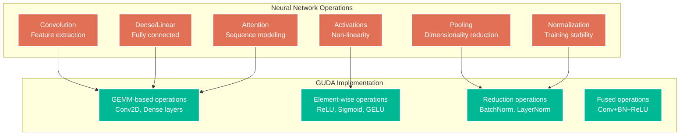

# Chapter 9: Neural Network Operations

> *"Neural networks are not magic—they're just very clever applications of matrix multiplication and nonlinear functions."* — The Demystified Deep Learning Handbook

GUDA's Neural Network API brings GPU-level performance to CPU-based deep learning. This chapter explores the high-level building blocks that make implementing neural networks a joy rather than a chore. From convolutions to transformers, we've got you covered!

## The Neural Network Building Blocks

Modern neural networks are constructed from a surprisingly small set of fundamental operations:



## Convolution Operations

The workhorse of computer vision networks:

```go
// 2D Convolution with comprehensive parameters
func Conv2D(input, weights, bias, output *Tensor4D, params ConvParams) error

type ConvParams struct {
    StrideH, StrideW     int
    PadH, PadW          int
    DilationH, DilationW int
    Groups              int    // For grouped/depthwise convolutions
    Algorithm           ConvAlgorithm
}

type ConvAlgorithm int

const (
    ConvAlgoDirect ConvAlgorithm = iota
    ConvAlgoIm2col
    ConvAlgoWinograd
    ConvAlgoFFT
    ConvAlgoAuto // Let GUDA choose optimal algorithm
)

// High-level convolution layer
func ConvolutionLayer(input *Tensor4D, params ConvLayerParams) (*Tensor4D, error) {
    // Allocate output tensor
    output := NewTensor4D(params.BatchSize, params.OutChannels, 
                         params.OutputH, params.OutputW)
    
    // Perform convolution
    err := Conv2D(input, params.Weights, params.Bias, output, params.ConvParams)
    if err != nil {
        return nil, err
    }
    
    return output, nil
}

// Example: Building a CNN layer
func demonstrateCNNLayer() {
    // Input: batch=4, channels=3, height=224, width=224 (ImageNet-style)
    input := NewTensor4D(4, 3, 224, 224)
    input.FillRandom()
    
    // Convolution: 3→64 channels, 7x7 kernel, stride=2, padding=3
    weights := NewTensor4D(64, 3, 7, 7)
    weights.FillXavier() // Xavier/Glorot initialization
    
    bias := NewTensor1D(64)
    bias.FillConstant(0.1)
    
    params := ConvParams{
        StrideH: 2, StrideW: 2,
        PadH: 3, PadW: 3,
        Algorithm: ConvAlgoAuto, // Let GUDA optimize
    }
    
    // Output will be: batch=4, channels=64, height=112, width=112
    output := NewTensor4D(4, 64, 112, 112)
    
    start := time.Now()
    err := guda.Conv2D(input, weights, bias, output, params)
    duration := time.Since(start)
    
    if err != nil {
        log.Fatal("Convolution failed:", err)
    }
    
    // Calculate performance
    ops := calculateConvOps(4, 3, 224, 224, 64, 7, 7, 2, 2)
    gflops := float64(ops) / duration.Seconds() / 1e9
    
    fmt.Printf("Convolution completed in %v (%.2f GFLOPS)\n", duration, gflops)
}

// Specialized convolution variants
func DepthwiseConv2D(input, weights, output *Tensor4D, params ConvParams) error
func GroupedConv2D(input, weights, output *Tensor4D, params ConvParams) error
func TransposedConv2D(input, weights, output *Tensor4D, params ConvParams) error

// High-performance fused convolutions
func FusedConvBatchNormReLU(input, weights, bias, gamma, beta, output *Tensor4D,
                           params ConvParams, bnParams BatchNormParams) error
```

### Advanced Convolution Patterns

```go
// Residual connections (ResNet-style)
func ResidualBlock(input *Tensor4D, weights1, weights2 *Tensor4D) (*Tensor4D, error) {
    channels := input.Shape[1]
    height, width := input.Shape[2], input.Shape[3]
    
    // First convolution: 3x3
    temp1 := NewTensor4D(input.Shape[0], channels, height, width)
    err := guda.Conv2D(input, weights1, nil, temp1, ConvParams{
        StrideH: 1, StrideW: 1, PadH: 1, PadW: 1,
    })
    if err != nil {
        return nil, err
    }
    
    // ReLU activation
    guda.ReLU(temp1, temp1)
    
    // Second convolution: 3x3
    temp2 := NewTensor4D(input.Shape[0], channels, height, width)
    err = guda.Conv2D(temp1, weights2, nil, temp2, ConvParams{
        StrideH: 1, StrideW: 1, PadH: 1, PadW: 1,
    })
    if err != nil {
        return nil, err
    }
    
    // Residual connection: output = temp2 + input
    output := NewTensor4D(input.Shape[0], channels, height, width)
    guda.Add(temp2, input, output)
    
    // Final ReLU
    guda.ReLU(output, output)
    
    return output, nil
}

// Separable convolutions for efficiency (MobileNet-style)
func SeparableConv2D(input *Tensor4D, depthwise, pointwise *Tensor4D) (*Tensor4D, error) {
    // Step 1: Depthwise convolution
    temp := NewTensor4D(input.Shape[0], input.Shape[1], input.Shape[2], input.Shape[3])
    err := guda.DepthwiseConv2D(input, depthwise, temp, ConvParams{
        StrideH: 1, StrideW: 1, PadH: 1, PadW: 1,
    })
    if err != nil {
        return nil, err
    }
    
    // Step 2: Pointwise convolution (1x1)
    output := NewTensor4D(input.Shape[0], pointwise.Shape[0], input.Shape[2], input.Shape[3])
    err = guda.Conv2D(temp, pointwise, nil, output, ConvParams{
        StrideH: 1, StrideW: 1, PadH: 0, PadW: 0,
    })
    if err != nil {
        return nil, err
    }
    
    return output, nil
}
```

## Dense (Fully Connected) Layers

The foundation of traditional neural networks:

```go
// Dense layer implementation
func Dense(input, weights, bias, output *Tensor2D) error

// Batch processing version
func DenseBatch(input, weights, bias, output *Tensor2D) error {
    // input: [batchSize, inputDim]
    // weights: [inputDim, outputDim]  
    // bias: [outputDim]
    // output: [batchSize, outputDim]
    
    batchSize := input.Shape[0]
    inputDim := input.Shape[1]
    outputDim := weights.Shape[1]
    
    // Matrix multiplication: output = input * weights
    err := guda.Sgemm(false, false, batchSize, outputDim, inputDim,
                      1.0, input.Data(), inputDim,
                      weights.Data(), outputDim,
                      0.0, output.Data(), outputDim)
    if err != nil {
        return err
    }
    
    // Add bias to each row
    for i := 0; i < batchSize; i++ {
        rowStart := i * outputDim
        err = guda.Saxpy(outputDim, 1.0, bias.Data(), 1, 
                         output.DataOffset(rowStart), 1)
        if err != nil {
            return err
        }
    }
    
    return nil
}

// Example: Multi-layer perceptron
func MultilayerPerceptron(input *Tensor2D, layers []DenseLayer) (*Tensor2D, error) {
    current := input
    
    for i, layer := range layers {
        next := NewTensor2D(current.Shape[0], layer.OutputDim)
        
        err := guda.DenseBatch(current, layer.Weights, layer.Bias, next)
        if err != nil {
            return nil, fmt.Errorf("layer %d failed: %v", i, err)
        }
        
        // Apply activation (except last layer)
        if i < len(layers)-1 {
            switch layer.Activation {
            case ActivationReLU:
                guda.ReLU(next, next)
            case ActivationSigmoid:
                guda.Sigmoid(next, next)
            case ActivationTanh:
                guda.Tanh(next, next)
            }
        }
        
        current = next
    }
    
    return current, nil
}
```

## Activation Functions

Non-linear transformations that give networks their power:

```go
// Basic activation functions
func ReLU(input, output *Tensor) error
func LeakyReLU(input, output *Tensor, alpha float32) error
func Sigmoid(input, output *Tensor) error
func Tanh(input, output *Tensor) error

// Modern activation functions
func GELU(input, output *Tensor) error // Gaussian Error Linear Unit
func Swish(input, output *Tensor) error // x * sigmoid(x)
func Mish(input, output *Tensor) error  // x * tanh(softplus(x))

// Vectorized implementations for performance
func activationBenchmark() {
    const N = 1024 * 1024
    input := NewTensor1D(N)
    output := NewTensor1D(N)
    
    input.FillRandom()
    
    activations := []struct {
        name string
        fn   func(*Tensor, *Tensor) error
    }{
        {"ReLU", guda.ReLU},
        {"GELU", guda.GELU},
        {"Sigmoid", guda.Sigmoid},
        {"Tanh", guda.Tanh},
        {"Swish", guda.Swish},
    }
    
    for _, activation := range activations {
        start := time.Now()
        for i := 0; i < 1000; i++ {
            activation.fn(input, output)
        }
        duration := time.Since(start)
        
        throughput := float64(N*1000) / duration.Seconds() / 1e9
        fmt.Printf("%s: %.2f billion elements/sec\n", activation.name, throughput)
    }
}

// Custom activation functions
func PReLU(input, output *Tensor, alpha *Tensor) error {
    // Parametric ReLU: f(x) = max(0, x) + alpha * min(0, x)
    return guda.ElementwiseBinary(input, alpha, output, func(x, a float32) float32 {
        if x > 0 {
            return x
        }
        return a * x
    })
}

func ELU(input, output *Tensor, alpha float32) error {
    // Exponential Linear Unit: f(x) = x if x > 0, alpha * (exp(x) - 1) if x <= 0
    return guda.ElementwiseUnary(input, output, func(x float32) float32 {
        if x > 0 {
            return x
        }
        return alpha * (float32(math.Exp(float64(x))) - 1)
    })
}
```

## Normalization Layers

Critical for training stability and convergence:

```go
// Batch Normalization
func BatchNorm2D(input, gamma, beta, runningMean, runningVar, output *Tensor4D,
                eps float32, momentum float32, training bool) error

// Layer Normalization (for transformers)
func LayerNorm(input, gamma, beta, output *Tensor, eps float32) error

// Group Normalization
func GroupNorm(input, gamma, beta, output *Tensor4D, groups int, eps float32) error

// Instance Normalization
func InstanceNorm2D(input, gamma, beta, output *Tensor4D, eps float32) error

// Example: Batch normalization implementation
func demonstrateBatchNorm() {
    // Input: [batchSize=32, channels=64, height=56, width=56]
    input := NewTensor4D(32, 64, 56, 56)
    input.FillRandom()
    
    // Learnable parameters
    gamma := NewTensor1D(64)  // Scale parameters
    beta := NewTensor1D(64)   // Shift parameters
    gamma.FillConstant(1.0)
    beta.FillConstant(0.0)
    
    // Running statistics (updated during training)
    runningMean := NewTensor1D(64)
    runningVar := NewTensor1D(64)
    runningMean.FillConstant(0.0)
    runningVar.FillConstant(1.0)
    
    output := NewTensor4D(32, 64, 56, 56)
    
    // Apply batch normalization
    err := guda.BatchNorm2D(input, gamma, beta, runningMean, runningVar, output,
                           1e-5, 0.1, true) // eps=1e-5, momentum=0.1, training=true
    if err != nil {
        log.Fatal("BatchNorm failed:", err)
    }
    
    fmt.Printf("Batch normalization completed\n")
    fmt.Printf("Output mean: %.6f (should be ~0.0)\n", output.Mean())
    fmt.Printf("Output std: %.6f (should be ~1.0)\n", output.Std())
}

// Fused BatchNorm + Activation for efficiency
func FusedBatchNormReLU(input, gamma, beta, runningMean, runningVar, output *Tensor4D,
                       eps float32, momentum float32, training bool) error {
    // First apply batch norm
    err := guda.BatchNorm2D(input, gamma, beta, runningMean, runningVar, output,
                           eps, momentum, training)
    if err != nil {
        return err
    }
    
    // Then apply ReLU in-place
    return guda.ReLU(output, output)
}
```

## Pooling Operations

Dimensionality reduction and translation invariance:

```go
// Pooling operations
func MaxPool2D(input, output *Tensor4D, params PoolParams) error
func AvgPool2D(input, output *Tensor4D, params PoolParams) error
func GlobalMaxPool2D(input, output *Tensor2D) error
func GlobalAvgPool2D(input, output *Tensor2D) error

type PoolParams struct {
    KernelH, KernelW int
    StrideH, StrideW int
    PadH, PadW       int
}

// Adaptive pooling (output size independent of input size)
func AdaptiveMaxPool2D(input *Tensor4D, outputH, outputW int) (*Tensor4D, error)
func AdaptiveAvgPool2D(input *Tensor4D, outputH, outputW int) (*Tensor4D, error)

// Example: CNN with pooling
func cnnWithPooling() {
    // Input: [batch=4, channels=64, height=112, width=112]
    input := NewTensor4D(4, 64, 112, 112)
    input.FillRandom()
    
    // Max pooling: 2x2 kernel, stride=2 -> output: [4, 64, 56, 56]
    pooled := NewTensor4D(4, 64, 56, 56)
    
    params := PoolParams{
        KernelH: 2, KernelW: 2,
        StrideH: 2, StrideW: 2,
        PadH: 0, PadW: 0,
    }
    
    err := guda.MaxPool2D(input, pooled, params)
    if err != nil {
        log.Fatal("MaxPool failed:", err)
    }
    
    // Global average pooling for final classification
    // Output: [4, 64] (batch_size, channels)
    globalPooled := NewTensor2D(4, 64)
    
    err = guda.GlobalAvgPool2D(pooled, globalPooled)
    if err != nil {
        log.Fatal("GlobalAvgPool failed:", err)
    }
    
    fmt.Printf("Pooling completed: %v -> %v -> %v\n",
               input.Shape, pooled.Shape, globalPooled.Shape)
}
```

## Attention Mechanisms

The foundation of modern transformer architectures:

```go
// Multi-head attention
func MultiHeadAttention(query, key, value *Tensor3D, params AttentionParams) (*Tensor3D, error)

type AttentionParams struct {
    NumHeads    int
    HeadDim     int
    DropoutRate float32
    Mask        *Tensor2D // Optional attention mask
}

// Self-attention (query, key, value are the same)
func SelfAttention(input *Tensor3D, params AttentionParams) (*Tensor3D, error) {
    return guda.MultiHeadAttention(input, input, input, params)
}

// Scaled dot-product attention (the core operation)
func ScaledDotProductAttention(query, key, value *Tensor3D, mask *Tensor2D) (*Tensor3D, error) {
    seqLen := query.Shape[1]
    headDim := query.Shape[2]
    scale := 1.0 / float32(math.Sqrt(float64(headDim)))
    
    // Compute attention scores: QK^T
    scores := NewTensor3D(query.Shape[0], seqLen, seqLen)
    err := guda.BatchMatmul(query, key, scores, true, false) // key transposed
    if err != nil {
        return nil, err
    }
    
    // Scale scores
    guda.Sscal(scores.Size(), scale, scores.Data(), 1)
    
    // Apply mask if provided
    if mask != nil {
        guda.AddMask(scores, mask, -1e9) // Large negative value
    }
    
    // Apply softmax
    guda.Softmax(scores, scores, 2) // Along last dimension
    
    // Apply attention to values: Attention * V
    output := NewTensor3D(query.Shape[0], seqLen, headDim)
    err = guda.BatchMatmul(scores, value, output, false, false)
    if err != nil {
        return nil, err
    }
    
    return output, nil
}

// Example: Transformer encoder block
func transformerEncoderBlock(input *Tensor3D, params TransformerParams) (*Tensor3D, error) {
    // Multi-head self-attention
    attended, err := guda.SelfAttention(input, params.AttentionParams)
    if err != nil {
        return nil, err
    }
    
    // Residual connection + layer norm
    residual1 := NewTensor3D(input.Shape[0], input.Shape[1], input.Shape[2])
    guda.Add(input, attended, residual1)
    guda.LayerNorm(residual1, params.LN1Gamma, params.LN1Beta, residual1, 1e-5)
    
    // Feed-forward network
    ff1 := NewTensor3D(residual1.Shape[0], residual1.Shape[1], params.FFDim)
    guda.DenseBatch(residual1, params.FF1Weights, params.FF1Bias, ff1)
    guda.GELU(ff1, ff1)
    
    ff2 := NewTensor3D(residual1.Shape[0], residual1.Shape[1], residual1.Shape[2])
    guda.DenseBatch(ff1, params.FF2Weights, params.FF2Bias, ff2)
    
    // Second residual connection + layer norm
    output := NewTensor3D(residual1.Shape[0], residual1.Shape[1], residual1.Shape[2])
    guda.Add(residual1, ff2, output)
    guda.LayerNorm(output, params.LN2Gamma, params.LN2Beta, output, 1e-5)
    
    return output, nil
}
```

## Loss Functions and Training

Essential for model training:

```go
// Common loss functions
func CrossEntropyLoss(predictions, targets *Tensor2D) (*Tensor1D, error)
func MeanSquaredError(predictions, targets *Tensor) (*Tensor1D, error)
func BinaryCrossEntropy(predictions, targets *Tensor) (*Tensor1D, error)

// Loss function with gradient computation
func CrossEntropyWithGradients(predictions, targets *Tensor2D) (loss *Tensor1D, gradients *Tensor2D, err error) {
    batchSize := predictions.Shape[0]
    numClasses := predictions.Shape[1]
    
    // Apply softmax to predictions
    softmax := NewTensor2D(batchSize, numClasses)
    err = guda.Softmax(predictions, softmax, 1)
    if err != nil {
        return nil, nil, err
    }
    
    // Compute cross-entropy loss
    loss = NewTensor1D(batchSize)
    err = guda.CrossEntropyLoss(softmax, targets, loss)
    if err != nil {
        return nil, nil, err
    }
    
    // Compute gradients: softmax - targets
    gradients = NewTensor2D(batchSize, numClasses)
    guda.Copy(softmax, gradients)
    guda.Subtract(gradients, targets, gradients)
    
    return loss, gradients, nil
}

// Optimizer implementations
type SGDOptimizer struct {
    LearningRate float32
    Momentum     float32
    velocity     map[string]*Tensor
}

func (opt *SGDOptimizer) Update(param *Tensor, gradient *Tensor, name string) error {
    // Initialize velocity if needed
    if _, exists := opt.velocity[name]; !exists {
        opt.velocity[name] = NewTensorLike(param)
        opt.velocity[name].FillConstant(0.0)
    }
    
    v := opt.velocity[name]
    
    // v = momentum * v + gradient
    guda.Sscal(v.Size(), opt.Momentum, v.Data(), 1)
    guda.Saxpy(v.Size(), 1.0, gradient.Data(), 1, v.Data(), 1)
    
    // param = param - learning_rate * v
    guda.Saxpy(param.Size(), -opt.LearningRate, v.Data(), 1, param.Data(), 1)
    
    return nil
}
```

## High-Level Model APIs

Putting it all together for common architectures:

```go
// CNN model builder
type CNNModel struct {
    layers []Layer
}

func NewCNNModel() *CNNModel {
    return &CNNModel{layers: make([]Layer, 0)}
}

func (m *CNNModel) AddConv2D(inChannels, outChannels, kernelSize, stride, padding int) {
    m.layers = append(m.layers, &Conv2DLayer{
        InChannels:  inChannels,
        OutChannels: outChannels,
        KernelSize:  kernelSize,
        Stride:      stride,
        Padding:     padding,
    })
}

func (m *CNNModel) AddReLU() {
    m.layers = append(m.layers, &ReLULayer{})
}

func (m *CNNModel) AddMaxPool2D(kernelSize, stride int) {
    m.layers = append(m.layers, &MaxPool2DLayer{
        KernelSize: kernelSize,
        Stride:     stride,
    })
}

func (m *CNNModel) Forward(input *Tensor4D) (*Tensor4D, error) {
    current := input
    
    for i, layer := range m.layers {
        next, err := layer.Forward(current)
        if err != nil {
            return nil, fmt.Errorf("layer %d failed: %v", i, err)
        }
        current = next.(*Tensor4D)
    }
    
    return current, nil
}

// Example: Build ResNet-18 style network
func buildResNet18() *CNNModel {
    model := NewCNNModel()
    
    // Initial convolution
    model.AddConv2D(3, 64, 7, 2, 3)
    model.AddReLU()
    model.AddMaxPool2D(3, 2)
    
    // ResNet blocks (simplified)
    for i := 0; i < 4; i++ {
        // Each block: Conv -> ReLU -> Conv -> Add residual
        model.AddConv2D(64, 64, 3, 1, 1)
        model.AddReLU()
        model.AddConv2D(64, 64, 3, 1, 1)
        // Note: Real implementation would need residual connections
    }
    
    return model
}
```

## Performance Optimization for Neural Networks

### Memory-Efficient Training

```go
// Gradient checkpointing to save memory
func checkpointedForward(layers []Layer, input *Tensor) (*Tensor, []func()) {
    checkpoints := make([]*Tensor, 0)
    recomputeFuncs := make([]func(), 0)
    
    current := input
    
    for i, layer := range layers {
        if i%2 == 0 { // Checkpoint every 2 layers
            checkpoints = append(checkpoints, current.Clone())
            
            // Create recompute function
            recompute := func(layerIdx int, checkpointInput *Tensor) func() {
                return func() {
                    // Recompute intermediate results when needed
                    temp := checkpointInput
                    for j := layerIdx; j < i; j++ {
                        temp, _ = layers[j].Forward(temp)
                    }
                }
            }(len(checkpoints)-1, current.Clone())
            
            recomputeFuncs = append(recomputeFuncs, recompute)
        }
        
        next, _ := layer.Forward(current)
        current = next
    }
    
    return current, recomputeFuncs
}

// Mixed precision training simulation
func mixedPrecisionGEMM(A, B, C *Tensor, useHalfPrecision bool) error {
    if useHalfPrecision && A.Size() > 1024*1024 {
        // Convert to FP16 for large operations
        A_fp16 := convertToFP16(A)
        B_fp16 := convertToFP16(B)
        C_fp16 := NewTensorFP16Like(C)
        
        // Perform operation in FP16
        err := guda.GemmFP16(A_fp16, B_fp16, C_fp16)
        if err != nil {
            return err
        }
        
        // Convert back to FP32
        convertToFP32(C_fp16, C)
        return nil
    }
    
    // Use full precision for small or sensitive operations
    return guda.Sgemm(false, false, A.Shape[0], B.Shape[1], A.Shape[1],
                      1.0, A.Data(), A.Shape[1], B.Data(), B.Shape[1],
                      0.0, C.Data(), C.Shape[1])
}
```

## What's Next?

You now have access to GUDA's complete neural network toolkit! Ready to build something amazing?

- [Optimization Techniques](10-optimization.md) - Maximize your neural network performance
- [Case Studies](12-case-studies.md) - See real neural networks implemented with GUDA
- [Benchmarking](11-benchmarking.md) - Measure and compare your models

Neural networks are just sophisticated compositions of simple operations. With GUDA's building blocks, you can implement any architecture from classic CNNs to cutting-edge transformers—all with CPU performance that rivals GPUs!

---

*🧠 Neural networks are the poetry of mathematics, and GUDA provides the perfect pen to write them.*