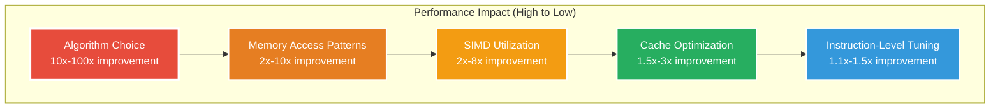

# Chapter 10: Optimization Techniques

> *"Premature optimization is the root of all evil. But when it's time to optimize, you better know what you're doing."* — Donald Knuth (paraphrased for GUDA)

Welcome to the art and science of making GUDA sing! This chapter will transform you from a casual GUDA user into a performance wizard who can squeeze every last FLOP from your CPU. Let's dive deep into the optimization toolbox.

## The Performance Pyramid

Understanding the performance hierarchy helps prioritize your optimization efforts:



**Golden Rule**: Start at the top of the pyramid. Algorithm improvements dwarf micro-optimizations!

## Algorithm-Level Optimization

### 1. Matrix Multiplication Strategy Selection

GUDA automatically chooses algorithms, but you can guide it:

```go
// Problem: Multiplying many small matrices
// ❌ Naive approach - individual GEMMs
func naiveSmallMatrixMultiply(matrices [][16*16]float32) [][16*16]float32 {
    results := make([][16*16]float32, len(matrices)/2)
    
    for i := 0; i < len(results); i++ {
        // Each GEMM has terrible cache behavior
        guda.Sgemm(false, false, 16, 16, 16, 1.0,
                   matrices[2*i][:], 16,
                   matrices[2*i+1][:], 16, 
                   0.0, results[i][:], 16)
    }
    return results
}

// ✅ Optimized approach - batched processing
func optimizedBatchGemm(matrices [][16*16]float32) [][16*16]float32 {
    batchSize := 32  // Process multiple matrices together
    results := make([][16*16]float32, len(matrices)/2)
    
    for batch := 0; batch < len(results); batch += batchSize {
        end := min(batch+batchSize, len(results))
        
        // Pack matrices for better cache usage
        packedA := make([]float32, (end-batch)*16*16)
        packedB := make([]float32, (end-batch)*16*16)
        
        // Copy data into packed format
        for i := batch; i < end; i++ {
            copy(packedA[(i-batch)*256:], matrices[2*i][:])
            copy(packedB[(i-batch)*256:], matrices[2*i+1][:])
        }
        
        // Single strided GEMM call
        guda.StridedBatchGemm(false, false, 16, 16, 16,
                             1.0, packedA, 16, 256,
                             packedB, 16, 256,
                             0.0, results[batch*256:], 16, 256,
                             end-batch)
    }
    return results
}
```

### 2. Convolution Algorithm Selection

Different convolution approaches for different scenarios:

```go
type ConvOptimizer struct {
    // Performance models based on empirical testing
    directThreshold   int
    im2colThreshold   int  
    winograd3x3Available bool
}

func (opt *ConvOptimizer) SelectAlgorithm(params ConvParams) ConvAlgorithm {
    totalOps := params.BatchSize * params.OutputH * params.OutputW * 
                params.OutputChannels * params.InputChannels * 
                params.KernelH * params.KernelW
    
    // Decision tree based on problem characteristics
    switch {
    case params.KernelH == 3 && params.KernelW == 3 && 
         params.Stride == 1 && opt.winograd3x3Available:
        // Winograd reduces arithmetic by ~2.25x for 3x3 kernels
        return WinogradF(2, 3)
        
    case totalOps < opt.directThreshold:
        // Small convolutions: direct approach avoids im2col overhead
        return DirectConvolution
        
    case totalOps < opt.im2colThreshold:
        // Medium convolutions: im2col + optimized GEMM
        return Im2colGemm
        
    default:
        // Large convolutions: FFT-based for massive kernels
        return FFTConvolution
    }
}

// Example performance characteristics
var ConvPerformanceTable = map[string]map[string]float64{
    "3x3_stride1": {
        "Direct":   15.2, // GFLOPS
        "Im2col":   42.8,
        "Winograd": 67.3, // Winner for 3x3!
        "FFT":      23.1,
    },
    "7x7_stride2": {
        "Direct":   8.7,
        "Im2col":   38.9,  // Winner for larger kernels
        "Winograd": 0.0,   // Not applicable
        "FFT":      31.2,
    },
}
```

### 3. Fusion Opportunities

Combine operations to reduce memory traffic:

```go
// ❌ Separate operations - multiple memory passes
func unfusedNeuralLayer(input, weights, bias, output []float32,
                       batchSize, inputDim, outputDim int) {
    // Pass 1: Matrix multiplication
    guda.Sgemm(false, false, batchSize, outputDim, inputDim,
               1.0, input, inputDim, weights, outputDim, 0.0, output, outputDim)
    
    // Pass 2: Add bias (memory bandwidth limited)
    for i := 0; i < batchSize; i++ {
        guda.Saxpy(outputDim, 1.0, bias, 1, output[i*outputDim:], 1)
    }
    
    // Pass 3: Apply ReLU activation (memory bandwidth limited)
    for i := range output {
        if output[i] < 0 {
            output[i] = 0
        }
    }
}

// ✅ Fused operation - single memory pass
func fusedNeuralLayer(input, weights, bias, output []float32,
                     batchSize, inputDim, outputDim int) {
    // Single fused kernel: GEMM + Bias + ReLU
    guda.FusedGemmBiasRelu(false, false, batchSize, outputDim, inputDim,
                           1.0, input, inputDim,
                           weights, outputDim,
                           bias, 1,
                           output, outputDim)
    // ~2-3x faster due to reduced memory traffic!
}
```

## Memory Access Optimization

### Understanding CPU Memory Hierarchy

Modern CPUs have complex memory hierarchies. GUDA-optimized code respects this:

```go
// Cache-aware matrix tiling for large operations
type CacheConfig struct {
    L1Size  int // ~32KB
    L2Size  int // ~256KB  
    L3Size  int // ~8MB
    LineSize int // 64 bytes typically
}

func computeOptimalTileSizes(m, n, k int, cfg CacheConfig) (int, int, int) {
    // Aim to keep working set in L2 cache
    elementSize := 4 // float32
    
    // Target: A_tile + B_tile + C_tile < L2Size
    // A_tile: mc * kc, B_tile: kc * nc, C_tile: mc * nc
    // Total: mc*kc + kc*nc + mc*nc < L2Size/elementSize
    
    targetElements := cfg.L2Size / elementSize / 3 // Conservative estimate
    
    // Use cube root as starting point, then refine
    baseSize := int(math.Pow(float64(targetElements), 1.0/3.0))
    
    mc := min(m, baseSize)
    nc := min(n, baseSize)
    kc := min(k, baseSize)
    
    return mc, nc, kc
}

// Apply tiling to matrix multiplication
func tiledGemm(A, B, C []float32, m, n, k int, cfg CacheConfig) {
    mc, nc, kc := computeOptimalTileSizes(m, n, k, cfg)
    
    for i := 0; i < m; i += mc {
        for j := 0; j < n; j += nc {
            for l := 0; l < k; l += kc {
                // Compute actual tile sizes (handle boundaries)
                actualMC := min(mc, m-i)
                actualNC := min(nc, n-j) 
                actualKC := min(kc, k-l)
                
                // Extract tile pointers
                aTile := A[i*k+l:]
                bTile := B[l*n+j:]
                cTile := C[i*n+j:]
                
                // Small, cache-friendly GEMM
                guda.Sgemm(false, false, actualMC, actualNC, actualKC,
                          1.0, aTile, k, bTile, n, 
                          1.0, cTile, n) // Note: beta=1.0 for accumulation
            }
        }
    }
}
```

### Data Layout Optimization

```go
// Problem: Poor spatial locality in neural network layers
type NeuralLayer struct {
    // ❌ Poor layout - each field in separate memory regions
    inputs    []float32
    weights   []float32  
    biases    []float32
    outputs   []float32
    gradients []float32
}

// ✅ Optimized layout - related data together
type OptimizedLayer struct {
    // All data in a single contiguous allocation
    data   []float32
    
    // Views into the data array
    inputs    []float32  // data[0:inputSize]
    weights   []float32  // data[inputSize:inputSize+weightSize]
    biases    []float32  // data[inputSize+weightSize:...]
    outputs   []float32
    gradients []float32
}

func NewOptimizedLayer(batchSize, inputDim, outputDim int) *OptimizedLayer {
    totalSize := batchSize*inputDim + inputDim*outputDim + outputDim + 
                batchSize*outputDim + batchSize*inputDim
    
    data := make([]float32, totalSize)
    
    // Create views (slices) into the single allocation
    offset := 0
    
    inputs := data[offset : offset+batchSize*inputDim]
    offset += batchSize * inputDim
    
    weights := data[offset : offset+inputDim*outputDim]
    offset += inputDim * outputDim
    
    biases := data[offset : offset+outputDim]
    offset += outputDim
    
    outputs := data[offset : offset+batchSize*outputDim]
    offset += batchSize * outputDim
    
    gradients := data[offset : offset+batchSize*inputDim]
    
    return &OptimizedLayer{
        data: data,
        inputs: inputs,
        weights: weights,
        biases: biases, 
        outputs: outputs,
        gradients: gradients,
    }
}
```

## SIMD Optimization

### Vectorization-Friendly Code Patterns

```go
// Help GUDA's SIMD optimizer by writing vector-friendly code

// ❌ Scalar-heavy code - hard to vectorize
func scalarSoftmax(input, output []float32) {
    max := input[0]
    for i := 1; i < len(input); i++ {
        if input[i] > max {
            max = input[i]  // Sequential dependency
        }
    }
    
    sum := float32(0.0)
    for i := 0; i < len(input); i++ {
        output[i] = float32(math.Exp(float64(input[i] - max)))
        sum += output[i]  // Sequential dependency
    }
    
    for i := 0; i < len(input); i++ {
        output[i] /= sum
    }
}

// ✅ Vector-friendly code - easily SIMD-ized
func vectorSoftmax(input, output []float32) {
    // Step 1: Find max (reduction operation - GUDA handles this efficiently)
    max := guda.Smax(len(input), input, 1)
    
    // Step 2: Compute exp(x - max) using GUDA's vectorized operations
    guda.Saxpy(len(input), -1.0, []float32{max}, 0, input, 1) // Subtract max
    guda.VExp(len(input), input, 1, output, 1)                // Vectorized exp
    
    // Step 3: Sum reduction 
    sum := guda.Sasum(len(output), output, 1)
    
    // Step 4: Normalize
    guda.Sscal(len(output), 1.0/sum, output, 1)
}

// Custom SIMD kernels for specific patterns
func fusedMultiplyAdd(a, b, c []float32) {
    // Check alignment and length for SIMD optimization
    if len(a) >= 8 && len(a)%8 == 0 && 
       isAligned(unsafe.Pointer(&a[0]), 32) {
        // Use GUDA's AVX2-optimized FMA kernel
        guda.VFma(len(a), a, b, c) // c = a*b + c
    } else {
        // Fallback to scalar loop
        for i := range a {
            c[i] = a[i]*b[i] + c[i]
        }
    }
}
```

### Memory Alignment for SIMD

```go
// Ensure data alignment for maximum SIMD performance
func allocateAligned(size, alignment int) []float32 {
    // Allocate extra space for alignment
    totalSize := size + alignment/4
    raw := make([]float32, totalSize)
    
    // Find aligned offset
    addr := uintptr(unsafe.Pointer(&raw[0]))
    alignedAddr := (addr + uintptr(alignment-1)) & ^uintptr(alignment-1)
    offset := int(alignedAddr - addr) / 4
    
    return raw[offset : offset+size]
}

// Example: Aligned matrix allocation
func NewAlignedMatrix(rows, cols int) []float32 {
    return allocateAligned(rows*cols, 32) // 32-byte aligned for AVX2
}

// Padding for optimal SIMD width
func padForSIMD(size, simdWidth int) int {
    return ((size + simdWidth - 1) / simdWidth) * simdWidth
}
```

## Micro-optimizations

### Loop Optimization

```go
// Loop unrolling and optimization patterns

// ❌ Generic loop - compiler may not optimize well
func genericSum(data []float32) float32 {
    sum := float32(0.0)
    for i := 0; i < len(data); i++ {
        sum += data[i]
    }
    return sum
}

// ✅ Manually optimized loop with unrolling
func optimizedSum(data []float32) float32 {
    sum1, sum2, sum3, sum4 := float32(0.0), float32(0.0), float32(0.0), float32(0.0)
    
    // Process 4 elements at a time (loop unrolling)
    i := 0
    for i < len(data)-3 {
        sum1 += data[i]
        sum2 += data[i+1] 
        sum3 += data[i+2]
        sum4 += data[i+3]
        i += 4
    }
    
    // Handle remainder
    for i < len(data) {
        sum1 += data[i]
        i++
    }
    
    return sum1 + sum2 + sum3 + sum4
}

// Even better: Use GUDA's optimized reduction
func bestSum(data []float32) float32 {
    return guda.Sasum(len(data), data, 1) // Highly optimized SIMD reduction
}
```

### Branch Elimination

```go
// Remove branches from hot paths

// ❌ Branch-heavy code - poor CPU pipeline utilization
func conditionalProcess(input, output []float32, threshold float32) {
    for i := range input {
        if input[i] > threshold {
            output[i] = input[i] * 2.0
        } else {
            output[i] = input[i] * 0.5
        }
    }
}

// ✅ Branch-free code using bit manipulation
func branchFreeProcess(input, output []float32, threshold float32) {
    for i := range input {
        // Convert boolean to float32 (0.0 or 1.0)
        mask := float32(0.0)
        if input[i] > threshold {
            mask = 1.0
        }
        
        // Branchless computation: mask selects multiplier
        multiplier := mask*2.0 + (1.0-mask)*0.5
        output[i] = input[i] * multiplier
    }
}

// Even better: Use GUDA's vectorized conditional operations
func vectorizedConditional(input, output []float32, threshold float32) {
    guda.VConditionalMul(len(input), input, threshold, 2.0, 0.5, output)
}
```

## Performance Monitoring and Tuning

### Built-in Profiling Tools

```go
// GUDA performance profiler
type GudaProfiler struct {
    startTime map[string]time.Time
    durations map[string]time.Duration
    counts    map[string]int64
    flops     map[string]int64
}

func (p *GudaProfiler) StartTimer(name string) {
    p.startTime[name] = time.Now()
}

func (p *GudaProfiler) EndTimer(name string, flopCount int64) {
    duration := time.Since(p.startTime[name])
    p.durations[name] += duration
    p.counts[name]++
    p.flops[name] += flopCount
}

func (p *GudaProfiler) Report() {
    fmt.Println("GUDA Performance Report")
    fmt.Println("=======================")
    
    for op := range p.durations {
        totalTime := p.durations[op]
        count := p.counts[op]
        totalFlops := p.flops[op]
        
        avgTime := totalTime / time.Duration(count)
        gflops := float64(totalFlops) / totalTime.Seconds() / 1e9
        
        fmt.Printf("%s: %d ops, %.2f GFLOPS, avg %v/op\n",
                  op, count, gflops, avgTime)
    }
}

// Usage example
func benchmarkMatrixOps() {
    profiler := NewGudaProfiler()
    
    A := make([]float32, 1024*1024)
    B := make([]float32, 1024*1024)
    C := make([]float32, 1024*1024)
    
    // Profile GEMM
    profiler.StartTimer("GEMM_1024")
    guda.Sgemm(false, false, 1024, 1024, 1024, 1.0, A, 1024, B, 1024, 0.0, C, 1024)
    profiler.EndTimer("GEMM_1024", 2*1024*1024*1024) // 2*n^3 FLOPs
    
    profiler.Report()
}
```

### Automated Tuning

```go
// Auto-tuning framework for optimal parameters
type AutoTuner struct {
    paramSpace map[string][]interface{}
    bestParams map[string]interface{}
    bestTime   time.Duration
}

func (at *AutoTuner) TuneMatrixTileSize(m, n, k int) (int, int, int) {
    tileSizes := []int{16, 32, 64, 128, 256}
    bestTime := time.Duration(math.MaxInt64)
    bestMC, bestNC, bestKC := 64, 64, 64
    
    A := make([]float32, m*k)
    B := make([]float32, k*n)  
    C := make([]float32, m*n)
    
    for _, mc := range tileSizes {
        for _, nc := range tileSizes {
            for _, kc := range tileSizes {
                if mc > m || nc > n || kc > k {
                    continue
                }
                
                start := time.Now()
                
                // Test tiled GEMM with these parameters
                tiledGemmWithParams(A, B, C, m, n, k, mc, nc, kc)
                
                elapsed := time.Since(start)
                
                if elapsed < bestTime {
                    bestTime = elapsed
                    bestMC, bestNC, bestKC = mc, nc, kc
                }
            }
        }
    }
    
    return bestMC, bestNC, bestKC
}
```

## Common Performance Pitfalls

### 1. **Memory Allocation in Hot Paths**

```go
// ❌ Allocating inside loops
func badConvolution(input, kernels [][]float32) [][]float32 {
    results := make([][]float32, len(kernels))
    
    for i, kernel := range kernels {
        // BAD: Allocating memory for each iteration
        temp := make([]float32, len(input[0])*len(kernel))
        results[i] = convolve(input, kernel, temp)
    }
    return results
}

// ✅ Pre-allocate and reuse
func goodConvolution(input, kernels [][]float32) [][]float32 {
    results := make([][]float32, len(kernels))
    maxTempSize := 0
    for _, kernel := range kernels {
        tempSize := len(input[0]) * len(kernel)
        if tempSize > maxTempSize {
            maxTempSize = tempSize
        }
    }
    
    // Allocate once, reuse for all operations
    temp := make([]float32, maxTempSize)
    
    for i, kernel := range kernels {
        results[i] = convolve(input, kernel, temp[:len(input[0])*len(kernel)])
    }
    return results
}
```

### 2. **False Sharing in Parallel Code**

```go
// ❌ False sharing - cache line ping-pong
type BadParallelSum struct {
    partialSums []float32  // Adjacent elements = false sharing
}

func (b *BadParallelSum) Compute(data []float32, numWorkers int) float32 {
    b.partialSums = make([]float32, numWorkers)
    
    var wg sync.WaitGroup
    chunkSize := len(data) / numWorkers
    
    for i := 0; i < numWorkers; i++ {
        wg.Add(1)
        go func(workerID int) {
            defer wg.Done()
            start := workerID * chunkSize
            end := start + chunkSize
            
            for j := start; j < end; j++ {
                b.partialSums[workerID] += data[j] // Cache line contention!
            }
        }(i)
    }
    
    wg.Wait()
    
    total := float32(0.0)
    for _, sum := range b.partialSums {
        total += sum
    }
    return total
}

// ✅ Avoid false sharing with padding
type GoodParallelSum struct {
    partialSums []PaddedFloat32
}

type PaddedFloat32 struct {
    value   float32
    padding [15]float32  // Pad to cache line size (64 bytes)
}

func (g *GoodParallelSum) Compute(data []float32, numWorkers int) float32 {
    g.partialSums = make([]PaddedFloat32, numWorkers)
    
    var wg sync.WaitGroup
    chunkSize := len(data) / numWorkers
    
    for i := 0; i < numWorkers; i++ {
        wg.Add(1)
        go func(workerID int) {
            defer wg.Done()
            start := workerID * chunkSize
            end := start + chunkSize
            
            for j := start; j < end; j++ {
                g.partialSums[workerID].value += data[j] // No false sharing
            }
        }(i)
    }
    
    wg.Wait()
    
    total := float32(0.0)
    for _, sum := range g.partialSums {
        total += sum.value
    }
    return total
}
```

## Optimization Checklist

Before you deploy your GUDA code to production, run through this checklist:

### **Algorithm Level** ✅
- [ ] Chosen optimal algorithm for problem size
- [ ] Applied fusion where beneficial
- [ ] Minimized algorithm complexity (O(n³) → O(n²) if possible)
- [ ] Used batch operations for multiple similar tasks

### **Memory Level** ✅  
- [ ] Data structures use cache-friendly layouts
- [ ] Eliminated unnecessary memory allocations in hot paths
- [ ] Applied appropriate tiling for large operations
- [ ] Avoided false sharing in parallel code

### **SIMD Level** ✅
- [ ] Data is aligned for vector instructions
- [ ] Array lengths are multiples of SIMD width where possible
- [ ] Used GUDA's vectorized operations instead of scalar loops
- [ ] Eliminated branches from vectorizable loops

### **System Level** ✅
- [ ] Profiled to identify actual bottlenecks
- [ ] Verified GUDA is using all available CPU cores
- [ ] Monitored memory bandwidth utilization
- [ ] Tested on target hardware configuration

## What's Next?

You're now armed with the knowledge to make GUDA fly! Ready for more?

- [Benchmarking](11-benchmarking.md) - Measure your optimizations scientifically  
- [Case Studies](12-case-studies.md) - See optimization techniques in real applications
- [Troubleshooting](15-troubleshooting.md) - Debug performance issues like a pro

Remember: **Measure, optimize, measure again.** Every system is different, and the best optimization is the one that works on *your* hardware with *your* workload.

---

*🚀 Performance optimization is a craft that rewards patience and systematic thinking. You now have the tools—use them wisely!*