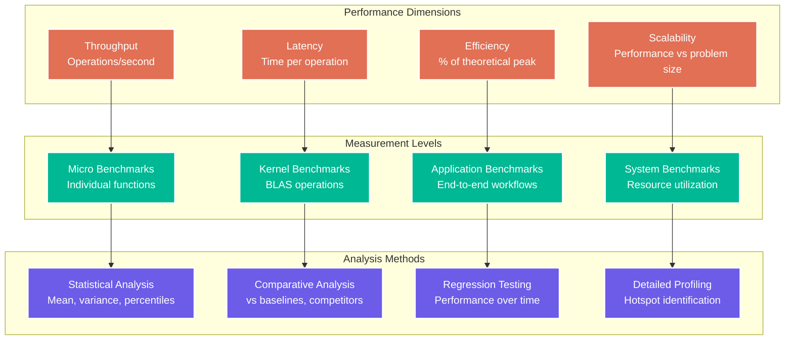

# Chapter 11: Benchmarking

> *"You can't optimize what you can't measure."* — The First Law of Performance Engineering

Benchmarking is where theory meets reality. GUDA provides comprehensive tools for measuring, analyzing, and optimizing performance across every layer of your application. This chapter will turn you into a performance measurement master!

## The GUDA Benchmarking Philosophy

Effective benchmarking requires understanding what you're measuring and why:



## Core Benchmarking Tools

### High-Precision Timing

GUDA provides multiple timing mechanisms optimized for different scenarios:

```go
// High-resolution timer for micro-benchmarks
type PrecisionTimer struct {
    start    time.Time
    samples  []time.Duration
    overhead time.Duration
}

func NewPrecisionTimer() *PrecisionTimer {
    pt := &PrecisionTimer{}
    pt.calibrateOverhead()
    return pt
}

func (pt *PrecisionTimer) calibrateOverhead() {
    // Measure timer overhead
    const calibrationRuns = 1000
    var totalOverhead time.Duration
    
    for i := 0; i < calibrationRuns; i++ {
        start := time.Now()
        _ = time.Now()
        totalOverhead += time.Since(start)
    }
    
    pt.overhead = totalOverhead / calibrationRuns
}

func (pt *PrecisionTimer) Start() {
    pt.start = time.Now()
}

func (pt *PrecisionTimer) Stop() time.Duration {
    duration := time.Since(pt.start) - pt.overhead
    pt.samples = append(pt.samples, duration)
    return duration
}

func (pt *PrecisionTimer) Statistics() BenchmarkStats {
    if len(pt.samples) == 0 {
        return BenchmarkStats{}
    }
    
    sort.Slice(pt.samples, func(i, j int) bool {
        return pt.samples[i] < pt.samples[j]
    })
    
    n := len(pt.samples)
    var total time.Duration
    for _, sample := range pt.samples {
        total += sample
    }
    
    return BenchmarkStats{
        Samples:    n,
        Mean:       total / time.Duration(n),
        Min:        pt.samples[0],
        Max:        pt.samples[n-1],
        Median:     pt.samples[n/2],
        P95:        pt.samples[int(float64(n)*0.95)],
        P99:        pt.samples[int(float64(n)*0.99)],
        StdDev:     pt.calculateStdDev(),
    }
}

type BenchmarkStats struct {
    Samples    int
    Mean       time.Duration
    Min        time.Duration
    Max        time.Duration
    Median     time.Duration
    P95        time.Duration
    P99        time.Duration
    StdDev     time.Duration
}

func (bs BenchmarkStats) String() string {
    return fmt.Sprintf(`Benchmark Statistics:
  Samples: %d
  Mean:    %v
  Median:  %v  
  Min:     %v
  Max:     %v
  P95:     %v
  P99:     %v
  StdDev:  %v`, 
        bs.Samples, bs.Mean, bs.Median, bs.Min, bs.Max, bs.P95, bs.P99, bs.StdDev)
}

// Example: Benchmarking BLAS operations
func benchmarkSgemm() {
    timer := NewPrecisionTimer()
    
    // Test different matrix sizes
    sizes := []int{64, 128, 256, 512, 1024, 2048}
    
    fmt.Println("SGEMM Benchmark Results")
    fmt.Println("=======================")
    fmt.Printf("%-8s %-12s %-12s %-12s %-10s\n", 
               "Size", "Time", "GFLOPS", "Efficiency", "Memory BW")
    
    for _, n := range sizes {
        A := guda.MallocAligned(n*n*4, 32)
        B := guda.MallocAligned(n*n*4, 32)  
        C := guda.MallocAligned(n*n*4, 32)
        defer guda.Free(A)
        defer guda.Free(B)
        defer guda.Free(C)
        
        // Fill with random data
        guda.FillRandom(A, n*n)
        guda.FillRandom(B, n*n)
        
        // Warm-up runs
        for i := 0; i < 5; i++ {
            guda.Sgemm(false, false, n, n, n, 1.0, A, n, B, n, 0.0, C, n)
        }
        
        // Benchmark runs
        const benchRuns = 100
        for i := 0; i < benchRuns; i++ {
            timer.Start()
            guda.Sgemm(false, false, n, n, n, 1.0, A, n, B, n, 0.0, C, n)
            timer.Stop()
        }
        
        stats := timer.Statistics()
        
        // Calculate performance metrics
        ops := 2.0 * float64(n*n*n) // Multiply-add operations
        gflops := ops / stats.Mean.Seconds() / 1e9
        
        // Theoretical peak (assuming 16 cores, 3.2 GHz, 8 FMA ops/cycle)
        theoreticalPeak := 16.0 * 3.2 * 8.0 // GFLOPS
        efficiency := (gflops / theoreticalPeak) * 100.0
        
        // Memory bandwidth (3 matrices read/written)
        memoryBytes := 3.0 * float64(n*n*4)
        memoryBW := memoryBytes / stats.Mean.Seconds() / 1e9
        
        fmt.Printf("%-8d %-12v %-12.2f %-12.1f%% %-10.2f GB/s\n",
                  n, stats.Mean, gflops, efficiency, memoryBW)
        
        timer.samples = nil // Reset for next size
    }
}
```

### GPU Comparison Benchmarks

Compare GUDA performance against actual GPU implementations:

```go
// Comprehensive GPU vs GUDA benchmark suite
type ComparisonBenchmark struct {
    operations []BenchmarkOperation
    results    map[string][]BenchmarkResult
}

type BenchmarkOperation struct {
    Name        string
    Setup       func() (interface{}, func()) // Returns context and cleanup
    GUDA        func(interface{}) time.Duration
    Reference   func(interface{}) time.Duration
    Validate    func(interface{}) bool
}

type BenchmarkResult struct {
    Size         int
    GUDATime     time.Duration
    ReferenceTime time.Duration
    Speedup      float64
    Relative     float64 // GUDA performance relative to reference
}

func NewComparisonBenchmark() *ComparisonBenchmark {
    return &ComparisonBenchmark{
        results: make(map[string][]BenchmarkResult),
    }
}

func (cb *ComparisonBenchmark) AddOperation(op BenchmarkOperation) {
    cb.operations = append(cb.operations, op)
}

func (cb *ComparisonBenchmark) RunAll() {
    sizes := []int{128, 256, 512, 1024, 2048, 4096}
    
    for _, op := range cb.operations {
        fmt.Printf("Benchmarking %s...\n", op.Name)
        
        for _, size := range sizes {
            result := cb.runComparison(op, size)
            cb.results[op.Name] = append(cb.results[op.Name], result)
        }
    }
}

func (cb *ComparisonBenchmark) runComparison(op BenchmarkOperation, size int) BenchmarkResult {
    context, cleanup := op.Setup()
    defer cleanup()
    
    // Warm-up
    op.GUDA(context)
    op.Reference(context)
    
    // Benchmark GUDA
    const runs = 50
    var gudaTotal time.Duration
    for i := 0; i < runs; i++ {
        gudaTotal += op.GUDA(context)
    }
    gudaAvg := gudaTotal / runs
    
    // Benchmark reference
    var refTotal time.Duration
    for i := 0; i < runs; i++ {
        refTotal += op.Reference(context)
    }
    refAvg := refTotal / runs
    
    // Validate correctness
    if !op.Validate(context) {
        fmt.Printf("WARNING: Validation failed for %s size %d\n", op.Name, size)
    }
    
    speedup := float64(refAvg) / float64(gudaAvg)
    relative := float64(gudaAvg) / float64(refAvg)
    
    return BenchmarkResult{
        Size:         size,
        GUDATime:     gudaAvg,
        ReferenceTime: refAvg,
        Speedup:      speedup,
        Relative:     relative,
    }
}

func (cb *ComparisonBenchmark) GenerateReport() {
    fmt.Println("\n" + strings.Repeat("=", 80))
    fmt.Println("GUDA vs Reference Performance Comparison")
    fmt.Println(strings.Repeat("=", 80))
    
    for opName, results := range cb.results {
        fmt.Printf("\n%s\n%s\n", opName, strings.Repeat("-", len(opName)))
        fmt.Printf("%-8s %-12s %-12s %-10s %-10s\n", 
                  "Size", "GUDA", "Reference", "Speedup", "Relative")
        
        var totalSpeedup float64
        for _, result := range results {
            fmt.Printf("%-8d %-12v %-12v %-10.2fx %-10.2f%%\n",
                      result.Size, result.GUDATime, result.ReferenceTime,
                      result.Speedup, result.Relative*100)
            totalSpeedup += result.Speedup
        }
        
        avgSpeedup := totalSpeedup / float64(len(results))
        fmt.Printf("Average speedup: %.2fx\n", avgSpeedup)
    }
}

// Example benchmark definitions
func defineSgemmBenchmark() BenchmarkOperation {
    return BenchmarkOperation{
        Name: "SGEMM (Single Precision Matrix Multiply)",
        Setup: func() (interface{}, func()) {
            const n = 1024
            A := guda.MallocAligned(n*n*4, 32)
            B := guda.MallocAligned(n*n*4, 32)
            C := guda.MallocAligned(n*n*4, 32)
            C_ref := guda.MallocAligned(n*n*4, 32)
            
            guda.FillRandom(A, n*n)
            guda.FillRandom(B, n*n)
            
            context := map[string]interface{}{
                "n": n, "A": A, "B": B, "C": C, "C_ref": C_ref,
            }
            
            cleanup := func() {
                guda.Free(A)
                guda.Free(B)
                guda.Free(C)
                guda.Free(C_ref)
            }
            
            return context, cleanup
        },
        GUDA: func(ctx interface{}) time.Duration {
            context := ctx.(map[string]interface{})
            n := context["n"].(int)
            A := context["A"].(guda.DevicePtr)
            B := context["B"].(guda.DevicePtr)
            C := context["C"].(guda.DevicePtr)
            
            start := time.Now()
            guda.Sgemm(false, false, n, n, n, 1.0, A, n, B, n, 0.0, C, n)
            return time.Since(start)
        },
        Reference: func(ctx interface{}) time.Duration {
            context := ctx.(map[string]interface{})
            n := context["n"].(int)
            A := context["A"].(guda.DevicePtr)
            B := context["B"].(guda.DevicePtr)
            C_ref := context["C_ref"].(guda.DevicePtr)
            
            start := time.Now()
            // Use reference implementation (e.g., OpenBLAS)
            referenceSgemm(false, false, n, n, n, 1.0, A, n, B, n, 0.0, C_ref, n)
            return time.Since(start)
        },
        Validate: func(ctx interface{}) bool {
            context := ctx.(map[string]interface{})
            n := context["n"].(int)
            C := context["C"].(guda.DevicePtr)
            C_ref := context["C_ref"].(guda.DevicePtr)
            
            return guda.CompareMatrices(C, C_ref, n*n, 1e-5)
        },
    }
}
```

## Memory Performance Analysis

### Cache Performance Profiling

Understanding cache behavior is crucial for optimization:

```go
// Cache performance profiler
type CacheProfiler struct {
    l1Misses    int64
    l2Misses    int64
    l3Misses    int64
    instructions int64
    cycles       int64
}

func (cp *CacheProfiler) StartProfile() {
    // Platform-specific performance counter setup
    // This would use perf events on Linux, for example
    cp.resetCounters()
}

func (cp *CacheProfiler) StopProfile() CacheStats {
    return CacheStats{
        L1Misses:     atomic.LoadInt64(&cp.l1Misses),
        L2Misses:     atomic.LoadInt64(&cp.l2Misses),
        L3Misses:     atomic.LoadInt64(&cp.l3Misses),
        Instructions: atomic.LoadInt64(&cp.instructions),
        Cycles:       atomic.LoadInt64(&cp.cycles),
    }
}

type CacheStats struct {
    L1Misses     int64
    L2Misses     int64
    L3Misses     int64
    Instructions int64
    Cycles       int64
}

func (cs CacheStats) Report() {
    ipc := float64(cs.Instructions) / float64(cs.Cycles)
    l1MissRate := float64(cs.L1Misses) / float64(cs.Instructions) * 100
    l2MissRate := float64(cs.L2Misses) / float64(cs.L1Misses) * 100
    l3MissRate := float64(cs.L3Misses) / float64(cs.L2Misses) * 100
    
    fmt.Printf("Cache Performance Analysis:\n")
    fmt.Printf("  Instructions per Cycle: %.2f\n", ipc)
    fmt.Printf("  L1 Miss Rate: %.2f%%\n", l1MissRate)
    fmt.Printf("  L2 Miss Rate: %.2f%%\n", l2MissRate)
    fmt.Printf("  L3 Miss Rate: %.2f%%\n", l3MissRate)
}

// Memory access pattern benchmark
func benchmarkMemoryPatterns() {
    profiler := &CacheProfiler{}
    
    const N = 1024 * 1024
    data := make([]float32, N)
    
    patterns := []struct {
        name string
        fn   func([]float32)
    }{
        {"Sequential Access", sequentialAccess},
        {"Strided Access (2)", func(d []float32) { stridedAccess(d, 2) }},
        {"Strided Access (8)", func(d []float32) { stridedAccess(d, 8) }},
        {"Random Access", randomAccess},
    }
    
    for _, pattern := range patterns {
        fmt.Printf("Testing %s...\n", pattern.name)
        
        profiler.StartProfile()
        pattern.fn(data)
        stats := profiler.StopProfile()
        
        fmt.Printf("  %s Results:\n", pattern.name)
        stats.Report()
        fmt.Println()
    }
}

func sequentialAccess(data []float32) {
    sum := float32(0)
    for i := 0; i < len(data); i++ {
        sum += data[i]
    }
    // Prevent optimization
    runtime.KeepAlive(sum)
}

func stridedAccess(data []float32, stride int) {
    sum := float32(0)
    for i := 0; i < len(data); i += stride {
        sum += data[i]
    }
    runtime.KeepAlive(sum)
}

func randomAccess(data []float32) {
    sum := float32(0)
    indices := make([]int, len(data))
    for i := range indices {
        indices[i] = i
    }
    
    // Shuffle indices
    rand.Shuffle(len(indices), func(i, j int) {
        indices[i], indices[j] = indices[j], indices[i]
    })
    
    for _, idx := range indices {
        sum += data[idx]
    }
    runtime.KeepAlive(sum)
}
```

### Bandwidth Measurements

Measure theoretical vs. achieved memory bandwidth:

```go
// Memory bandwidth benchmark suite
type BandwidthBenchmark struct {
    sizes      []int
    operations []BandwidthOperation
}

type BandwidthOperation struct {
    Name     string
    BytesPerElement int
    Function func(src, dst guda.DevicePtr, size int) time.Duration
}

func NewBandwidthBenchmark() *BandwidthBenchmark {
    return &BandwidthBenchmark{
        sizes: []int{
            1024,           // 4KB
            256 * 1024,     // 1MB  
            4 * 1024 * 1024,   // 16MB
            64 * 1024 * 1024,  // 256MB
            256 * 1024 * 1024, // 1GB
        },
        operations: []BandwidthOperation{
            {
                Name: "Memory Copy",
                BytesPerElement: 4,
                Function: func(src, dst guda.DevicePtr, size int) time.Duration {
                    start := time.Now()
                    guda.MemcpyDtoD(dst, src, size*4)
                    return time.Since(start)
                },
            },
            {
                Name: "Vector Scale (SAXPY)",
                BytesPerElement: 8, // Read + Write
                Function: func(src, dst guda.DevicePtr, size int) time.Duration {
                    start := time.Now()
                    guda.Sscal(size, 2.0, src, 1)
                    return time.Since(start)
                },
            },
            {
                Name: "Vector Add",
                BytesPerElement: 12, // 2 Reads + 1 Write
                Function: func(src, dst guda.DevicePtr, size int) time.Duration {
                    start := time.Now()
                    guda.Saxpy(size, 1.0, src, 1, dst, 1)
                    return time.Since(start)
                },
            },
        },
    }
}

func (bb *BandwidthBenchmark) Run() {
    fmt.Println("Memory Bandwidth Benchmark")
    fmt.Println("==========================")
    
    for _, op := range bb.operations {
        fmt.Printf("\n%s\n%s\n", op.Name, strings.Repeat("-", len(op.Name)))
        fmt.Printf("%-12s %-12s %-12s %-12s\n", "Size", "Time", "Bandwidth", "Efficiency")
        
        for _, size := range bb.sizes {
            src := guda.MallocAligned(size*4, 32)
            dst := guda.MallocAligned(size*4, 32)
            defer guda.Free(src)
            defer guda.Free(dst)
            
            // Fill with data
            guda.FillRandom(src, size)
            
            // Warm-up
            for i := 0; i < 3; i++ {
                op.Function(src, dst, size)
            }
            
            // Benchmark
            const runs = 20
            var totalTime time.Duration
            
            for i := 0; i < runs; i++ {
                totalTime += op.Function(src, dst, size)
            }
            
            avgTime := totalTime / runs
            bytesTransferred := float64(size * op.BytesPerElement)
            bandwidth := bytesTransferred / avgTime.Seconds() / 1e9
            
            // Theoretical peak bandwidth (assume 100 GB/s DDR4)
            theoreticalBW := 100.0
            efficiency := (bandwidth / theoreticalBW) * 100.0
            
            sizeStr := formatBytes(size * 4)
            fmt.Printf("%-12s %-12v %-12.2f GB/s %-12.1f%%\n",
                      sizeStr, avgTime, bandwidth, efficiency)
        }
    }
}

func formatBytes(bytes int) string {
    const (
        KB = 1024
        MB = KB * 1024
        GB = MB * 1024
    )
    
    switch {
    case bytes >= GB:
        return fmt.Sprintf("%.1fGB", float64(bytes)/GB)
    case bytes >= MB:
        return fmt.Sprintf("%.1fMB", float64(bytes)/MB)
    case bytes >= KB:
        return fmt.Sprintf("%.1fKB", float64(bytes)/KB)
    default:
        return fmt.Sprintf("%dB", bytes)
    }
}
```

## Neural Network Benchmarks

### CNN Performance Suite

Comprehensive benchmarks for computer vision workloads:

```go
// CNN benchmark suite
type CNNBenchmarkSuite struct {
    models []CNNModel
    inputs []InputConfig
}

type CNNModel struct {
    Name    string
    Layers  []LayerConfig
}

type LayerConfig struct {
    Type       string
    InputDims  [4]int // [N, C, H, W]
    OutputDims [4]int
    Params     map[string]interface{}
}

type InputConfig struct {
    BatchSize int
    Channels  int
    Height    int
    Width     int
}

func NewCNNBenchmarkSuite() *CNNBenchmarkSuite {
    return &CNNBenchmarkSuite{
        models: []CNNModel{
            createResNet18(),
            createVGG16(),
            createMobileNetV2(),
            createEfficientNetB0(),
        },
        inputs: []InputConfig{
            {1, 3, 224, 224},   // Single inference
            {8, 3, 224, 224},   // Small batch
            {32, 3, 224, 224},  // Medium batch
            {128, 3, 224, 224}, // Large batch
        },
    }
}

func (cbs *CNNBenchmarkSuite) RunInferenceBenchmarks() {
    fmt.Println("CNN Inference Benchmarks")
    fmt.Println("========================")
    
    for _, model := range cbs.models {
        fmt.Printf("\nModel: %s\n", model.Name)
        fmt.Printf("%s\n", strings.Repeat("-", len(model.Name)+7))
        
        for _, input := range cbs.inputs {
            latency, throughput := cbs.benchmarkModel(model, input)
            
            fmt.Printf("Batch %d: %.2fms latency, %.1f images/sec\n",
                      input.BatchSize, latency.Seconds()*1000, throughput)
        }
    }
}

func (cbs *CNNBenchmarkSuite) benchmarkModel(model CNNModel, input InputConfig) (time.Duration, float64) {
    // Allocate input tensor
    inputSize := input.BatchSize * input.Channels * input.Height * input.Width * 4
    inputTensor := guda.MallocAligned(inputSize, 32)
    defer guda.Free(inputTensor)
    
    // Fill with random data
    guda.FillRandom(inputTensor, inputSize/4)
    
    // Create layer implementations
    layers := make([]Layer, len(model.Layers))
    for i, layerConfig := range model.Layers {
        layers[i] = createLayer(layerConfig)
    }
    
    // Warm-up runs
    for i := 0; i < 5; i++ {
        _ = runInference(layers, inputTensor, input)
    }
    
    // Benchmark runs
    const benchRuns = 50
    start := time.Now()
    
    for i := 0; i < benchRuns; i++ {
        _ = runInference(layers, inputTensor, input)
    }
    
    totalTime := time.Since(start)
    avgLatency := totalTime / benchRuns
    throughput := float64(input.BatchSize*benchRuns) / totalTime.Seconds()
    
    return avgLatency, throughput
}

func createResNet18() CNNModel {
    return CNNModel{
        Name: "ResNet-18",
        Layers: []LayerConfig{
            {Type: "Conv2D", InputDims: [4]int{1, 3, 224, 224}, OutputDims: [4]int{1, 64, 112, 112},
             Params: map[string]interface{}{"kernel": 7, "stride": 2, "padding": 3}},
            {Type: "BatchNorm", InputDims: [4]int{1, 64, 112, 112}, OutputDims: [4]int{1, 64, 112, 112}},
            {Type: "ReLU", InputDims: [4]int{1, 64, 112, 112}, OutputDims: [4]int{1, 64, 112, 112}},
            {Type: "MaxPool2D", InputDims: [4]int{1, 64, 112, 112}, OutputDims: [4]int{1, 64, 56, 56},
             Params: map[string]interface{}{"kernel": 3, "stride": 2, "padding": 1}},
            // ... more layers would be defined here
        },
    }
}

// Layer operations benchmark
func benchmarkLayerOperations() {
    operations := []struct {
        name string
        fn   func()
    }{
        {"3x3 Convolution", func() { benchmarkConv2D(3, 3) }},
        {"1x1 Convolution", func() { benchmarkConv2D(1, 1) }},
        {"Depthwise 3x3", func() { benchmarkDepthwiseConv2D(3, 3) }},
        {"Batch Normalization", benchmarkBatchNorm},
        {"ReLU Activation", benchmarkReLU},
        {"Max Pooling", benchmarkMaxPooling},
    }
    
    fmt.Println("Layer Operation Benchmarks")
    fmt.Println("==========================")
    
    for _, op := range operations {
        fmt.Printf("Benchmarking %s...\n", op.name)
        start := time.Now()
        op.fn()
        duration := time.Since(start)
        fmt.Printf("  %s: %v\n", op.name, duration)
    }
}

func benchmarkConv2D(kernelH, kernelW int) {
    const (
        batchSize = 32
        inChannels = 64
        outChannels = 128
        height = 56
        width = 56
    )
    
    inputSize := batchSize * inChannels * height * width * 4
    weightSize := outChannels * inChannels * kernelH * kernelW * 4
    outputSize := batchSize * outChannels * height * width * 4
    
    input := guda.MallocAligned(inputSize, 32)
    weights := guda.MallocAligned(weightSize, 32)
    output := guda.MallocAligned(outputSize, 32)
    
    defer guda.Free(input)
    defer guda.Free(weights)
    defer guda.Free(output)
    
    // Fill with random data
    guda.FillRandom(input, inputSize/4)
    guda.FillRandom(weights, weightSize/4)
    
    params := guda.ConvParams{
        StrideH: 1, StrideW: 1,
        PadH: kernelH/2, PadW: kernelW/2,
        Algorithm: guda.ConvAlgoAuto,
    }
    
    // Benchmark
    const runs = 100
    start := time.Now()
    
    for i := 0; i < runs; i++ {
        guda.Conv2D(input, weights, nil, output, params)
    }
    
    duration := time.Since(start)
    avgTime := duration / runs
    
    // Calculate theoretical operations
    ops := float64(batchSize * outChannels * height * width * inChannels * kernelH * kernelW * 2)
    gflops := ops / avgTime.Seconds() / 1e9
    
    fmt.Printf("    %dx%d kernel: %v per iteration (%.2f GFLOPS)\n", 
              kernelH, kernelW, avgTime, gflops)
}
```

## Scalability Analysis

### Multi-Core Scaling Studies

Analyze how performance scales with CPU core count:

```go
// Scalability benchmark for multi-core analysis
type ScalabilityBenchmark struct {
    operation  BenchmarkOp
    maxCores   int
    problemSizes []int
}

type BenchmarkOp func(cores int, size int) (time.Duration, error)

func NewScalabilityBenchmark(op BenchmarkOp) *ScalabilityBenchmark {
    return &ScalabilityBenchmark{
        operation: op,
        maxCores:  runtime.NumCPU(),
        problemSizes: []int{1024, 2048, 4096, 8192},
    }
}

func (sb *ScalabilityBenchmark) Run() ScalabilityResults {
    results := ScalabilityResults{
        CoreCounts: make([]int, 0),
        Results:    make(map[int]map[int]ScalabilityPoint),
    }
    
    // Test different core counts
    coreCounts := []int{1, 2, 4, 8}
    if sb.maxCores > 8 {
        coreCounts = append(coreCounts, sb.maxCores)
    }
    
    results.CoreCounts = coreCounts
    
    for _, cores := range coreCounts {
        results.Results[cores] = make(map[int]ScalabilityPoint)
        
        for _, size := range sb.problemSizes {
            // Set GOMAXPROCS to limit cores
            oldMax := runtime.GOMAXPROCS(cores)
            
            // Warm-up
            sb.operation(cores, size)
            
            // Benchmark
            const runs = 10
            var totalTime time.Duration
            
            for i := 0; i < runs; i++ {
                duration, err := sb.operation(cores, size)
                if err != nil {
                    fmt.Printf("Error in benchmark: %v\n", err)
                    continue
                }
                totalTime += duration
            }
            
            avgTime := totalTime / runs
            
            // Calculate scaling metrics
            baseTime := results.getBaseTime(size)
            var speedup, efficiency float64
            
            if baseTime > 0 {
                speedup = float64(baseTime) / float64(avgTime)
                efficiency = speedup / float64(cores)
            }
            
            results.Results[cores][size] = ScalabilityPoint{
                Time:       avgTime,
                Speedup:    speedup,
                Efficiency: efficiency,
            }
            
            // Restore GOMAXPROCS
            runtime.GOMAXPROCS(oldMax)
        }
    }
    
    return results
}

type ScalabilityResults struct {
    CoreCounts []int
    Results    map[int]map[int]ScalabilityPoint
}

type ScalabilityPoint struct {
    Time       time.Duration
    Speedup    float64
    Efficiency float64
}

func (sr *ScalabilityResults) getBaseTime(size int) time.Duration {
    if baseResults, exists := sr.Results[1]; exists {
        if point, exists := baseResults[size]; exists {
            return point.Time
        }
    }
    return 0
}

func (sr *ScalabilityResults) Report() {
    fmt.Println("Scalability Analysis Report")
    fmt.Println("===========================")
    
    for _, size := range []int{1024, 2048, 4096, 8192} {
        fmt.Printf("\nProblem Size: %d\n", size)
        fmt.Printf("%-8s %-12s %-10s %-10s\n", "Cores", "Time", "Speedup", "Efficiency")
        
        for _, cores := range sr.CoreCounts {
            if results, exists := sr.Results[cores]; exists {
                if point, exists := results[size]; exists {
                    fmt.Printf("%-8d %-12v %-10.2fx %-10.1f%%\n",
                              cores, point.Time, point.Speedup, point.Efficiency*100)
                }
            }
        }
    }
    
    // Analyze scaling patterns
    sr.analyzeScalingPatterns()
}

func (sr *ScalabilityResults) analyzeScalingPatterns() {
    fmt.Println("\nScaling Pattern Analysis:")
    
    for _, size := range []int{1024, 2048, 4096, 8192} {
        maxCores := sr.CoreCounts[len(sr.CoreCounts)-1]
        
        if results, exists := sr.Results[maxCores]; exists {
            if point, exists := results[size]; exists {
                category := ""
                
                switch {
                case point.Efficiency > 0.8:
                    category = "Excellent scaling (>80% efficient)"
                case point.Efficiency > 0.6:
                    category = "Good scaling (60-80% efficient)"
                case point.Efficiency > 0.4:
                    category = "Fair scaling (40-60% efficient)"
                default:
                    category = "Poor scaling (<40% efficient)"
                }
                
                fmt.Printf("  Size %d: %s\n", size, category)
            }
        }
    }
}

// Example: GEMM scalability benchmark
func benchmarkGemmScalability() {
    gemmOp := func(cores int, size int) (time.Duration, error) {
        A := guda.MallocAligned(size*size*4, 32)
        B := guda.MallocAligned(size*size*4, 32)
        C := guda.MallocAligned(size*size*4, 32)
        
        defer guda.Free(A)
        defer guda.Free(B)
        defer guda.Free(C)
        
        guda.FillRandom(A, size*size)
        guda.FillRandom(B, size*size)
        
        start := time.Now()
        err := guda.Sgemm(false, false, size, size, size, 1.0, A, size, B, size, 0.0, C, size)
        return time.Since(start), err
    }
    
    benchmark := NewScalabilityBenchmark(gemmOp)
    results := benchmark.Run()
    results.Report()
}
```

## Regression Testing

### Performance Regression Detection

Automatically detect performance regressions:

```go
// Performance regression testing system
type RegressionTester struct {
    baselineFile string
    threshold    float64 // Acceptable regression threshold (e.g., 0.05 = 5%)
    baseline     map[string]BenchmarkBaseline
}

type BenchmarkBaseline struct {
    Mean     time.Duration `json:"mean"`
    StdDev   time.Duration `json:"stddev"`
    Samples  int           `json:"samples"`
    Version  string        `json:"version"`
    Date     time.Time     `json:"date"`
}

func NewRegressionTester(baselineFile string, threshold float64) *RegressionTester {
    rt := &RegressionTester{
        baselineFile: baselineFile,
        threshold:    threshold,
        baseline:     make(map[string]BenchmarkBaseline),
    }
    
    rt.loadBaseline()
    return rt
}

func (rt *RegressionTester) loadBaseline() {
    data, err := ioutil.ReadFile(rt.baselineFile)
    if err != nil {
        fmt.Printf("No baseline file found, starting fresh: %v\n", err)
        return
    }
    
    err = json.Unmarshal(data, &rt.baseline)
    if err != nil {
        fmt.Printf("Error loading baseline: %v\n", err)
    }
}

func (rt *RegressionTester) saveBaseline() {
    data, err := json.MarshalIndent(rt.baseline, "", "  ")
    if err != nil {
        fmt.Printf("Error marshaling baseline: %v\n", err)
        return
    }
    
    err = ioutil.WriteFile(rt.baselineFile, data, 0644)
    if err != nil {
        fmt.Printf("Error saving baseline: %v\n", err)
    }
}

func (rt *RegressionTester) RunTest(name string, benchFunc func() time.Duration) RegressionResult {
    const samples = 50
    durations := make([]time.Duration, samples)
    
    // Warm-up
    for i := 0; i < 5; i++ {
        benchFunc()
    }
    
    // Collect samples
    for i := 0; i < samples; i++ {
        durations[i] = benchFunc()
    }
    
    // Calculate statistics
    sort.Slice(durations, func(i, j int) bool {
        return durations[i] < durations[j]
    })
    
    var total time.Duration
    for _, d := range durations {
        total += d
    }
    
    mean := total / time.Duration(samples)
    
    // Calculate standard deviation
    var variance time.Duration
    for _, d := range durations {
        diff := d - mean
        variance += time.Duration(int64(diff) * int64(diff) / int64(samples))
    }
    stddev := time.Duration(math.Sqrt(float64(variance)))
    
    result := RegressionResult{
        Name:    name,
        Mean:    mean,
        StdDev:  stddev,
        Samples: samples,
        Date:    time.Now(),
    }
    
    // Compare against baseline
    if baseline, exists := rt.baseline[name]; exists {
        result.BaselineMean = baseline.Mean
        result.Change = float64(mean-baseline.Mean) / float64(baseline.Mean)
        result.IsRegression = result.Change > rt.threshold
        result.IsImprovement = result.Change < -rt.threshold/2 // Half threshold for improvements
        
        // Statistical significance test (simple z-test)
        pooledStdDev := time.Duration(math.Sqrt(
            (float64(stddev*stddev) + float64(baseline.StdDev*baseline.StdDev)) / 2))
        
        if pooledStdDev > 0 {
            zScore := float64(mean-baseline.Mean) / float64(pooledStdDev)
            result.ZScore = zScore
            result.StatisticallySignificant = math.Abs(zScore) > 1.96 // 95% confidence
        }
    } else {
        fmt.Printf("No baseline for %s, establishing new baseline\n", name)
        rt.baseline[name] = BenchmarkBaseline{
            Mean:    mean,
            StdDev:  stddev,
            Samples: samples,
            Date:    time.Now(),
        }
    }
    
    return result
}

type RegressionResult struct {
    Name                     string
    Mean                     time.Duration
    StdDev                   time.Duration
    Samples                  int
    Date                     time.Time
    BaselineMean            time.Duration
    Change                  float64
    ZScore                  float64
    IsRegression            bool
    IsImprovement           bool
    StatisticallySignificant bool
}

func (rr RegressionResult) Report() {
    fmt.Printf("=== %s ===\n", rr.Name)
    fmt.Printf("Current: %v (±%v)\n", rr.Mean, rr.StdDev)
    
    if rr.BaselineMean > 0 {
        fmt.Printf("Baseline: %v\n", rr.BaselineMean)
        fmt.Printf("Change: %+.2f%%", rr.Change*100)
        
        if rr.StatisticallySignificant {
            fmt.Printf(" (statistically significant, z=%.2f)", rr.ZScore)
        } else {
            fmt.Printf(" (not statistically significant)")
        }
        
        if rr.IsRegression {
            fmt.Printf(" ⚠️  REGRESSION DETECTED!")
        } else if rr.IsImprovement {
            fmt.Printf(" ✅ Performance improvement!")
        }
        fmt.Println()
    }
    fmt.Println()
}

// Example usage
func runRegressionTests() {
    tester := NewRegressionTester("benchmarks_baseline.json", 0.05)
    defer tester.saveBaseline()
    
    tests := map[string]func() time.Duration{
        "SGEMM_1024x1024": func() time.Duration {
            return benchmarkSgemm1024()
        },
        "Conv2D_3x3_224x224": func() time.Duration {
            return benchmarkConv2D224()
        },
        "BatchNorm_1024": func() time.Duration {
            return benchmarkBatchNorm1024()
        },
    }
    
    regressions := 0
    improvements := 0
    
    for name, benchFunc := range tests {
        result := tester.RunTest(name, benchFunc)
        result.Report()
        
        if result.IsRegression {
            regressions++
        } else if result.IsImprovement {
            improvements++
        }
    }
    
    fmt.Printf("Summary: %d regressions, %d improvements\n", regressions, improvements)
    
    if regressions > 0 {
        os.Exit(1) // Fail CI/CD pipeline
    }
}
```

## What's Next?

You now have comprehensive benchmarking capabilities for GUDA! Ready to dive deeper?

- [Case Studies](12-case-studies.md) - See real-world performance analysis examples
- [Numerical Precision](13-numerical-precision.md) - Understand accuracy vs performance tradeoffs
- [Optimization Techniques](10-optimization.md) - Apply benchmarking insights for maximum performance

Benchmarking is both an art and a science. With these tools, you can measure, analyze, and optimize with confidence. Remember: measure twice, optimize once!

---

*📊 In performance optimization, measurement is your compass and benchmarking is your map.*