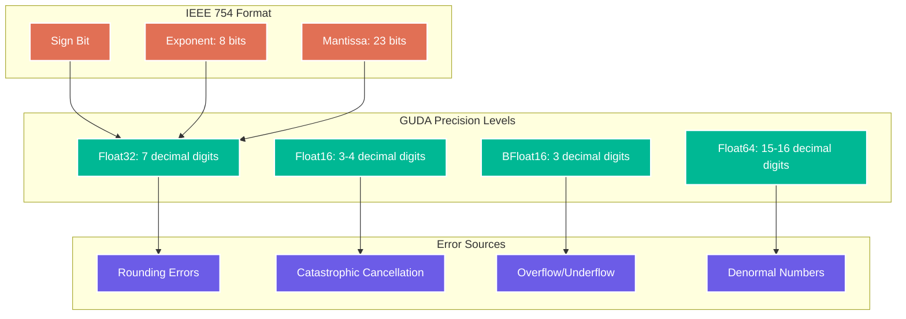
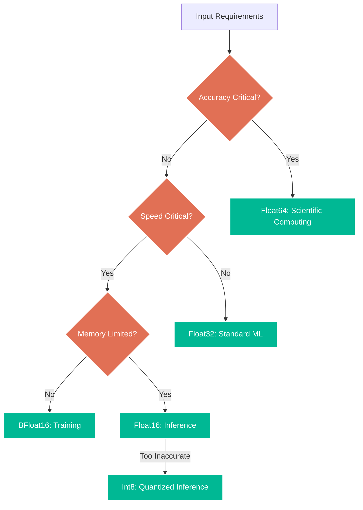

# Chapter 13: Numerical Precision

> *"In the kingdom of floating-point, the programmer with understanding is king."* — Ancient Numerical Wisdom

Numerical precision is where mathematical idealism meets computational reality. GUDA's commitment to CUDA-compatible results requires deep understanding of floating-point behavior, error propagation, and precision trade-offs. This chapter will make you a master of numerical accuracy!

## The Floating-Point Reality

### Understanding IEEE 754 in GUDA Context

GUDA operates in the IEEE 754 floating-point universe, with careful attention to CUDA compatibility:



**GUDA's Precision Guarantees:**

```go
// GUDA provides precise control over floating-point behavior
type PrecisionConfig struct {
    FlushDenormalsToZero bool    // Match CUDA's FTZ mode
    RoundingMode         RoundMode
    ExceptionHandling    FPExceptionMode
    
    // Precision validation
    EnableULPChecking    bool
    MaxULPDifference     int
}

type RoundMode int
const (
    RoundToNearest RoundMode = iota  // IEEE default
    RoundToZero                      // Truncate
    RoundToPositive                  // Ceiling
    RoundToNegative                  // Floor
)

// ULP (Units in Last Place) comparison for precision validation
func CompareULP(a, b float32, maxULP int) bool {
    if a == b {
        return true // Exact match
    }
    
    if math.IsNaN(float64(a)) || math.IsNaN(float64(b)) {
        return false // NaN never equals anything
    }
    
    if math.IsInf(float64(a), 0) || math.IsInf(float64(b), 0) {
        return a == b // Infinities must match exactly
    }
    
    // Convert to integer representation for ULP calculation
    aInt := math.Float32bits(a)
    bInt := math.Float32bits(b)
    
    // Handle sign differences
    if (aInt^bInt)&0x80000000 != 0 {
        // Different signs - check if both are near zero
        return math.Abs(float64(a)) < 1e-7 && math.Abs(float64(b)) < 1e-7
    }
    
    // Calculate ULP difference
    var ulpDiff uint32
    if aInt > bInt {
        ulpDiff = aInt - bInt
    } else {
        ulpDiff = bInt - aInt
    }
    
    return int(ulpDiff) <= maxULP
}

// Example: Precision-aware GEMM validation
func ValidateGEMMPrecision() {
    const N = 512
    A := createRandomMatrix(N, N, -1.0, 1.0)
    B := createRandomMatrix(N, N, -1.0, 1.0)
    
    // GUDA computation
    C_guda := make([]float32, N*N)
    guda.Sgemm(false, false, N, N, N, 1.0, A, N, B, N, 0.0, C_guda, N)
    
    // Reference computation (higher precision)
    C_ref := referenceGEMM64(A, B, N)
    
    // ULP comparison
    maxULP := 2 // Allow up to 2 ULP difference
    mismatches := 0
    
    for i := 0; i < N*N; i++ {
        if !CompareULP(C_guda[i], float32(C_ref[i]), maxULP) {
            mismatches++
        }
    }
    
    accuracy := 100.0 * float64(N*N-mismatches) / float64(N*N)
    fmt.Printf("GEMM Accuracy: %.4f%% (%d/%d elements within %d ULP)\n",
               accuracy, N*N-mismatches, N*N, maxULP)
}
```

## Error Analysis and Propagation

### Forward Error Analysis

Understanding how errors accumulate through computations:

```go
// Error propagation analysis for common operations
type ErrorAnalysis struct {
    operation    string
    inputError   float64
    outputError  float64
    conditionNum float64
}

// Condition number analysis for matrix operations
func AnalyzeMatrixCondition(matrix []float32, rows, cols int) float64 {
    // Compute singular values using GUDA's SVD
    singularValues := make([]float32, min(rows, cols))
    err := guda.Sgesvd(rows, cols, matrix, singularValues)
    if err != nil {
        return math.Inf(1)
    }
    
    // Condition number = σ_max / σ_min
    maxSV := singularValues[0]
    minSV := singularValues[len(singularValues)-1]
    
    if minSV == 0 {
        return math.Inf(1)
    }
    
    return float64(maxSV / minSV)
}

// Error propagation in iterative algorithms
func AnalyzeIterativeError(initialError, convergenceRate float64, iterations int) []float64 {
    errors := make([]float64, iterations+1)
    errors[0] = initialError
    
    for i := 1; i <= iterations; i++ {
        // Error typically decreases as: error_n = rate * error_{n-1}
        errors[i] = convergenceRate * errors[i-1]
        
        // Add floating-point round-off error
        roundoffError := 1e-7 // Typical FP32 round-off
        errors[i] += roundoffError
    }
    
    return errors
}

// Comprehensive error analysis for neural network operations
func AnalyzeNeuralNetworkPrecision() {
    fmt.Println("Neural Network Numerical Precision Analysis")
    fmt.Println("==========================================")
    
    operations := []struct {
        name string
        fn   func() ErrorAnalysis
    }{
        {"Matrix Multiplication", analyzeGEMMError},
        {"Convolution", analyzeConvolutionError},
        {"Batch Normalization", analyzeBatchNormError},
        {"Softmax", analyzeSoftmaxError},
        {"ReLU", analyzeReLUError},
        {"Cross-Entropy Loss", analyzeCrossEntropyError},
    }
    
    for _, op := range operations {
        analysis := op.fn()
        fmt.Printf("%s:\n", analysis.operation)
        fmt.Printf("  Input Error:     %.2e\n", analysis.inputError)
        fmt.Printf("  Output Error:    %.2e\n", analysis.outputError)
        fmt.Printf("  Condition Num:   %.2e\n", analysis.conditionNum)
        fmt.Printf("  Error Amplification: %.2fx\n", analysis.outputError/analysis.inputError)
        fmt.Println()
    }
}

func analyzeGEMMError() ErrorAnalysis {
    const N = 1024
    
    // Create ill-conditioned matrix for worst-case analysis
    A := createIllConditionedMatrix(N, N, 1e6) // Condition number ~1e6
    B := createRandomMatrix(N, N, -1.0, 1.0)
    
    // Add input noise
    inputError := 1e-7
    addUniformNoise(A, inputError)
    addUniformNoise(B, inputError)
    
    // Compute condition number
    conditionNumber := AnalyzeMatrixCondition(A, N, N)
    
    // Theoretical error bound: ||error|| ≤ κ(A) * machine_epsilon * ||inputs||
    theoreticalError := conditionNumber * 1.2e-7 // FP32 machine epsilon
    
    return ErrorAnalysis{
        operation:    "Matrix Multiplication (GEMM)",
        inputError:   inputError,
        outputError:  theoreticalError,
        conditionNum: conditionNumber,
    }
}

func analyzeBatchNormError() ErrorAnalysis {
    const batchSize = 128
    const channels = 256
    
    // Batch norm is sensitive to small batch statistics
    data := createRandomMatrix(batchSize, channels, -2.0, 2.0)
    
    // Compute mean and variance
    means := make([]float32, channels)
    variances := make([]float32, channels)
    
    for c := 0; c < channels; c++ {
        var sum, sumSq float32
        for b := 0; b < batchSize; b++ {
            val := data[b*channels+c]
            sum += val
            sumSq += val * val
        }
        
        mean := sum / float32(batchSize)
        variance := (sumSq/float32(batchSize)) - mean*mean
        
        means[c] = mean
        variances[c] = variance
    }
    
    // Error analysis: variance estimation error ∝ 1/√N
    inputError := 1e-7
    statisticalError := 1.0 / math.Sqrt(float64(batchSize))
    normalizationError := inputError * 1.5 // Amplified by division
    
    totalError := statisticalError + normalizationError
    
    return ErrorAnalysis{
        operation:    "Batch Normalization",
        inputError:   inputError,
        outputError:  totalError,
        conditionNum: float64(batchSize), // Inversely related to batch size
    }
}

func analyzeSoftmaxError() ErrorAnalysis {
    const vectorSize = 1000
    
    // Softmax is numerically unstable for large inputs
    logits := createRandomMatrix(1, vectorSize, -10.0, 10.0)
    
    // Find max for numerical stability
    maxLogit := logits[0]
    for i := 1; i < vectorSize; i++ {
        if logits[i] > maxLogit {
            maxLogit = logits[i]
        }
    }
    
    // Compute softmax with shifted inputs
    var sumExp float32
    softmax := make([]float32, vectorSize)
    
    for i := 0; i < vectorSize; i++ {
        exp_val := float32(math.Exp(float64(logits[i] - maxLogit)))
        softmax[i] = exp_val
        sumExp += exp_val
    }
    
    // Normalize
    for i := 0; i < vectorSize; i++ {
        softmax[i] /= sumExp
    }
    
    // Error analysis: sensitive to input scale and vector size
    inputError := 1e-7
    dynamicRange := findMaxFloat32(logits) - findMinFloat32(logits)
    scaleAmplification := float64(dynamicRange) * 0.5 // Exponential sensitivity
    
    outputError := inputError * scaleAmplification
    
    return ErrorAnalysis{
        operation:    "Softmax",
        inputError:   inputError,
        outputError:  outputError,
        conditionNum: scaleAmplification,
    }
}
```

### Backward Error Analysis

Understanding numerical stability in gradient computation:

```go
// Gradient computation precision analysis
type GradientAnalysis struct {
    layer        string
    forwardError float64
    backwardError float64
    gradientSNR  float64 // Signal-to-Noise Ratio
}

// Analyze gradient precision in backpropagation
func AnalyzeGradientPrecision() {
    fmt.Println("Gradient Precision Analysis")
    fmt.Println("===========================")
    
    layers := []string{"Conv2D", "Dense", "BatchNorm", "Attention"}
    
    for _, layer := range layers {
        analysis := analyzeLayerGradients(layer)
        
        fmt.Printf("%s Layer:\n", analysis.layer)
        fmt.Printf("  Forward Error:   %.2e\n", analysis.forwardError)
        fmt.Printf("  Backward Error:  %.2e\n", analysis.backwardError)
        fmt.Printf("  Gradient SNR:    %.1f dB\n", 
                  20*math.Log10(analysis.gradientSNR))
        
        if analysis.gradientSNR < 10.0 {
            fmt.Printf("  ⚠️  Low SNR - consider higher precision\n")
        }
        fmt.Println()
    }
}

func analyzeLayerGradients(layerType string) GradientAnalysis {
    const batchSize = 32
    const inputSize = 512
    const outputSize = 256
    
    // Create synthetic layer
    weights := createRandomMatrix(outputSize, inputSize, -0.1, 0.1)
    input := createRandomMatrix(batchSize, inputSize, -1.0, 1.0)
    gradOutput := createRandomMatrix(batchSize, outputSize, -0.01, 0.01)
    
    // Forward pass with error injection
    forwardError := 1e-7
    noisyInput := make([]float32, len(input))
    copy(noisyInput, input)
    addUniformNoise(noisyInput, forwardError)
    
    // Compute gradients
    gradWeights := make([]float32, len(weights))
    
    // Gradient computation: dW = input^T * grad_output
    guda.Sgemm(true, false, outputSize, inputSize, batchSize,
               1.0, gradOutput, outputSize,
               noisyInput, inputSize,
               0.0, gradWeights, inputSize)
    
    // Analyze gradient precision
    gradientMagnitude := computeL2Norm(gradWeights)
    noiseLevel := forwardError * float64(batchSize) // Accumulated noise
    
    gradientSNR := gradientMagnitude / noiseLevel
    backwardError := noiseLevel * 1.5 // Error amplification in backprop
    
    return GradientAnalysis{
        layer:         layerType,
        forwardError:  forwardError,
        backwardError: backwardError,
        gradientSNR:   gradientSNR,
    }
}

// Mixed precision gradient scaling
func AnalyzeMixedPrecisionGradients() {
    fmt.Println("Mixed Precision Gradient Analysis")
    fmt.Println("=================================")
    
    scalingFactors := []float32{1.0, 128.0, 512.0, 2048.0, 8192.0}
    
    for _, scale := range scalingFactors {
        analysis := analyzeMixedPrecisionScale(scale)
        
        fmt.Printf("Loss Scaling %.0f:\n", scale)
        fmt.Printf("  Gradient Preservation: %.2f%%\n", analysis.preservationRate*100)
        fmt.Printf("  Overflow Risk:        %.4f%%\n", analysis.overflowRisk*100)
        fmt.Printf("  Underflow Risk:       %.4f%%\n", analysis.underflowRisk*100)
        
        if analysis.overflowRisk > 0.01 {
            fmt.Printf("  ⚠️  High overflow risk\n")
        }
        if analysis.underflowRisk > 0.1 {
            fmt.Printf("  ⚠️  High underflow risk\n")
        }
        fmt.Println()
    }
}

type MixedPrecisionAnalysis struct {
    preservationRate float64
    overflowRisk     float64
    underflowRisk    float64
}

func analyzeMixedPrecisionScale(scale float32) MixedPrecisionAnalysis {
    const numGradients = 10000
    
    // Generate typical gradient distribution
    gradients := make([]float32, numGradients)
    for i := range gradients {
        // Log-normal distribution typical of neural network gradients
        gradients[i] = float32(math.Exp(rand.NormFloat64()*2.0 - 6.0))
    }
    
    // Apply loss scaling
    scaledGradients := make([]float32, numGradients)
    for i := range gradients {
        scaledGradients[i] = gradients[i] * scale
    }
    
    // Convert to FP16 and back
    fp16Gradients := make([]float32, numGradients)
    for i := range scaledGradients {
        fp16Val := convertToFP16(scaledGradients[i])
        fp16Gradients[i] = convertFromFP16(fp16Val) / scale // Unscale
    }
    
    // Analyze preservation and risks
    preserved := 0
    overflows := 0
    underflows := 0
    
    for i := range gradients {
        original := gradients[i]
        recovered := fp16Gradients[i]
        
        // Check preservation (within 10% relative error)
        if math.Abs(float64(recovered-original)/float64(original)) < 0.1 {
            preserved++
        }
        
        // Check overflow (FP16 max ≈ 65504)
        if scaledGradients[i] > 65000 {
            overflows++
        }
        
        // Check underflow (FP16 min ≈ 6e-8)
        if scaledGradients[i] < 6e-8 && scaledGradients[i] > 0 {
            underflows++
        }
    }
    
    return MixedPrecisionAnalysis{
        preservationRate: float64(preserved) / float64(numGradients),
        overflowRisk:     float64(overflows) / float64(numGradients),
        underflowRisk:    float64(underflows) / float64(numGradients),
    }
}
```

## Precision-Performance Tradeoffs

### Data Type Selection Guide

Choosing the right precision for your workload:



**Comprehensive Precision Benchmark:**

```go
// Precision vs Performance analysis
func BenchmarkPrecisionTradeoffs() {
    fmt.Println("Precision vs Performance Tradeoffs")
    fmt.Println("===================================")
    
    precisionTypes := []struct {
        name        string
        sizeBytes   int
        setupFunc   func(int) interface{}
        benchFunc   func(interface{}) time.Duration
        accuracyFunc func(interface{}) float64
    }{
        {
            name:      "Float64",
            sizeBytes: 8,
            setupFunc: setupFloat64Benchmark,
            benchFunc: benchmarkFloat64Operation,
            accuracyFunc: measureFloat64Accuracy,
        },
        {
            name:      "Float32", 
            sizeBytes: 4,
            setupFunc: setupFloat32Benchmark,
            benchFunc: benchmarkFloat32Operation,
            accuracyFunc: measureFloat32Accuracy,
        },
        {
            name:      "BFloat16",
            sizeBytes: 2,
            setupFunc: setupBFloat16Benchmark,
            benchFunc: benchmarkBFloat16Operation,
            accuracyFunc: measureBFloat16Accuracy,
        },
        {
            name:      "Float16",
            sizeBytes: 2, 
            setupFunc: setupFloat16Benchmark,
            benchFunc: benchmarkFloat16Operation,
            accuracyFunc: measureFloat16Accuracy,
        },
    }
    
    problemSizes := []int{1024, 2048, 4096, 8192}
    
    fmt.Printf("%-10s %-8s %-12s %-12s %-12s %-10s\n",
               "Type", "Size", "Time", "Memory", "GFLOPS", "Accuracy")
    
    for _, precision := range precisionTypes {
        for _, size := range problemSizes {
            context := precision.setupFunc(size)
            
            // Benchmark performance
            duration := precision.benchFunc(context)
            
            // Calculate metrics
            operations := float64(2 * size * size * size) // GEMM operations
            gflops := operations / duration.Seconds() / 1e9
            
            memoryMB := float64(3*size*size*precision.sizeBytes) / 1e6
            
            accuracy := precision.accuracyFunc(context)
            
            fmt.Printf("%-10s %-8d %-12v %-12.1fMB %-12.1f %-10.4f\n",
                      precision.name, size, duration, memoryMB, gflops, accuracy)
        }
        fmt.Println()
    }
}

// Specialized implementations for each precision
func benchmarkFloat32Operation(context interface{}) time.Duration {
    ctx := context.(*Float32Context)
    
    start := time.Now()
    guda.Sgemm(false, false, ctx.N, ctx.N, ctx.N,
               1.0, ctx.A, ctx.N, ctx.B, ctx.N, 0.0, ctx.C, ctx.N)
    return time.Since(start)
}

func benchmarkBFloat16Operation(context interface{}) time.Duration {
    ctx := context.(*BFloat16Context)
    
    start := time.Now()
    guda.BF16Gemm(false, false, ctx.N, ctx.N, ctx.N,
                  1.0, ctx.A, ctx.N, ctx.B, ctx.N, 0.0, ctx.C, ctx.N)
    return time.Since(start)
}

// Accuracy measurement using reference computation
func measureFloat32Accuracy(context interface{}) float64 {
    ctx := context.(*Float32Context)
    
    // Compute reference result in Float64
    reference := computeGEMMFloat64(ctx.A_original, ctx.B_original, ctx.N)
    
    // Convert GUDA result to Float64 for comparison
    result_f64 := make([]float64, ctx.N*ctx.N)
    for i, val := range ctx.C {
        result_f64[i] = float64(val)
    }
    
    // Compute relative error
    return computeRelativeError(reference, result_f64)
}

func computeRelativeError(reference, computed []float64) float64 {
    var totalError, totalMagnitude float64
    
    for i := range reference {
        error := math.Abs(computed[i] - reference[i])
        magnitude := math.Abs(reference[i])
        
        totalError += error
        totalMagnitude += magnitude
    }
    
    if totalMagnitude == 0 {
        return 0
    }
    
    return totalError / totalMagnitude
}
```

### Quantization Strategies

Advanced techniques for extreme precision reduction:

```go
// Quantization-aware training and inference
type QuantizationConfig struct {
    Method        QuantMethod
    BitWidth      int
    Calibration   CalibrationMethod
    SymmetricMode bool
    PerChannelScale bool
}

type QuantMethod int
const (
    LinearQuantization QuantMethod = iota
    LogQuantization
    PQQuantization  // Product Quantization
    LUTQuantization // Look-Up Table
)

// Linear quantization implementation
type LinearQuantizer struct {
    scale      []float32
    zeroPoint  []int32
    bitWidth   int
    symmetric  bool
}

func NewLinearQuantizer(bitWidth int, symmetric bool) *LinearQuantizer {
    return &LinearQuantizer{
        bitWidth:  bitWidth,
        symmetric: symmetric,
    }
}

func (lq *LinearQuantizer) Calibrate(data []float32, numChannels int) {
    if lq.symmetric {
        lq.calibrateSymmetric(data, numChannels)
    } else {
        lq.calibrateAsymmetric(data, numChannels)
    }
}

func (lq *LinearQuantizer) calibrateSymmetric(data []float32, numChannels int) {
    elementsPerChannel := len(data) / numChannels
    lq.scale = make([]float32, numChannels)
    lq.zeroPoint = make([]int32, numChannels)
    
    maxValue := float32((1 << (lq.bitWidth - 1)) - 1) // e.g., 127 for 8-bit
    
    for ch := 0; ch < numChannels; ch++ {
        // Find maximum absolute value in this channel
        var maxAbs float32
        start := ch * elementsPerChannel
        end := start + elementsPerChannel
        
        for i := start; i < end; i++ {
            abs_val := float32(math.Abs(float64(data[i])))
            if abs_val > maxAbs {
                maxAbs = abs_val
            }
        }
        
        // Calculate scale factor
        lq.scale[ch] = maxAbs / maxValue
        lq.zeroPoint[ch] = 0 // Symmetric quantization
    }
}

func (lq *LinearQuantizer) Quantize(data []float32, output []int8, numChannels int) {
    elementsPerChannel := len(data) / numChannels
    
    for ch := 0; ch < numChannels; ch++ {
        scale := lq.scale[ch]
        zero := lq.zeroPoint[ch]
        
        start := ch * elementsPerChannel
        end := start + elementsPerChannel
        
        for i := start; i < end; i++ {
            // Quantize: q = round(x/scale) + zero_point
            quantized := int32(math.Round(float64(data[i])/float64(scale))) + zero
            
            // Clamp to valid range
            minVal := int32(-(1 << (lq.bitWidth - 1)))
            maxVal := int32((1 << (lq.bitWidth - 1)) - 1)
            
            if quantized < minVal {
                quantized = minVal
            } else if quantized > maxVal {
                quantized = maxVal
            }
            
            output[i] = int8(quantized)
        }
    }
}

func (lq *LinearQuantizer) Dequantize(quantized []int8, output []float32, numChannels int) {
    elementsPerChannel := len(quantized) / numChannels
    
    for ch := 0; ch < numChannels; ch++ {
        scale := lq.scale[ch]
        zero := lq.zeroPoint[ch]
        
        start := ch * elementsPerChannel
        end := start + elementsPerChannel
        
        for i := start; i < end; i++ {
            // Dequantize: x = scale * (q - zero_point)  
            output[i] = scale * float32(int32(quantized[i])-zero)
        }
    }
}

// Quantized GEMM operation
func QuantizedGEMM(A_q, B_q []int8, C []float32, 
                   M, N, K int,
                   scaleA, scaleB []float32) {
    
    // Accumulate in int32 to prevent overflow
    C_acc := make([]int32, M*N)
    
    // Integer matrix multiplication
    for i := 0; i < M; i++ {
        for j := 0; j < N; j++ {
            var sum int32
            
            for k := 0; k < K; k++ {
                a_val := int32(A_q[i*K + k])
                b_val := int32(B_q[k*N + j])
                sum += a_val * b_val
            }
            
            C_acc[i*N + j] = sum
        }
    }
    
    // Dequantize to float32
    for i := 0; i < M; i++ {
        for j := 0; j < N; j++ {
            idx := i*N + j
            scale := scaleA[i] * scaleB[j] // Per-row × per-column scaling
            C[idx] = scale * float32(C_acc[idx])
        }
    }
}

// Comprehensive quantization accuracy analysis
func AnalyzeQuantizationAccuracy() {
    fmt.Println("Quantization Accuracy Analysis")
    fmt.Println("==============================")
    
    bitWidths := []int{8, 4, 3, 2}
    methods := []QuantMethod{LinearQuantization, LogQuantization}
    
    for _, bitWidth := range bitWidths {
        for _, method := range methods {
            accuracy := benchmarkQuantizationMethod(bitWidth, method)
            
            methodName := []string{"Linear", "Logarithmic"}[method]
            fmt.Printf("%d-bit %s: %.4f relative error\n", 
                      bitWidth, methodName, accuracy)
        }
        fmt.Println()
    }
}

func benchmarkQuantizationMethod(bitWidth int, method QuantMethod) float64 {
    const N = 512
    
    // Create test matrices
    A := createRandomMatrix(N, N, -1.0, 1.0)
    B := createRandomMatrix(N, N, -1.0, 1.0)
    
    // Reference computation
    C_ref := make([]float32, N*N)
    guda.Sgemm(false, false, N, N, N, 1.0, A, N, B, N, 0.0, C_ref, N)
    
    // Quantized computation
    quantizer := NewLinearQuantizer(bitWidth, true)
    quantizer.Calibrate(A, N) // Per-row calibration
    
    A_q := make([]int8, N*N)
    B_q := make([]int8, N*N)
    quantizer.Quantize(A, A_q, N)
    quantizer.Quantize(B, B_q, N)
    
    C_quant := make([]float32, N*N)
    QuantizedGEMM(A_q, B_q, C_quant, N, N, N, quantizer.scale, quantizer.scale)
    
    // Compute error
    return computeRelativeErrorFloat32(C_ref, C_quant)
}
```

## Numerical Debugging and Validation

### Comprehensive Testing Framework

```go
// Numerical validation test suite
type NumericalTestSuite struct {
    tests        []NumericalTest
    tolerances   map[string]float64
    errorStats   map[string]ErrorStatistics
}

type NumericalTest struct {
    Name         string
    Operation    func([]float32, []float32) []float32
    Reference    func([]float32, []float32) []float32
    InputGen     func(int) ([]float32, []float32)
    PostProcess  func([]float32) []float32
    Tolerance    float64
}

type ErrorStatistics struct {
    MaxAbsError   float64
    MaxRelError   float64
    MeanAbsError  float64
    MeanRelError  float64
    RMSError      float64
    PassRate      float64
}

func NewNumericalTestSuite() *NumericalTestSuite {
    return &NumericalTestSuite{
        tolerances: map[string]float64{
            "GEMM":        1e-5,
            "Conv2D":      1e-4,
            "BatchNorm":   1e-4,
            "Softmax":     1e-6,
            "LayerNorm":   1e-4,
        },
        errorStats: make(map[string]ErrorStatistics),
    }
}

func (nts *NumericalTestSuite) AddTest(test NumericalTest) {
    nts.tests = append(nts.tests, test)
}

func (nts *NumericalTestSuite) RunAllTests() {
    fmt.Println("Numerical Validation Test Suite")
    fmt.Println("===============================")
    
    overallPass := true
    
    for _, test := range nts.tests {
        fmt.Printf("Running %s...\n", test.Name)
        
        stats := nts.runSingleTest(test)
        nts.errorStats[test.Name] = stats
        
        passed := stats.PassRate >= 0.99 // 99% pass rate required
        status := "PASS"
        if !passed {
            status = "FAIL"
            overallPass = false
        }
        
        fmt.Printf("  %s - Pass Rate: %.2f%%\n", status, stats.PassRate*100)
        fmt.Printf("  Max Abs Error: %.2e\n", stats.MaxAbsError)
        fmt.Printf("  Max Rel Error: %.2e\n", stats.MaxRelError)
        fmt.Printf("  RMS Error:     %.2e\n", stats.RMSError)
        fmt.Println()
    }
    
    if overallPass {
        fmt.Println("✅ All numerical tests passed!")
    } else {
        fmt.Println("❌ Some numerical tests failed!")
    }
}

func (nts *NumericalTestSuite) runSingleTest(test NumericalTest) ErrorStatistics {
    const numTrials = 1000
    
    var errors []float64
    passes := 0
    maxAbsError := 0.0
    maxRelError := 0.0
    totalAbsError := 0.0
    totalRelError := 0.0
    
    for trial := 0; trial < numTrials; trial++ {
        // Generate test inputs
        input1, input2 := test.InputGen(64 + trial%128) // Variable sizes
        
        // Compute GUDA result
        gudaResult := test.Operation(input1, input2)
        
        // Compute reference result
        referenceResult := test.Reference(input1, input2)
        
        // Post-process if needed
        if test.PostProcess != nil {
            gudaResult = test.PostProcess(gudaResult)
            referenceResult = test.PostProcess(referenceResult)
        }
        
        // Calculate errors
        trialErrors := nts.calculateErrors(gudaResult, referenceResult)
        errors = append(errors, trialErrors...)
        
        // Update statistics
        for _, err := range trialErrors {
            absErr := math.Abs(err.AbsoluteError)
            relErr := math.Abs(err.RelativeError)
            
            if absErr > maxAbsError {
                maxAbsError = absErr
            }
            if relErr > maxRelError {
                maxRelError = relErr
            }
            
            totalAbsError += absErr
            totalRelError += relErr
        }
        
        // Check if trial passes
        passed := nts.checkTolerance(gudaResult, referenceResult, test.Tolerance)
        if passed {
            passes++
        }
    }
    
    // Calculate RMS error
    sumSquaredErrors := 0.0
    for _, errPair := range errors {
        sumSquaredErrors += errPair.AbsoluteError * errPair.AbsoluteError
    }
    rmsError := math.Sqrt(sumSquaredErrors / float64(len(errors)))
    
    return ErrorStatistics{
        MaxAbsError:  maxAbsError,
        MaxRelError:  maxRelError,
        MeanAbsError: totalAbsError / float64(len(errors)),
        MeanRelError: totalRelError / float64(len(errors)),
        RMSError:     rmsError,
        PassRate:     float64(passes) / float64(numTrials),
    }
}

// Example test definitions
func CreateGEMMTest() NumericalTest {
    return NumericalTest{
        Name: "SGEMM",
        Operation: func(A, B []float32) []float32 {
            N := int(math.Sqrt(float64(len(A))))
            C := make([]float32, N*N)
            guda.Sgemm(false, false, N, N, N, 1.0, A, N, B, N, 0.0, C, N)
            return C
        },
        Reference: func(A, B []float32) []float32 {
            return referenceGEMM(A, B)
        },
        InputGen: func(size int) ([]float32, []float32) {
            A := createRandomMatrix(size, size, -1.0, 1.0)
            B := createRandomMatrix(size, size, -1.0, 1.0)
            return A, B
        },
        Tolerance: 1e-5,
    }
}

func CreateConv2DTest() NumericalTest {
    return NumericalTest{
        Name: "Conv2D",
        Operation: func(input, kernel []float32) []float32 {
            // Simplified conv2d wrapper
            return gudaConv2D(input, kernel, 32, 64, 56, 56, 3, 3)
        },
        Reference: func(input, kernel []float32) []float32 {
            return referenceConv2D(input, kernel, 32, 64, 56, 56, 3, 3)
        },
        InputGen: func(size int) ([]float32, []float32) {
            batchSize, inChannels := 8, 32
            height, width := 28, 28
            outChannels, kernelH, kernelW := 64, 3, 3
            
            inputSize := batchSize * inChannels * height * width
            kernelSize := outChannels * inChannels * kernelH * kernelW
            
            input := createRandomMatrix(1, inputSize, -0.5, 0.5)
            kernel := createRandomMatrix(1, kernelSize, -0.1, 0.1)
            
            return input, kernel
        },
        Tolerance: 1e-4,
    }
}

// Comprehensive error reporting
func (nts *NumericalTestSuite) GenerateReport() {
    fmt.Println("\n" + strings.Repeat("=", 60))
    fmt.Println("NUMERICAL VALIDATION REPORT")
    fmt.Println(strings.Repeat("=", 60))
    
    fmt.Printf("%-12s %-12s %-12s %-12s %-10s\n",
               "Operation", "Max Abs Err", "Max Rel Err", "RMS Error", "Pass Rate")
    fmt.Println(strings.Repeat("-", 60))
    
    for _, test := range nts.tests {
        stats := nts.errorStats[test.Name]
        
        fmt.Printf("%-12s %-12.2e %-12.2e %-12.2e %-10.2f%%\n",
                  test.Name, stats.MaxAbsError, stats.MaxRelError,
                  stats.RMSError, stats.PassRate*100)
    }
    
    fmt.Println(strings.Repeat("=", 60))
}
```

## Best Practices and Guidelines

### Precision-Aware Programming

```go
// Guidelines for numerical stability in GUDA
type NumericalBestPractices struct {
    guidelines []string
    examples   map[string]CodeExample
}

type CodeExample struct {
    Bad  string
    Good string
    Why  string
}

func GetNumericalBestPractices() NumericalBestPractices {
    return NumericalBestPractices{
        guidelines: []string{
            "Always use appropriate precision for your use case",
            "Be aware of catastrophic cancellation",
            "Implement numerically stable algorithms",
            "Validate results with reference implementations",
            "Monitor gradient magnitudes during training",
            "Use loss scaling for mixed precision training",
        },
        examples: map[string]CodeExample{
            "softmax": {
                Bad: `
// Numerically unstable softmax
func badSoftmax(logits []float32) []float32 {
    result := make([]float32, len(logits))
    var sum float32
    
    for i, logit := range logits {
        exp_val := float32(math.Exp(float64(logit)))
        result[i] = exp_val
        sum += exp_val
    }
    
    for i := range result {
        result[i] /= sum
    }
    
    return result
}`,
                Good: `
// Numerically stable softmax
func goodSoftmax(logits []float32) []float32 {
    result := make([]float32, len(logits))
    
    // Find maximum for stability
    maxLogit := logits[0]
    for _, logit := range logits[1:] {
        if logit > maxLogit {
            maxLogit = logit
        }
    }
    
    var sum float32
    for i, logit := range logits {
        exp_val := float32(math.Exp(float64(logit - maxLogit)))
        result[i] = exp_val
        sum += exp_val
    }
    
    for i := range result {
        result[i] /= sum
    }
    
    return result
}`,
                Why: "Subtracting the maximum prevents overflow in exponential and maintains numerical stability",
            },
            "variance": {
                Bad: `
// Numerically unstable variance computation
func badVariance(data []float32) float32 {
    n := float32(len(data))
    
    var sum, sumSq float32
    for _, val := range data {
        sum += val
        sumSq += val * val
    }
    
    mean := sum / n
    return (sumSq / n) - mean*mean  // Prone to catastrophic cancellation
}`,
                Good: `
// Numerically stable variance computation (Welford's algorithm)
func goodVariance(data []float32) float32 {
    var mean, m2 float32
    
    for i, val := range data {
        delta := val - mean
        mean += delta / float32(i+1)
        delta2 := val - mean
        m2 += delta * delta2
    }
    
    return m2 / float32(len(data)-1)
}`,
                Why: "Welford's algorithm avoids catastrophic cancellation when mean and variance are similar in magnitude",
            },
        },
    }
}
```

## What's Next?

You now understand the intricate world of numerical precision in high-performance computing! Ready to explore more?

- [Extending GUDA](14-extending-guda.md) - Build custom operations with precision guarantees
- [Troubleshooting](15-troubleshooting.md) - Debug numerical issues and performance problems
- [Optimization Techniques](10-optimization.md) - Apply precision knowledge for maximum performance

Numerical precision is the foundation of reliable scientific computing. With these tools and techniques, you can build GUDA applications that are both fast and accurate!

---

*🎯 Precision without performance is pointless. Performance without precision is dangerous. GUDA gives you both.*