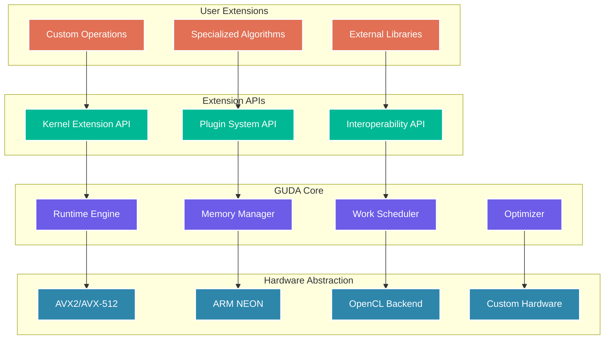

# Chapter 14: Extending GUDA

> *"The best libraries are not just tools—they're platforms for innovation."* — The Extensible System Design Manifesto

GUDA's architecture is designed for extensibility. Whether you need custom operations, specialized algorithms, or integration with external libraries, this chapter will show you how to extend GUDA while maintaining its performance guarantees and API consistency.

## Extension Architecture Overview

GUDA's modular design allows multiple levels of extension:



## Custom Kernel Development

### The Kernel Extension Framework

Build high-performance custom operations with GUDA's kernel framework:

```go
// Kernel extension interface
type KernelExtension interface {
    // Kernel identification
    Name() string
    Version() string
    Description() string
    
    // Kernel properties
    SupportedTypes() []DataType
    OptimalBlockSizes() []int
    MemoryRequirements(inputShapes []Shape) int64
    
    // Kernel execution
    Launch(inputs []DevicePtr, outputs []DevicePtr, params KernelParams) error
    LaunchAsync(inputs []DevicePtr, outputs []DevicePtr, params KernelParams, stream Stream) error
    
    // Optimization
    Optimize(params OptimizationHints) error
    Profile(inputs []DevicePtr, numIterations int) KernelProfile
}

// Custom kernel implementation example: Depthwise separable convolution
type DepthwiseSeparableConv struct {
    // Kernel configuration
    kernelSize    int
    stride        int
    padding       int
    
    // Optimized implementations for different sizes
    kernelSizes   map[int]func([]DevicePtr, []DevicePtr, KernelParams) error
    
    // Performance characteristics
    profile       KernelProfile
    isOptimized   bool
}

func NewDepthwiseSeparableConv(kernelSize, stride, padding int) *DepthwiseSeparableConv {
    dsc := &DepthwiseSeparableConv{
        kernelSize:  kernelSize,
        stride:      stride,
        padding:     padding,
        kernelSizes: make(map[int]func([]DevicePtr, []DevicePtr, KernelParams) error),
    }
    
    // Register optimized implementations
    dsc.kernelSizes[3] = dsc.depthwiseConv3x3
    dsc.kernelSizes[5] = dsc.depthwiseConv5x5
    dsc.kernelSizes[7] = dsc.depthwiseConv7x7
    
    return dsc
}

func (dsc *DepthwiseSeparableConv) Name() string {
    return "DepthwiseSeparableConv"
}

func (dsc *DepthwiseSeparableConv) SupportedTypes() []DataType {
    return []DataType{Float32, Float16, BFloat16}
}

func (dsc *DepthwiseSeparableConv) Launch(inputs, outputs []DevicePtr, params KernelParams) error {
    // Extract parameters
    batchSize := params.GetInt("batch_size")
    channels := params.GetInt("channels")
    inputHeight := params.GetInt("input_height")
    inputWidth := params.GetInt("input_width")
    
    // Validate inputs
    if len(inputs) < 2 {
        return fmt.Errorf("depthwise separable conv requires input and depthwise kernel")
    }
    if len(outputs) < 1 {
        return fmt.Errorf("depthwise separable conv requires output tensor")
    }
    
    input := inputs[0]
    depthwiseKernel := inputs[1]
    output := outputs[0]
    
    // Choose optimized implementation
    if kernelImpl, exists := dsc.kernelSizes[dsc.kernelSize]; exists {
        return kernelImpl([]DevicePtr{input, depthwiseKernel}, []DevicePtr{output}, params)
    }
    
    // Fall back to general implementation
    return dsc.depthwiseConvGeneral(input, depthwiseKernel, output, params)
}

// Highly optimized 3x3 depthwise convolution
func (dsc *DepthwiseSeparableConv) depthwiseConv3x3(inputs, outputs []DevicePtr, params KernelParams) error {
    input := inputs[0]
    kernel := inputs[1]
    output := outputs[0]
    
    batchSize := params.GetInt("batch_size")
    channels := params.GetInt("channels")
    inputHeight := params.GetInt("input_height")
    inputWidth := params.GetInt("input_width")
    
    outputHeight := (inputHeight + 2*dsc.padding - 3) / dsc.stride + 1
    outputWidth := (inputWidth + 2*dsc.padding - 3) / dsc.stride + 1
    
    // Parallelize across batch and channels
    var wg sync.WaitGroup
    numWorkers := runtime.NumCPU()
    workPerWorker := (batchSize * channels + numWorkers - 1) / numWorkers
    
    for worker := 0; worker < numWorkers; worker++ {
        wg.Add(1)
        
        go func(workerID int) {
            defer wg.Done()
            
            start := workerID * workPerWorker
            end := start + workPerWorker
            if end > batchSize*channels {
                end = batchSize*channels
            }
            
            for idx := start; idx < end; idx++ {
                batch := idx / channels
                channel := idx % channels
                
                dsc.process3x3ChannelSIMD(input, kernel, output, 
                                         batch, channel,
                                         inputHeight, inputWidth,
                                         outputHeight, outputWidth)
            }
        }(worker)
    }
    
    wg.Wait()
    return nil
}

// SIMD-optimized channel processing
func (dsc *DepthwiseSeparableConv) process3x3ChannelSIMD(input, kernel, output DevicePtr,
                                                         batch, channel int,
                                                         inputH, inputW, outputH, outputW int) {
    
    // Calculate memory offsets
    inputOffset := (batch*GetChannelCount(input) + channel) * inputH * inputW
    kernelOffset := channel * 9 // 3x3 kernel
    outputOffset := (batch*GetChannelCount(output) + channel) * outputH * outputW
    
    // Load kernel weights into registers (3x3 = 9 weights)
    k00 := guda.LoadFloat32(kernel, kernelOffset+0)
    k01 := guda.LoadFloat32(kernel, kernelOffset+1)
    k02 := guda.LoadFloat32(kernel, kernelOffset+2)
    k10 := guda.LoadFloat32(kernel, kernelOffset+3)
    k11 := guda.LoadFloat32(kernel, kernelOffset+4)
    k12 := guda.LoadFloat32(kernel, kernelOffset+5)
    k20 := guda.LoadFloat32(kernel, kernelOffset+6)
    k21 := guda.LoadFloat32(kernel, kernelOffset+7)
    k22 := guda.LoadFloat32(kernel, kernelOffset+8)
    
    // Process output in SIMD blocks
    const simdWidth = 8
    
    for oh := 0; oh < outputH; oh++ {
        for ow := 0; ow < outputW; ow += simdWidth {
            endOW := ow + simdWidth
            if endOW > outputW {
                endOW = outputW
            }
            actualWidth := endOW - ow
            
            // Calculate input coordinates
            ih := oh*dsc.stride - dsc.padding
            iw := ow*dsc.stride - dsc.padding
            
            // SIMD convolution for this block
            dsc.convolve3x3BlockSIMD(input, output,
                                   inputOffset, outputOffset,
                                   ih, iw, oh, ow,
                                   inputH, inputW, actualWidth,
                                   k00, k01, k02, k10, k11, k12, k20, k21, k22)
        }
    }
}

// Vectorized 3x3 convolution block
func (dsc *DepthwiseSeparableConv) convolve3x3BlockSIMD(input, output DevicePtr,
                                                        inputOffset, outputOffset int,
                                                        ih, iw, oh, ow int,
                                                        inputH, inputW, blockWidth int,
                                                        k00, k01, k02, k10, k11, k12, k20, k21, k22 float32) {
    
    // Accumulator vectors (8 output pixels at once)
    acc := make([]float32, 8)
    
    // 3x3 kernel application
    for dy := 0; dy < 3; dy++ {
        for dx := 0; dx < 3; dx++ {
            y := ih + dy
            x := iw + dx
            
            if y >= 0 && y < inputH && x >= 0 && x < inputW {
                // Load input values with bounds checking
                inputVec := make([]float32, blockWidth)
                for i := 0; i < blockWidth; i++ {
                    inX := x + i*dsc.stride
                    if inX < inputW {
                        inputIdx := inputOffset + y*inputW + inX
                        inputVec[i] = guda.LoadFloat32(input, inputIdx)
                    }
                }
                
                // Get kernel weight
                kernelWeight := dsc.getKernelWeight(dx, dy, k00, k01, k02, k10, k11, k12, k20, k21, k22)
                
                // Vectorized multiply-accumulate
                for i := 0; i < blockWidth; i++ {
                    acc[i] += inputVec[i] * kernelWeight
                }
            }
        }
    }
    
    // Store results
    for i := 0; i < blockWidth; i++ {
        outputIdx := outputOffset + oh*outputW + ow + i
        guda.StoreFloat32(output, outputIdx, acc[i])
    }
}
```

### Kernel Registration and Discovery

```go
// Kernel registry for dynamic extension loading
type KernelRegistry struct {
    kernels map[string]KernelExtension
    mutex   sync.RWMutex
}

var globalRegistry = &KernelRegistry{
    kernels: make(map[string]KernelExtension),
}

func RegisterKernel(kernel KernelExtension) error {
    globalRegistry.mutex.Lock()
    defer globalRegistry.mutex.Unlock()
    
    name := kernel.Name()
    if _, exists := globalRegistry.kernels[name]; exists {
        return fmt.Errorf("kernel %s already registered", name)
    }
    
    globalRegistry.kernels[name] = kernel
    
    // Validate kernel interface
    if err := validateKernel(kernel); err != nil {
        delete(globalRegistry.kernels, name)
        return fmt.Errorf("kernel validation failed: %v", err)
    }
    
    fmt.Printf("Registered kernel: %s v%s\n", kernel.Name(), kernel.Version())
    return nil
}

func GetKernel(name string) (KernelExtension, error) {
    globalRegistry.mutex.RLock()
    defer globalRegistry.mutex.RUnlock()
    
    if kernel, exists := globalRegistry.kernels[name]; exists {
        return kernel, nil
    }
    
    return nil, fmt.Errorf("kernel %s not found", name)
}

func ListKernels() []string {
    globalRegistry.mutex.RLock()
    defer globalRegistry.mutex.RUnlock()
    
    names := make([]string, 0, len(globalRegistry.kernels))
    for name := range globalRegistry.kernels {
        names = append(names, name)
    }
    
    sort.Strings(names)
    return names
}

// Kernel validation
func validateKernel(kernel KernelExtension) error {
    // Test basic interface compliance
    if kernel.Name() == "" {
        return fmt.Errorf("kernel must have a non-empty name")
    }
    
    if len(kernel.SupportedTypes()) == 0 {
        return fmt.Errorf("kernel must support at least one data type")
    }
    
    // Test with dummy inputs
    testInputs := []DevicePtr{guda.Malloc(1024)}
    testOutputs := []DevicePtr{guda.Malloc(1024)}
    defer guda.Free(testInputs[0])
    defer guda.Free(testOutputs[0])
    
    testParams := NewKernelParams()
    testParams.SetInt("batch_size", 1)
    testParams.SetInt("channels", 1)
    testParams.SetInt("input_height", 32)
    testParams.SetInt("input_width", 32)
    
    // Verify kernel can be launched without crashing
    err := kernel.Launch(testInputs, testOutputs, testParams)
    if err != nil {
        return fmt.Errorf("kernel launch test failed: %v", err)
    }
    
    return nil
}

// Example: Register the depthwise separable convolution
func init() {
    depthwiseConv := NewDepthwiseSeparableConv(3, 1, 1)
    if err := RegisterKernel(depthwiseConv); err != nil {
        log.Printf("Failed to register depthwise conv kernel: %v", err)
    }
}

// High-level API integration
func DepthwiseSeparableConv2D(input DevicePtr, depthwiseKernel, pointwiseKernel DevicePtr,
                              inputShape []int, params ConvParams) (DevicePtr, error) {
    
    // Get registered kernel
    kernel, err := GetKernel("DepthwiseSeparableConv")
    if err != nil {
        return 0, fmt.Errorf("depthwise separable convolution not available: %v", err)
    }
    
    // Prepare parameters
    kernelParams := NewKernelParams()
    kernelParams.SetInt("batch_size", inputShape[0])
    kernelParams.SetInt("channels", inputShape[1])
    kernelParams.SetInt("input_height", inputShape[2])
    kernelParams.SetInt("input_width", inputShape[3])
    kernelParams.SetInt("stride", params.StrideH)
    kernelParams.SetInt("padding", params.PadH)
    
    // Calculate output dimensions
    outputHeight := (inputShape[2] + 2*params.PadH - 3) / params.StrideH + 1
    outputWidth := (inputShape[3] + 2*params.PadW - 3) / params.StrideW + 1
    outputSize := inputShape[0] * inputShape[1] * outputHeight * outputWidth * 4
    
    // Allocate output
    output := guda.MallocAligned(outputSize, 32)
    
    // Launch kernel
    inputs := []DevicePtr{input, depthwiseKernel}
    outputs := []DevicePtr{output}
    
    err = kernel.Launch(inputs, outputs, kernelParams)
    if err != nil {
        guda.Free(output)
        return 0, err
    }
    
    return output, nil
}
```

## Plugin System Architecture

### Plugin Interface Design

Create loadable plugins for complex extensions:

```go
// Plugin interface for dynamic loading
type Plugin interface {
    // Plugin metadata
    Name() string
    Version() string
    Author() string
    Description() string
    
    // Plugin lifecycle
    Initialize(config PluginConfig) error
    Finalize() error
    
    // Capabilities
    GetCapabilities() PluginCapabilities
    GetOperations() []OperationDescriptor
    
    // Operation execution
    ExecuteOperation(name string, inputs []DevicePtr, params OperationParams) ([]DevicePtr, error)
}

type PluginCapabilities struct {
    SupportedDataTypes []DataType
    RequiredFeatures   []string
    OptionalFeatures   []string
    MinGUDAVersion     string
}

type OperationDescriptor struct {
    Name        string
    InputTypes  []DataType
    OutputTypes []DataType
    Parameters  []ParameterDescriptor
    Description string
}

// Example: Computer Vision Plugin
type ComputerVisionPlugin struct {
    initialized   bool
    operations    map[string]CVOperation
    tempBuffers   []DevicePtr
    
    // Configuration
    config        PluginConfig
    
    // Performance optimization
    blockSize     int
    numThreads    int
}

func NewComputerVisionPlugin() *ComputerVisionPlugin {
    return &ComputerVisionPlugin{
        operations: make(map[string]CVOperation),
    }
}

func (cvp *ComputerVisionPlugin) Initialize(config PluginConfig) error {
    if cvp.initialized {
        return fmt.Errorf("plugin already initialized")
    }
    
    cvp.config = config
    cvp.blockSize = config.GetInt("block_size", 64)
    cvp.numThreads = config.GetInt("num_threads", runtime.NumCPU())
    
    // Register operations
    cvp.registerOperations()
    
    // Allocate temporary buffers
    cvp.allocateBuffers()
    
    cvp.initialized = true
    fmt.Printf("Computer Vision Plugin v%s initialized\n", cvp.Version())
    return nil
}

func (cvp *ComputerVisionPlugin) registerOperations() {
    cvp.operations["gaussian_blur"] = &GaussianBlurOperation{}
    cvp.operations["sobel_filter"] = &SobelFilterOperation{}
    cvp.operations["canny_edge"] = &CannyEdgeOperation{}
    cvp.operations["harris_corner"] = &HarrisCornerOperation{}
    cvp.operations["optical_flow"] = &OpticalFlowOperation{}
    cvp.operations["template_match"] = &TemplateMatchOperation{}
}

func (cvp *ComputerVisionPlugin) GetOperations() []OperationDescriptor {
    descriptors := make([]OperationDescriptor, 0, len(cvp.operations))
    
    for name, op := range cvp.operations {
        descriptors = append(descriptors, OperationDescriptor{
            Name:        name,
            InputTypes:  op.GetInputTypes(),
            OutputTypes: op.GetOutputTypes(),
            Parameters:  op.GetParameters(),
            Description: op.GetDescription(),
        })
    }
    
    return descriptors
}

// Computer vision operation interface
type CVOperation interface {
    Execute(inputs []DevicePtr, params OperationParams) ([]DevicePtr, error)
    GetInputTypes() []DataType
    GetOutputTypes() []DataType
    GetParameters() []ParameterDescriptor
    GetDescription() string
}

// Example: Gaussian Blur implementation
type GaussianBlurOperation struct{}

func (gbo *GaussianBlurOperation) Execute(inputs []DevicePtr, params OperationParams) ([]DevicePtr, error) {
    if len(inputs) != 1 {
        return nil, fmt.Errorf("gaussian blur requires exactly 1 input")
    }
    
    input := inputs[0]
    
    // Extract parameters
    width := params.GetInt("width")
    height := params.GetInt("height")
    channels := params.GetInt("channels")
    sigma := params.GetFloat("sigma")
    kernelSize := params.GetInt("kernel_size")
    
    if kernelSize%2 == 0 {
        return nil, fmt.Errorf("kernel size must be odd")
    }
    
    // Generate Gaussian kernel
    kernel := gbo.generateGaussianKernel(kernelSize, sigma)
    
    // Allocate output
    outputSize := width * height * channels * 4
    output := guda.MallocAligned(outputSize, 32)
    
    // Apply separable Gaussian filter
    err := gbo.applySeparableFilter(input, output, kernel, width, height, channels)
    if err != nil {
        guda.Free(output)
        return nil, err
    }
    
    return []DevicePtr{output}, nil
}

func (gbo *GaussianBlurOperation) generateGaussianKernel(size int, sigma float32) []float32 {
    kernel := make([]float32, size)
    center := size / 2
    var sum float32
    
    // Generate 1D Gaussian kernel
    for i := 0; i < size; i++ {
        x := float32(i - center)
        value := float32(math.Exp(float64(-x*x / (2*sigma*sigma))))
        kernel[i] = value
        sum += value
    }
    
    // Normalize
    for i := range kernel {
        kernel[i] /= sum
    }
    
    return kernel
}

func (gbo *GaussianBlurOperation) applySeparableFilter(input, output DevicePtr, 
                                                       kernel []float32, 
                                                       width, height, channels int) error {
    // Horizontal pass
    tempSize := width * height * channels * 4
    temp := guda.MallocAligned(tempSize, 32)
    defer guda.Free(temp)
    
    err := gbo.horizontalFilter(input, temp, kernel, width, height, channels)
    if err != nil {
        return err
    }
    
    // Vertical pass
    return gbo.verticalFilter(temp, output, kernel, width, height, channels)
}

// SIMD-optimized horizontal filtering
func (gbo *GaussianBlurOperation) horizontalFilter(input, output DevicePtr, 
                                                   kernel []float32, 
                                                   width, height, channels int) error {
    kernelSize := len(kernel)
    radius := kernelSize / 2
    
    // Parallel processing across rows
    var wg sync.WaitGroup
    numWorkers := runtime.NumCPU()
    rowsPerWorker := (height + numWorkers - 1) / numWorkers
    
    for worker := 0; worker < numWorkers; worker++ {
        wg.Add(1)
        
        go func(workerID int) {
            defer wg.Done()
            
            startRow := workerID * rowsPerWorker
            endRow := startRow + rowsPerWorker
            if endRow > height {
                endRow = height
            }
            
            for row := startRow; row < endRow; row++ {
                for ch := 0; ch < channels; ch++ {
                    gbo.filterRowSIMD(input, output, kernel, 
                                     row, ch, width, height, channels, radius)
                }
            }
        }(worker)
    }
    
    wg.Wait()
    return nil
}

// SIMD-optimized row filtering
func (gbo *GaussianBlurOperation) filterRowSIMD(input, output DevicePtr, kernel []float32,
                                                row, channel, width, height, channels, radius int) {
    const simdWidth = 8
    
    for col := 0; col < width; col += simdWidth {
        endCol := col + simdWidth
        if endCol > width {
            endCol = width
        }
        actualWidth := endCol - col
        
        // SIMD accumulation
        acc := make([]float32, simdWidth)
        
        for ki := 0; ki < len(kernel); ki++ {
            kernelWeight := kernel[ki]
            sourceCol := col + ki - radius
            
            // Boundary handling with clamping
            if sourceCol < 0 {
                sourceCol = 0
            } else if sourceCol >= width {
                sourceCol = width - 1
            }
            
            // Load and accumulate with SIMD
            for i := 0; i < actualWidth; i++ {
                srcIdx := (row*width + sourceCol + i) * channels + channel
                srcValue := guda.LoadFloat32(input, srcIdx)
                acc[i] += srcValue * kernelWeight
            }
        }
        
        // Store results
        for i := 0; i < actualWidth; i++ {
            dstIdx := (row*width + col + i) * channels + channel
            guda.StoreFloat32(output, dstIdx, acc[i])
        }
    }
}
```

### Plugin Loading and Management

```go
// Plugin manager for dynamic loading
type PluginManager struct {
    plugins       map[string]Plugin
    pluginDirs    []string
    operations    map[string]PluginOperation
    mutex         sync.RWMutex
}

type PluginOperation struct {
    Plugin    Plugin
    Operation string
}

func NewPluginManager() *PluginManager {
    return &PluginManager{
        plugins:    make(map[string]Plugin),
        pluginDirs: []string{"./plugins", "/usr/local/lib/guda/plugins"},
        operations: make(map[string]PluginOperation),
    }
}

func (pm *PluginManager) LoadPlugin(pluginPath string) error {
    pm.mutex.Lock()
    defer pm.mutex.Unlock()
    
    // For this example, we'll use a factory function approach
    // In a real implementation, you might use Go plugins or shared libraries
    
    plugin, err := pm.createPluginFromFile(pluginPath)
    if err != nil {
        return fmt.Errorf("failed to create plugin from %s: %v", pluginPath, err)
    }
    
    // Initialize plugin
    config := pm.getPluginConfig(plugin.Name())
    if err := plugin.Initialize(config); err != nil {
        return fmt.Errorf("plugin initialization failed: %v", err)
    }
    
    // Register plugin
    name := plugin.Name()
    if _, exists := pm.plugins[name]; exists {
        plugin.Finalize()
        return fmt.Errorf("plugin %s already loaded", name)
    }
    
    pm.plugins[name] = plugin
    
    // Register operations
    for _, op := range plugin.GetOperations() {
        fullName := fmt.Sprintf("%s.%s", name, op.Name)
        pm.operations[fullName] = PluginOperation{
            Plugin:    plugin,
            Operation: op.Name,
        }
    }
    
    fmt.Printf("Loaded plugin: %s v%s (%d operations)\n", 
               plugin.Name(), plugin.Version(), len(plugin.GetOperations()))
    return nil
}

func (pm *PluginManager) ExecuteOperation(name string, inputs []DevicePtr, 
                                         params OperationParams) ([]DevicePtr, error) {
    pm.mutex.RLock()
    op, exists := pm.operations[name]
    pm.mutex.RUnlock()
    
    if !exists {
        return nil, fmt.Errorf("operation %s not found", name)
    }
    
    return op.Plugin.ExecuteOperation(op.Operation, inputs, params)
}

func (pm *PluginManager) ListOperations() map[string]OperationDescriptor {
    pm.mutex.RLock()
    defer pm.mutex.RUnlock()
    
    result := make(map[string]OperationDescriptor)
    
    for opName, pluginOp := range pm.operations {
        for _, desc := range pluginOp.Plugin.GetOperations() {
            if desc.Name == pluginOp.Operation {
                result[opName] = desc
                break
            }
        }
    }
    
    return result
}

// Auto-discovery and loading
func (pm *PluginManager) DiscoverAndLoadPlugins() error {
    var errors []error
    
    for _, dir := range pm.pluginDirs {
        files, err := ioutil.ReadDir(dir)
        if err != nil {
            continue // Skip directories that don't exist
        }
        
        for _, file := range files {
            if strings.HasSuffix(file.Name(), ".so") || 
               strings.HasSuffix(file.Name(), ".dll") ||
               strings.HasSuffix(file.Name(), ".dylib") {
                
                pluginPath := filepath.Join(dir, file.Name())
                if err := pm.LoadPlugin(pluginPath); err != nil {
                    errors = append(errors, fmt.Errorf("failed to load %s: %v", pluginPath, err))
                }
            }
        }
    }
    
    if len(errors) > 0 {
        return fmt.Errorf("some plugins failed to load: %v", errors)
    }
    
    return nil
}

// High-level plugin operation API
func ExecutePluginOperation(operationName string, inputs []DevicePtr, 
                           params map[string]interface{}) ([]DevicePtr, error) {
    
    opParams := NewOperationParams()
    for key, value := range params {
        opParams.Set(key, value)
    }
    
    return globalPluginManager.ExecuteOperation(operationName, inputs, opParams)
}

// Example usage
func demonstratePluginUsage() {
    // Load computer vision plugin
    pm := NewPluginManager()
    pm.LoadPlugin("./plugins/computer_vision.so")
    
    // Create test image
    width, height, channels := 640, 480, 3
    imageSize := width * height * channels * 4
    testImage := guda.MallocAligned(imageSize, 32)
    defer guda.Free(testImage)
    
    // Fill with test pattern
    guda.FillTestPattern(testImage, width, height, channels)
    
    // Apply Gaussian blur
    params := map[string]interface{}{
        "width":       width,
        "height":      height,
        "channels":    channels,
        "sigma":       2.0,
        "kernel_size": 5,
    }
    
    blurred, err := ExecutePluginOperation("computer_vision.gaussian_blur", 
                                          []DevicePtr{testImage}, params)
    if err != nil {
        fmt.Printf("Plugin operation failed: %v\n", err)
        return
    }
    defer guda.Free(blurred[0])
    
    // Apply edge detection
    edgeParams := map[string]interface{}{
        "width":    width,
        "height":   height,
        "channels": channels,
        "threshold_low":  0.1,
        "threshold_high": 0.3,
    }
    
    edges, err := ExecutePluginOperation("computer_vision.canny_edge", 
                                        blurred, edgeParams)
    if err != nil {
        fmt.Printf("Edge detection failed: %v\n", err)
        return
    }
    defer guda.Free(edges[0])
    
    fmt.Println("Computer vision pipeline completed successfully!")
}
```

## External Library Integration

### C/C++ Library Bindings

Seamlessly integrate existing high-performance libraries:

```go
// C library integration framework
package guda_fftw

/*
#cgo CFLAGS: -I/usr/local/include
#cgo LDFLAGS: -L/usr/local/lib -lfftw3f -lfftw3f_threads
#include <fftw3.h>
#include <stdlib.h>

// Wrapper functions for thread-safe FFTW usage
int fftw_init_threads_wrapper() {
    return fftw_init_threads();
}

fftwf_plan create_dft_plan(int n, fftwf_complex* in, fftwf_complex* out, int sign) {
    return fftwf_plan_dft_1d(n, in, out, sign, FFTW_ESTIMATE);
}
*/
import "C"
import "unsafe"

// FFTW integration for high-performance FFTs
type FFTWPlan struct {
    plan     C.fftwf_plan
    size     int
    forward  bool
    input    DevicePtr
    output   DevicePtr
}

func NewFFTWPlan(size int, forward bool) (*FFTWPlan, error) {
    // Initialize FFTW threads once
    static var once sync.Once
    once.Do(func() {
        C.fftw_init_threads_wrapper()
        C.fftwf_plan_with_nthreads(C.int(runtime.NumCPU()))
    })
    
    // Allocate aligned memory for FFTW
    inputSize := size * 8  // Complex64 = 8 bytes
    outputSize := size * 8
    
    input := guda.MallocAligned(inputSize, 32)
    output := guda.MallocAligned(outputSize, 32)
    
    if input == 0 || output == 0 {
        if input != 0 {
            guda.Free(input)
        }
        if output != 0 {
            guda.Free(output)
        }
        return nil, fmt.Errorf("failed to allocate memory for FFT plan")
    }
    
    // Create FFTW plan
    direction := C.FFTW_FORWARD
    if !forward {
        direction = C.FFTW_BACKWARD
    }
    
    plan := C.create_dft_plan(C.int(size),
                             (*C.fftwf_complex)(unsafe.Pointer(uintptr(input))),
                             (*C.fftwf_complex)(unsafe.Pointer(uintptr(output))),
                             direction)
    
    if plan == nil {
        guda.Free(input)
        guda.Free(output)
        return nil, fmt.Errorf("failed to create FFTW plan")
    }
    
    return &FFTWPlan{
        plan:    plan,
        size:    size,
        forward: forward,
        input:   input,
        output:  output,
    }, nil
}

func (fp *FFTWPlan) Execute(inputData DevicePtr) (DevicePtr, error) {
    // Copy input data to FFTW buffer
    dataSize := fp.size * 8 // Complex64 size
    guda.MemcpyDtoD(fp.input, inputData, dataSize)
    
    // Execute FFT
    C.fftwf_execute(fp.plan)
    
    // Allocate result buffer
    result := guda.MallocAligned(dataSize, 32)
    if result == 0 {
        return 0, fmt.Errorf("failed to allocate result buffer")
    }
    
    // Copy result
    guda.MemcpyDtoD(result, fp.output, dataSize)
    
    return result, nil
}

func (fp *FFTWPlan) ExecuteInPlace(data DevicePtr) error {
    // Copy to input buffer
    dataSize := fp.size * 8
    guda.MemcpyDtoD(fp.input, data, dataSize)
    
    // Execute FFT
    C.fftwf_execute(fp.plan)
    
    // Copy back
    guda.MemcpyDtoD(data, fp.output, dataSize)
    
    return nil
}

func (fp *FFTWPlan) Destroy() {
    if fp.plan != nil {
        C.fftwf_destroy_plan(fp.plan)
        fp.plan = nil
    }
    
    if fp.input != 0 {
        guda.Free(fp.input)
        fp.input = 0
    }
    
    if fp.output != 0 {
        guda.Free(fp.output)
        fp.output = 0
    }
}

// High-level FFT API with automatic plan caching
type FFTCache struct {
    plans map[string]*FFTWPlan
    mutex sync.RWMutex
}

var fftCache = &FFTCache{
    plans: make(map[string]*FFTWPlan),
}

func FFT(input DevicePtr, size int) (DevicePtr, error) {
    return fftCache.executeFFT(input, size, true)
}

func IFFT(input DevicePtr, size int) (DevicePtr, error) {
    return fftCache.executeFFT(input, size, false)
}

func (fc *FFTCache) executeFFT(input DevicePtr, size int, forward bool) (DevicePtr, error) {
    // Generate plan key
    planKey := fmt.Sprintf("%d_%t", size, forward)
    
    // Try to get existing plan
    fc.mutex.RLock()
    plan, exists := fc.plans[planKey]
    fc.mutex.RUnlock()
    
    if !exists {
        // Create new plan
        fc.mutex.Lock()
        // Double-check after acquiring write lock
        if plan, exists = fc.plans[planKey]; !exists {
            var err error
            plan, err = NewFFTWPlan(size, forward)
            if err != nil {
                fc.mutex.Unlock()
                return 0, err
            }
            fc.plans[planKey] = plan
        }
        fc.mutex.Unlock()
    }
    
    return plan.Execute(input)
}
```

### Python/NumPy Interoperability

Bridge to Python ecosystem for rapid prototyping:

```go
// Python bridge for GUDA
package guda_python

/*
#cgo pkg-config: python3-embed
#include <Python.h>
#include <numpy/arrayobject.h>

// Initialize Python and NumPy
int init_python() {
    if (Py_IsInitialized()) {
        return 0;
    }
    
    Py_Initialize();
    if (!Py_IsInitialized()) {
        return -1;
    }
    
    import_array();
    return 0;
}

// Create NumPy array from GUDA memory
PyObject* create_numpy_array(void* data, int ndim, npy_intp* dims, int typenum) {
    return PyArray_SimpleNewFromData(ndim, dims, typenum, data);
}
*/
import "C"
import "unsafe"

// Python interpreter wrapper
type PythonInterpreter struct {
    initialized bool
    modules     map[string]*C.PyObject
    mutex       sync.Mutex
}

var globalInterpreter = &PythonInterpreter{
    modules: make(map[string]*C.PyObject),
}

func InitializePython() error {
    globalInterpreter.mutex.Lock()
    defer globalInterpreter.mutex.Unlock()
    
    if globalInterpreter.initialized {
        return nil
    }
    
    if C.init_python() != 0 {
        return fmt.Errorf("failed to initialize Python interpreter")
    }
    
    globalInterpreter.initialized = true
    return nil
}

// Convert GUDA tensor to NumPy array
func TensorToNumpy(tensor DevicePtr, shape []int, dtype DataType) (*C.PyObject, error) {
    if !globalInterpreter.initialized {
        if err := InitializePython(); err != nil {
            return nil, err
        }
    }
    
    // Convert shape to C array
    ndim := len(shape)
    dims := make([]C.npy_intp, ndim)
    for i, s := range shape {
        dims[i] = C.npy_intp(s)
    }
    
    // Determine NumPy type
    var numpyType C.int
    switch dtype {
    case Float32:
        numpyType = C.NPY_FLOAT32
    case Float64:
        numpyType = C.NPY_FLOAT64
    case Int32:
        numpyType = C.NPY_INT32
    default:
        return nil, fmt.Errorf("unsupported data type: %v", dtype)
    }
    
    // Create NumPy array pointing to GUDA memory
    ptr := unsafe.Pointer(uintptr(tensor))
    array := C.create_numpy_array(ptr, C.int(ndim), &dims[0], numpyType)
    
    if array == nil {
        return nil, fmt.Errorf("failed to create NumPy array")
    }
    
    return array, nil
}

// Execute Python code with GUDA tensors
func ExecutePythonCode(code string, inputs map[string]DevicePtr, 
                      inputShapes map[string][]int) (map[string]DevicePtr, error) {
    
    // Create Python dictionary for inputs
    inputDict := C.PyDict_New()
    defer C.Py_DecRef(inputDict)
    
    for name, tensor := range inputs {
        shape := inputShapes[name]
        npArray, err := TensorToNumpy(tensor, shape, Float32)
        if err != nil {
            return nil, err
        }
        
        nameObj := C.PyUnicode_FromString(C.CString(name))
        C.PyDict_SetItem(inputDict, nameObj, npArray)
        
        C.Py_DecRef(nameObj)
        C.Py_DecRef(npArray)
    }
    
    // Create output dictionary
    outputDict := C.PyDict_New()
    defer C.Py_DecRef(outputDict)
    
    // Set up execution environment
    globalDict := C.PyModule_GetDict(C.PyImport_AddModule(C.CString("__main__")))
    localDict := C.PyDict_New()
    defer C.Py_DecRef(localDict)
    
    // Add inputs to local dictionary
    C.PyDict_SetItemString(localDict, C.CString("inputs"), inputDict)
    C.PyDict_SetItemString(localDict, C.CString("outputs"), outputDict)
    
    // Execute Python code
    codeObj := C.PyCompile_String(C.CString(code), C.CString("<guda>"), C.Py_exec_input)
    if codeObj == nil {
        return nil, fmt.Errorf("failed to compile Python code")
    }
    defer C.Py_DecRef(codeObj)
    
    result := C.PyEval_EvalCode(codeObj, globalDict, localDict)
    if result == nil {
        // Handle Python exception
        C.PyErr_Print()
        return nil, fmt.Errorf("Python execution failed")
    }
    defer C.Py_DecRef(result)
    
    // Extract outputs (this is simplified - real implementation would be more complex)
    outputs := make(map[string]DevicePtr)
    
    // For now, return empty map - full implementation would extract arrays from outputDict
    return outputs, nil
}

// High-level Python function execution
func CallPythonFunction(module, function string, args []interface{}) (interface{}, error) {
    if !globalInterpreter.initialized {
        if err := InitializePython(); err != nil {
            return nil, err
        }
    }
    
    globalInterpreter.mutex.Lock()
    defer globalInterpreter.mutex.Unlock()
    
    // Import module
    moduleObj, exists := globalInterpreter.modules[module]
    if !exists {
        moduleObj = C.PyImport_ImportModule(C.CString(module))
        if moduleObj == nil {
            return nil, fmt.Errorf("failed to import module: %s", module)
        }
        globalInterpreter.modules[module] = moduleObj
    }
    
    // Get function
    funcObj := C.PyObject_GetAttrString(moduleObj, C.CString(function))
    if funcObj == nil {
        return nil, fmt.Errorf("function %s not found in module %s", function, module)
    }
    defer C.Py_DecRef(funcObj)
    
    // Create arguments tuple
    argsObj := C.PyTuple_New(C.Py_ssize_t(len(args)))
    defer C.Py_DecRef(argsObj)
    
    for i, arg := range args {
        var pyArg *C.PyObject
        
        switch v := arg.(type) {
        case int:
            pyArg = C.PyLong_FromLong(C.long(v))
        case float64:
            pyArg = C.PyFloat_FromDouble(C.double(v))
        case string:
            pyArg = C.PyUnicode_FromString(C.CString(v))
        case DevicePtr:
            // Convert tensor to NumPy array
            npArray, err := TensorToNumpy(v, []int{1000}, Float32) // Example shape
            if err != nil {
                return nil, err
            }
            pyArg = npArray
        default:
            return nil, fmt.Errorf("unsupported argument type: %T", v)
        }
        
        C.PyTuple_SetItem(argsObj, C.Py_ssize_t(i), pyArg)
    }
    
    // Call function
    result := C.PyObject_CallObject(funcObj, argsObj)
    if result == nil {
        C.PyErr_Print()
        return nil, fmt.Errorf("function call failed")
    }
    defer C.Py_DecRef(result)
    
    // Convert result back to Go (simplified)
    return nil, nil // Would implement proper conversion
}

// Example usage
func demonstratePythonIntegration() {
    err := InitializePython()
    if err != nil {
        fmt.Printf("Failed to initialize Python: %v\n", err)
        return
    }
    
    // Create test tensor
    testData := guda.MallocAligned(1000*4, 32)
    defer guda.Free(testData)
    guda.FillRandom(testData, 1000)
    
    // Execute Python code that processes the tensor
    pythonCode := `
import numpy as np
from scipy import ndimage

# Get input tensor
input_array = inputs['test_data']

# Apply Gaussian filter
filtered = ndimage.gaussian_filter(input_array, sigma=2.0)

# Store result
outputs['filtered'] = filtered
`
    
    inputs := map[string]DevicePtr{"test_data": testData}
    shapes := map[string][]int{"test_data": {1000}}
    
    outputs, err := ExecutePythonCode(pythonCode, inputs, shapes)
    if err != nil {
        fmt.Printf("Python execution failed: %v\n", err)
        return
    }
    
    fmt.Printf("Python integration successful, %d outputs\n", len(outputs))
}
```

## Extension Best Practices

### Performance Optimization Guidelines

```go
// Extension performance guidelines and utilities
type ExtensionOptimizer struct {
    metrics     map[string]PerformanceMetric
    benchmarks  []BenchmarkResult
    guidelines  []OptimizationGuideline
}

type PerformanceMetric struct {
    Name           string
    Value          float64
    Unit           string
    Target         float64
    Status         OptimizationStatus
}

type OptimizationGuideline struct {
    Category    string
    Rule        string
    Rationale   string
    Example     string
    Importance  Priority
}

const (
    Critical Priority = iota
    High
    Medium
    Low
)

func NewExtensionOptimizer() *ExtensionOptimizer {
    eo := &ExtensionOptimizer{
        metrics: make(map[string]PerformanceMetric),
    }
    
    eo.initializeGuidelines()
    return eo
}

func (eo *ExtensionOptimizer) initializeGuidelines() {
    eo.guidelines = []OptimizationGuideline{
        {
            Category:   "Memory Access",
            Rule:       "Always use aligned memory allocations",
            Rationale:  "Aligned memory enables SIMD vectorization and prevents cache line splits",
            Example:    "guda.MallocAligned(size, 32) // 32-byte alignment for AVX2",
            Importance: Critical,
        },
        {
            Category:   "SIMD Optimization",
            Rule:       "Process data in blocks matching SIMD width",
            Rationale:  "AVX2 can process 8 float32 values simultaneously",
            Example:    "for i := 0; i < n; i += 8 { /* process 8 elements */ }",
            Importance: High,
        },
        {
            Category:   "Cache Efficiency",
            Rule:       "Use cache-friendly access patterns",
            Rationale:  "Sequential access is 10x faster than random access",
            Example:    "Process row-major order, not column-major",
            Importance: High,
        },
        {
            Category:   "Parallelization",
            Rule:       "Balance work across all CPU cores",
            Rationale:  "Uneven work distribution wastes CPU resources",
            Example:    "Use work-stealing or dynamic load balancing",
            Importance: Medium,
        },
        {
            Category:   "Algorithm Selection",
            Rule:       "Choose algorithms based on problem size",
            Rationale:  "Different algorithms have different scalability characteristics",
            Example:    "Use direct convolution for small kernels, im2col for large",
            Importance: High,
        },
    }
}

func (eo *ExtensionOptimizer) AnalyzeExtension(extension KernelExtension) OptimizationReport {
    report := OptimizationReport{
        ExtensionName: extension.Name(),
        Timestamp:     time.Now(),
    }
    
    // Benchmark the extension
    profile := extension.Profile(nil, 100)
    report.PerformanceProfile = profile
    
    // Check compliance with guidelines
    report.GuidelineCompliance = eo.checkGuidelines(extension)
    
    // Analyze memory usage patterns
    report.MemoryAnalysis = eo.analyzeMemoryUsage(extension)
    
    // Suggest optimizations
    report.Suggestions = eo.generateOptimizationSuggestions(report)
    
    return report
}

type OptimizationReport struct {
    ExtensionName       string
    Timestamp           time.Time
    PerformanceProfile  KernelProfile
    GuidelineCompliance []GuidelineCheck
    MemoryAnalysis      MemoryUsageAnalysis
    Suggestions         []OptimizationSuggestion
}

type GuidelineCheck struct {
    Guideline   OptimizationGuideline
    Compliant   bool
    Evidence    string
    Severity    Priority
}

func (eo *ExtensionOptimizer) checkGuidelines(extension KernelExtension) []GuidelineCheck {
    var checks []GuidelineCheck
    
    for _, guideline := range eo.guidelines {
        check := GuidelineCheck{
            Guideline: guideline,
            Compliant: true, // Default assumption
            Severity:  guideline.Importance,
        }
        
        // Perform specific checks based on guideline category
        switch guideline.Category {
        case "Memory Access":
            check.Compliant, check.Evidence = eo.checkMemoryAlignment(extension)
        case "SIMD Optimization":
            check.Compliant, check.Evidence = eo.checkSIMDUsage(extension)
        case "Cache Efficiency":
            check.Compliant, check.Evidence = eo.checkCacheEfficiency(extension)
        case "Parallelization":
            check.Compliant, check.Evidence = eo.checkParallelization(extension)
        }
        
        checks = append(checks, check)
    }
    
    return checks
}

// Extension testing framework
func TestExtension(extension KernelExtension) TestResults {
    results := TestResults{
        ExtensionName: extension.Name(),
        TestSuite:     "Comprehensive Extension Test",
        StartTime:     time.Now(),
    }
    
    // Test 1: Basic functionality
    results.Tests = append(results.Tests, testBasicFunctionality(extension))
    
    // Test 2: Performance benchmarks
    results.Tests = append(results.Tests, testPerformance(extension))
    
    // Test 3: Memory safety
    results.Tests = append(results.Tests, testMemorySafety(extension))
    
    // Test 4: Numerical accuracy
    results.Tests = append(results.Tests, testNumericalAccuracy(extension))
    
    // Test 5: Edge cases
    results.Tests = append(results.Tests, testEdgeCases(extension))
    
    results.EndTime = time.Now()
    results.Duration = results.EndTime.Sub(results.StartTime)
    
    // Calculate overall result
    passed := 0
    for _, test := range results.Tests {
        if test.Passed {
            passed++
        }
    }
    results.OverallPassed = passed == len(results.Tests)
    
    return results
}

type TestResults struct {
    ExtensionName  string
    TestSuite      string
    StartTime      time.Time
    EndTime        time.Time
    Duration       time.Duration
    Tests          []TestResult
    OverallPassed  bool
}

type TestResult struct {
    Name        string
    Passed      bool
    Duration    time.Duration
    Error       error
    Details     string
}

func testPerformance(extension KernelExtension) TestResult {
    test := TestResult{Name: "Performance Benchmark"}
    
    start := time.Now()
    defer func() {
        test.Duration = time.Since(start)
    }()
    
    // Create test data
    testSizes := []int{64, 128, 256, 512, 1024}
    
    for _, size := range testSizes {
        inputs := []DevicePtr{guda.MallocAligned(size*size*4, 32)}
        outputs := []DevicePtr{guda.MallocAligned(size*size*4, 32)}
        defer guda.Free(inputs[0])
        defer guda.Free(outputs[0])
        
        params := NewKernelParams()
        params.SetInt("size", size)
        
        // Measure performance
        iterations := 100
        benchStart := time.Now()
        
        for i := 0; i < iterations; i++ {
            err := extension.Launch(inputs, outputs, params)
            if err != nil {
                test.Error = err
                test.Passed = false
                test.Details = fmt.Sprintf("Failed at size %d: %v", size, err)
                return test
            }
        }
        
        duration := time.Since(benchStart)
        avgTime := duration / time.Duration(iterations)
        
        // Calculate performance metrics (example: GFLOPS)
        operations := float64(2 * size * size * size) // Assuming GEMM-like operation
        gflops := operations / avgTime.Seconds() / 1e9
        
        test.Details += fmt.Sprintf("Size %d: %.2f GFLOPS (%.3fms), ", size, gflops, avgTime.Seconds()*1000)
        
        // Check if performance meets minimum threshold
        minGFLOPS := float64(size) * 0.01 // Very conservative threshold
        if gflops < minGFLOPS {
            test.Passed = false
            test.Details += fmt.Sprintf("Performance below threshold (%.2f < %.2f GFLOPS)", gflops, minGFLOPS)
            return test
        }
    }
    
    test.Passed = true
    return test
}
```

## What's Next?

You now have the complete toolkit for extending GUDA! Ready to build amazing custom operations?

- [Troubleshooting](15-troubleshooting.md) - Debug and fix issues in your extensions
- [Case Studies](12-case-studies.md) - See real-world extension examples
- [Optimization Techniques](10-optimization.md) - Apply advanced optimization to your extensions

The extension system is GUDA's gateway to infinite possibilities. Whether you're building domain-specific operations, integrating cutting-edge algorithms, or bridging to other ecosystems, these tools will help you build fast, reliable, and maintainable extensions.

---

*🔧 The best tools adapt to their users' needs. GUDA's extension system ensures you're never limited by what came in the box.*