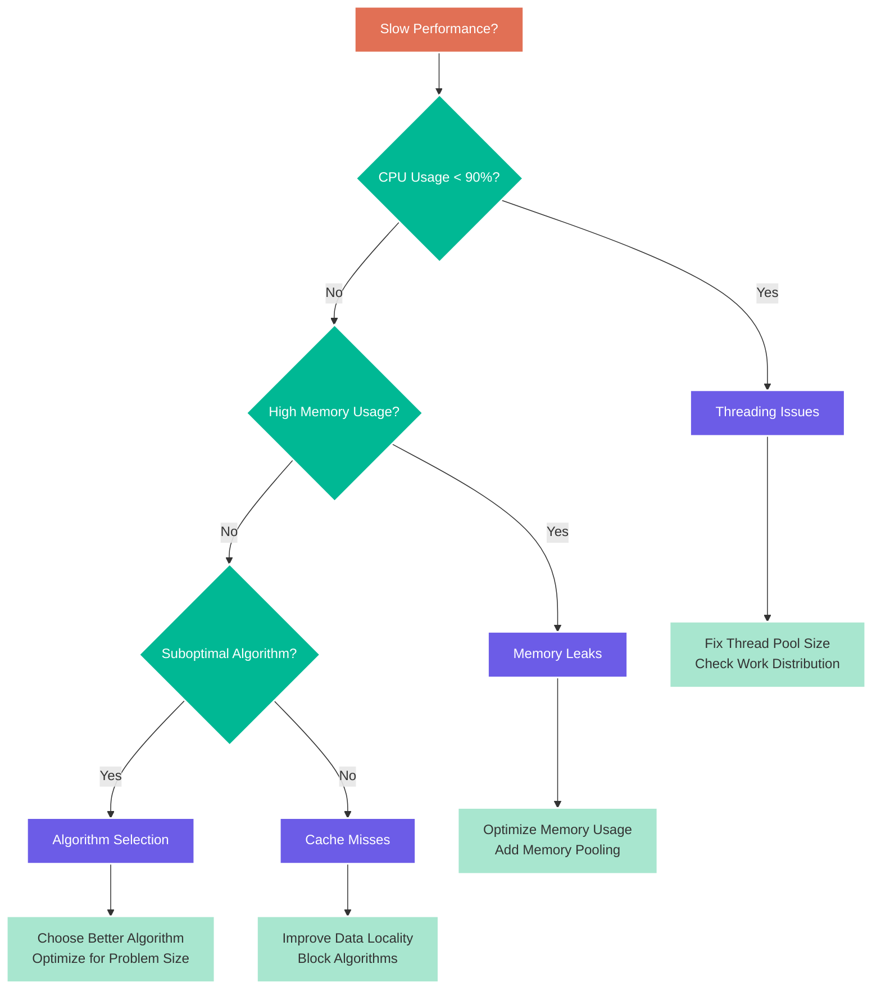

# Chapter 15: Troubleshooting

> *"Every bug is a teacher in disguise—the question is whether you're ready to learn."* — The Debugger's Creed

Welcome to the final chapter of your GUDA journey! This comprehensive troubleshooting guide will help you diagnose and fix the most common (and uncommon) issues you'll encounter. From performance bottlenecks to numerical precision problems, we've got you covered.

## Diagnostic Framework

### The GUDA Health Check System

Start every troubleshooting session with a comprehensive system check:

```go
// Comprehensive GUDA health check system
type HealthCheckResult struct {
    Component   string
    Status      HealthStatus
    Message     string
    Details     map[string]interface{}
    Suggestions []string
}

type HealthStatus int

const (
    Healthy HealthStatus = iota
    Warning
    Critical
    Fatal
)

type SystemDiagnostics struct {
    checks   []HealthCheck
    results  []HealthCheckResult
    summary  DiagnosticSummary
}

type HealthCheck interface {
    Name() string
    Description() string
    Check() HealthCheckResult
    Priority() Priority
}

func RunComprehensiveHealthCheck() DiagnosticSummary {
    diagnostics := &SystemDiagnostics{
        checks: []HealthCheck{
            &CPUCapabilityCheck{},
            &MemorySystemCheck{},
            &SIMDSupportCheck{},
            &NumericPrecisionCheck{},
            &PerformanceBaselineCheck{},
            &ThreadingSystemCheck{},
            &MemoryLeakCheck{},
        },
    }
    
    fmt.Println("🔍 Running GUDA Health Check...")
    fmt.Println(strings.Repeat("=", 60))
    
    healthy := 0
    warnings := 0
    critical := 0
    
    for _, check := range diagnostics.checks {
        fmt.Printf("Checking %s...", check.Name())
        result := check.Check()
        diagnostics.results = append(diagnostics.results, result)
        
        switch result.Status {
        case Healthy:
            fmt.Printf(" ✅ %s\n", result.Message)
            healthy++
        case Warning:
            fmt.Printf(" ⚠️  %s\n", result.Message)
            warnings++
            if len(result.Suggestions) > 0 {
                for _, suggestion := range result.Suggestions {
                    fmt.Printf("    💡 %s\n", suggestion)
                }
            }
        case Critical:
            fmt.Printf(" ❌ %s\n", result.Message)
            critical++
            if len(result.Suggestions) > 0 {
                for _, suggestion := range result.Suggestions {
                    fmt.Printf("    🚨 %s\n", suggestion)
                }
            }
        case Fatal:
            fmt.Printf(" 💀 %s\n", result.Message)
            critical++
        }
        
        if len(result.Details) > 0 {
            for key, value := range result.Details {
                fmt.Printf("    %s: %v\n", key, value)
            }
        }
        fmt.Println()
    }
    
    diagnostics.summary = DiagnosticSummary{
        TotalChecks:   len(diagnostics.checks),
        HealthyCount:  healthy,
        WarningCount:  warnings,
        CriticalCount: critical,
        OverallHealth: diagnostics.calculateOverallHealth(),
        Timestamp:     time.Now(),
    }
    
    diagnostics.printSummary()
    return diagnostics.summary
}

// CPU Capability Check
type CPUCapabilityCheck struct{}

func (cc *CPUCapabilityCheck) Name() string { return "CPU Capabilities" }
func (cc *CPUCapabilityCheck) Description() string { return "Check CPU features and performance capabilities" }
func (cc *CPUCapabilityCheck) Priority() Priority { return Critical }

func (cc *CPUCapabilityCheck) Check() HealthCheckResult {
    result := HealthCheckResult{
        Component: "CPU",
        Details:   make(map[string]interface{}),
    }
    
    // Check CPU count
    numCPU := runtime.NumCPU()
    result.Details["CPU Cores"] = numCPU
    
    if numCPU < 4 {
        result.Status = Warning
        result.Message = fmt.Sprintf("Low CPU count (%d cores)", numCPU)
        result.Suggestions = []string{
            "GUDA performance scales with CPU core count",
            "Consider upgrading to a multi-core CPU for better performance",
        }
    } else {
        result.Status = Healthy
        result.Message = fmt.Sprintf("CPU count adequate (%d cores)", numCPU)
    }
    
    // Check SIMD support
    simdSupport := checkSIMDSupport()
    result.Details["SIMD Support"] = simdSupport
    
    if !simdSupport.AVX2 {
        result.Status = Critical
        result.Message = "AVX2 not supported - severe performance impact"
        result.Suggestions = append(result.Suggestions, 
            "GUDA requires AVX2 for optimal performance",
            "Consider upgrading to a CPU with AVX2 support")
    }
    
    // Check CPU frequency
    cpuFreq := getCPUFrequency()
    result.Details["Base Frequency"] = fmt.Sprintf("%.2f GHz", cpuFreq)
    
    if cpuFreq < 2.0 {
        if result.Status == Healthy {
            result.Status = Warning
        }
        result.Message += " | Low CPU frequency"
        result.Suggestions = append(result.Suggestions, 
            "Low CPU frequency may impact single-threaded performance")
    }
    
    return result
}

// Memory System Check
type MemorySystemCheck struct{}

func (msc *MemorySystemCheck) Name() string { return "Memory System" }
func (msc *MemorySystemCheck) Description() string { return "Check memory availability and performance" }
func (msc *MemorySystemCheck) Priority() Priority { return Critical }

func (msc *MemorySystemCheck) Check() HealthCheckResult {
    result := HealthCheckResult{
        Component: "Memory",
        Details:   make(map[string]interface{}),
    }
    
    var memStats runtime.MemStats
    runtime.ReadMemStats(&memStats)
    
    // Check available memory
    totalMem := getTotalSystemMemory()
    availableMem := getAvailableSystemMemory()
    
    result.Details["Total Memory"] = formatBytes(int(totalMem))
    result.Details["Available Memory"] = formatBytes(int(availableMem))
    result.Details["Go Heap"] = formatBytes(int(memStats.Alloc))
    
    // Check if we have enough memory for typical workloads
    minRequiredMem := int64(2 * 1024 * 1024 * 1024) // 2GB minimum
    
    if availableMem < minRequiredMem {
        result.Status = Critical
        result.Message = "Insufficient available memory"
        result.Suggestions = []string{
            "Close other applications to free memory",
            "Consider adding more RAM",
            "Use smaller batch sizes in your workloads",
        }
    } else if availableMem < 8*1024*1024*1024 { // Less than 8GB
        result.Status = Warning
        result.Message = "Limited memory may constrain large workloads"
        result.Suggestions = []string{
            "Monitor memory usage during training/inference",
            "Consider memory-efficient algorithms",
        }
    } else {
        result.Status = Healthy
        result.Message = "Memory system adequate"
    }
    
    // Check memory bandwidth
    bandwidth := benchmarkMemoryBandwidth()
    result.Details["Memory Bandwidth"] = fmt.Sprintf("%.1f GB/s", bandwidth)
    
    expectedBandwidth := 25.0 // Conservative expectation for DDR4
    if bandwidth < expectedBandwidth {
        if result.Status == Healthy {
            result.Status = Warning
        }
        result.Message += " | Low memory bandwidth detected"
        result.Suggestions = append(result.Suggestions,
            "Memory bandwidth may be a bottleneck for large operations")
    }
    
    return result
}

// Performance Baseline Check
type PerformanceBaselineCheck struct{}

func (pbc *PerformanceBaselineCheck) Name() string { return "Performance Baseline" }
func (pbc *PerformanceBaselineCheck) Description() string { return "Verify GUDA performance meets expectations" }
func (pbc *PerformanceBaselineCheck) Priority() Priority { return High }

func (pbc *PerformanceBaselineCheck) Check() HealthCheckResult {
    result := HealthCheckResult{
        Component: "Performance",
        Details:   make(map[string]interface{}),
    }
    
    // Benchmark key operations
    benchmarks := map[string]func() (float64, string){
        "SGEMM 512x512": func() (float64, string) {
            return benchmarkSGEMM(512), "GFLOPS"
        },
        "Vector Add 1M": func() (float64, string) {
            return benchmarkVectorAdd(1000000), "GB/s"
        },
        "Conv2D 3x3": func() (float64, string) {
            return benchmarkConv2D(), "GFLOPS"
        },
    }
    
    overallStatus := Healthy
    performanceIssues := []string{}
    
    for name, benchmark := range benchmarks {
        value, unit := benchmark()
        result.Details[name] = fmt.Sprintf("%.2f %s", value, unit)
        
        // Check against minimum expectations
        var threshold float64
        switch name {
        case "SGEMM 512x512":
            threshold = 5.0 // 5 GFLOPS minimum
        case "Vector Add 1M":
            threshold = 1.0 // 1 GB/s minimum  
        case "Conv2D 3x3":
            threshold = 2.0 // 2 GFLOPS minimum
        }
        
        if value < threshold {
            overallStatus = Warning
            performanceIssues = append(performanceIssues, 
                fmt.Sprintf("%s underperforming (%.2f < %.2f %s)", name, value, threshold, unit))
        }
    }
    
    result.Status = overallStatus
    
    if len(performanceIssues) == 0 {
        result.Message = "Performance baselines met"
    } else {
        result.Message = "Performance issues detected"
        result.Suggestions = []string{
            "Check CPU governor settings (performance vs powersave)",
            "Ensure system is not thermal throttling",
            "Close background applications",
            "Verify GUDA is using all CPU cores",
        }
        
        for _, issue := range performanceIssues {
            result.Suggestions = append(result.Suggestions, "• "+issue)
        }
    }
    
    return result
}
```

## Common Performance Issues

### Performance Troubleshooting Decision Tree



### Performance Profiling Tools

```go
// Advanced performance profiler for GUDA applications
type GUDAProfiler struct {
    enabled      bool
    startTime    time.Time
    events       []ProfileEvent
    cpuProfile   *CPUProfile
    memProfile   *MemoryProfile
    gpuProfile   *GPUProfile // For future GPU backend
    
    // Sampling configuration
    sampleRate   time.Duration
    bufferSize   int
    
    // Analysis results
    hotspots     []Hotspot
    bottlenecks  []Bottleneck
}

type ProfileEvent struct {
    Timestamp   time.Time
    EventType   EventType
    Function    string
    Duration    time.Duration
    MemoryUsed  int64
    CPUUsage    float64
    Details     map[string]interface{}
}

type EventType int

const (
    FunctionCall EventType = iota
    MemoryAlloc
    MemoryFree
    KernelLaunch
    Synchronization
)

func NewGUDAProfiler() *GUDAProfiler {
    return &GUDAProfiler{
        sampleRate:  time.Millisecond,
        bufferSize:  100000,
        events:     make([]ProfileEvent, 0, 100000),
        hotspots:   make([]Hotspot, 0),
        bottlenecks: make([]Bottleneck, 0),
    }
}

func (gp *GUDAProfiler) Start() {
    gp.enabled = true
    gp.startTime = time.Now()
    
    // Start background profiling goroutine
    go gp.backgroundSampling()
    
    fmt.Println("🔍 GUDA Profiler started")
}

func (gp *GUDAProfiler) Stop() *ProfileReport {
    gp.enabled = false
    
    fmt.Println("⏹️  GUDA Profiler stopped")
    
    // Analyze collected data
    report := gp.generateReport()
    
    return report
}

func (gp *GUDAProfiler) backgroundSampling() {
    ticker := time.NewTicker(gp.sampleRate)
    defer ticker.Stop()
    
    for gp.enabled {
        select {
        case <-ticker.C:
            gp.sampleSystemState()
        }
    }
}

func (gp *GUDAProfiler) sampleSystemState() {
    var memStats runtime.MemStats
    runtime.ReadMemStats(&memStats)
    
    event := ProfileEvent{
        Timestamp:  time.Now(),
        EventType:  FunctionCall,
        MemoryUsed: int64(memStats.Alloc),
        CPUUsage:   getCurrentCPUUsage(),
        Details:    make(map[string]interface{}),
    }
    
    event.Details["goroutines"] = runtime.NumGoroutine()
    event.Details["gc_cycles"] = memStats.NumGC
    
    gp.events = append(gp.events, event)
}

// Profile-guided optimization suggestions
type OptimizationSuggestion struct {
    Category    string
    Priority    Priority
    Description string
    CodeExample string
    Impact      string
}

func (gp *GUDAProfiler) generateOptimizationSuggestions() []OptimizationSuggestion {
    var suggestions []OptimizationSuggestion
    
    // Analyze function call patterns
    if gp.detectFrequentSmallAllocations() {
        suggestions = append(suggestions, OptimizationSuggestion{
            Category: "Memory Management",
            Priority: High,
            Description: "Frequent small memory allocations detected",
            CodeExample: `// Replace frequent allocations
// Bad:
for i := 0; i < n; i++ {
    temp := guda.Malloc(1024)
    defer guda.Free(temp)
    // process...
}

// Good:
pool := guda.NewMemoryPool()
temp := pool.Allocate(1024)
for i := 0; i < n; i++ {
    // reuse temp...
}
pool.Free(temp)`,
            Impact: "Can improve performance by 2-5x and reduce GC pressure",
        })
    }
    
    if gp.detectPoorCacheLocality() {
        suggestions = append(suggestions, OptimizationSuggestion{
            Category: "Memory Access",
            Priority: High,
            Description: "Poor cache locality detected in matrix operations",
            CodeExample: `// Improve cache locality with blocking
for ii := 0; ii < N; ii += blockSize {
    for jj := 0; jj < N; jj += blockSize {
        for kk := 0; kk < N; kk += blockSize {
            // Process block [ii:ii+blockSize, jj:jj+blockSize]
            matrixMultiplyBlock(A, B, C, ii, jj, kk, blockSize)
        }
    }
}`,
            Impact: "Can improve performance by 1.5-3x for large matrices",
        })
    }
    
    if gp.detectUnbalancedParallelism() {
        suggestions = append(suggestions, OptimizationSuggestion{
            Category: "Parallelization",
            Priority: Medium,
            Description: "Unbalanced work distribution across CPU cores",
            CodeExample: `// Use work-stealing for better load balancing
scheduler := NewWorkStealingScheduler(runtime.NumCPU())
for i := 0; i < numTasks; i++ {
    scheduler.Submit(WorkUnit{
        ID: i,
        Work: func() { /* process task i */ },
    })
}
scheduler.Wait()`,
            Impact: "Can improve CPU utilization by 10-30%",
        })
    }
    
    return suggestions
}

// Detailed hotspot analysis
type Hotspot struct {
    Function     string
    File         string
    Line         int
    TotalTime    time.Duration
    Calls        int64
    AvgTime      time.Duration
    Percentage   float64
    Suggestions  []string
}

func (gp *GUDAProfiler) identifyHotspots() []Hotspot {
    functionTimes := make(map[string]*FunctionStats)
    
    for _, event := range gp.events {
        if event.EventType == FunctionCall {
            if stats, exists := functionTimes[event.Function]; exists {
                stats.TotalTime += event.Duration
                stats.Calls++
            } else {
                functionTimes[event.Function] = &FunctionStats{
                    Function:  event.Function,
                    TotalTime: event.Duration,
                    Calls:     1,
                }
            }
        }
    }
    
    // Sort by total time and convert to hotspots
    var hotspots []Hotspot
    totalTime := gp.calculateTotalTime()
    
    for _, stats := range functionTimes {
        hotspot := Hotspot{
            Function:   stats.Function,
            TotalTime:  stats.TotalTime,
            Calls:      stats.Calls,
            AvgTime:    stats.TotalTime / time.Duration(stats.Calls),
            Percentage: float64(stats.TotalTime) / float64(totalTime) * 100,
        }
        
        // Generate suggestions based on hotspot characteristics
        hotspot.Suggestions = gp.generateHotspotSuggestions(hotspot)
        
        hotspots = append(hotspots, hotspot)
    }
    
    // Sort by percentage descending
    sort.Slice(hotspots, func(i, j int) bool {
        return hotspots[i].Percentage > hotspots[j].Percentage
    })
    
    // Return top 10 hotspots
    if len(hotspots) > 10 {
        hotspots = hotspots[:10]
    }
    
    return hotspots
}
```

### Memory Troubleshooting

```go
// Comprehensive memory debugging toolkit
type MemoryDebugger struct {
    allocations   map[uintptr]*AllocationInfo
    stackTraces   map[uintptr][]byte
    leakDetector  *LeakDetector
    poolAnalyzer  *PoolAnalyzer
    mutex         sync.RWMutex
}

type AllocationInfo struct {
    Size      int64
    Timestamp time.Time
    Function  string
    File      string
    Line      int
    Freed     bool
    FreedAt   time.Time
}

func NewMemoryDebugger() *MemoryDebugger {
    return &MemoryDebugger{
        allocations:  make(map[uintptr]*AllocationInfo),
        stackTraces:  make(map[uintptr][]byte),
        leakDetector: NewLeakDetector(),
        poolAnalyzer: NewPoolAnalyzer(),
    }
}

func (md *MemoryDebugger) TrackAllocation(ptr DevicePtr, size int64) {
    md.mutex.Lock()
    defer md.mutex.Unlock()
    
    // Capture stack trace
    stack := make([]byte, 4096)
    n := runtime.Stack(stack, false)
    stack = stack[:n]
    
    // Extract caller information
    pc, file, line, _ := runtime.Caller(2)
    function := runtime.FuncForPC(pc).Name()
    
    info := &AllocationInfo{
        Size:      size,
        Timestamp: time.Now(),
        Function:  function,
        File:      file,
        Line:      line,
    }
    
    md.allocations[uintptr(ptr)] = info
    md.stackTraces[uintptr(ptr)] = stack
    
    md.leakDetector.RecordAllocation(ptr, size)
}

func (md *MemoryDebugger) TrackDeallocation(ptr DevicePtr) {
    md.mutex.Lock()
    defer md.mutex.Unlock()
    
    if info, exists := md.allocations[uintptr(ptr)]; exists {
        info.Freed = true
        info.FreedAt = time.Now()
        
        md.leakDetector.RecordDeallocation(ptr)
    } else {
        // Double free or invalid free detected
        fmt.Printf("⚠️  Double free or invalid free detected: %x\n", ptr)
        md.printStackTrace()
    }
}

func (md *MemoryDebugger) DetectLeaks() []MemoryLeak {
    md.mutex.RLock()
    defer md.mutex.RUnlock()
    
    var leaks []MemoryLeak
    now := time.Now()
    
    for ptr, info := range md.allocations {
        if !info.Freed {
            age := now.Sub(info.Timestamp)
            
            // Consider allocations older than 5 minutes as potential leaks
            if age > 5*time.Minute {
                leak := MemoryLeak{
                    Address:    DevicePtr(ptr),
                    Size:       info.Size,
                    Age:        age,
                    Function:   info.Function,
                    File:       info.File,
                    Line:       info.Line,
                    StackTrace: string(md.stackTraces[ptr]),
                }
                leaks = append(leaks, leak)
            }
        }
    }
    
    // Sort by age (oldest first)
    sort.Slice(leaks, func(i, j int) bool {
        return leaks[i].Age > leaks[j].Age
    })
    
    return leaks
}

type MemoryLeak struct {
    Address    DevicePtr
    Size       int64
    Age        time.Duration
    Function   string
    File       string
    Line       int
    StackTrace string
}

func (ml MemoryLeak) String() string {
    return fmt.Sprintf("LEAK: %d bytes at %x, age: %v, allocated in %s (%s:%d)",
                      ml.Size, ml.Address, ml.Age, ml.Function, 
                      filepath.Base(ml.File), ml.Line)
}

// Memory usage pattern analysis
func (md *MemoryDebugger) AnalyzeUsagePatterns() MemoryAnalysis {
    md.mutex.RLock()
    defer md.mutex.RUnlock()
    
    analysis := MemoryAnalysis{
        TotalAllocations: int64(len(md.allocations)),
        Timestamp:        time.Now(),
    }
    
    var totalAllocated int64
    var totalFreed int64
    var activeAllocations int64
    
    sizeDistribution := make(map[string]int64)
    
    for _, info := range md.allocations {
        totalAllocated += info.Size
        
        if info.Freed {
            totalFreed += info.Size
        } else {
            activeAllocations++
        }
        
        // Categorize by size
        category := md.categorizeSizeAllocation(info.Size)
        sizeDistribution[category]++
    }
    
    analysis.TotalBytesAllocated = totalAllocated
    analysis.TotalBytesFreed = totalFreed
    analysis.ActiveAllocations = activeAllocations
    analysis.LeakedBytes = totalAllocated - totalFreed
    analysis.SizeDistribution = sizeDistribution
    
    // Detect patterns
    analysis.Patterns = md.detectAllocationPatterns()
    
    return analysis
}

type MemoryAnalysis struct {
    TotalAllocations     int64
    TotalBytesAllocated  int64
    TotalBytesFreed      int64
    ActiveAllocations    int64
    LeakedBytes          int64
    SizeDistribution     map[string]int64
    Patterns            []AllocationPattern
    Timestamp           time.Time
}

type AllocationPattern struct {
    Type        string
    Description string
    Frequency   int64
    Impact      string
    Suggestion  string
}

func (md *MemoryDebugger) detectAllocationPatterns() []AllocationPattern {
    var patterns []AllocationPattern
    
    // Detect frequent small allocations
    smallAllocCount := int64(0)
    for _, info := range md.allocations {
        if info.Size <= 1024 { // Small allocation threshold
            smallAllocCount++
        }
    }
    
    if smallAllocCount > int64(len(md.allocations))/2 {
        patterns = append(patterns, AllocationPattern{
            Type:        "FrequentSmallAllocations",
            Description: "High frequency of small memory allocations detected",
            Frequency:   smallAllocCount,
            Impact:      "Increased GC pressure and allocation overhead",
            Suggestion:  "Consider using memory pools for small, frequently allocated objects",
        })
    }
    
    // Detect allocation/deallocation imbalance
    freedCount := int64(0)
    for _, info := range md.allocations {
        if info.Freed {
            freedCount++
        }
    }
    
    freeRatio := float64(freedCount) / float64(len(md.allocations))
    if freeRatio < 0.8 {
        patterns = append(patterns, AllocationPattern{
            Type:        "LowFreeRatio",
            Description: fmt.Sprintf("Low free ratio detected (%.1f%%)", freeRatio*100),
            Frequency:   int64(len(md.allocations)) - freedCount,
            Impact:      "Potential memory leaks",
            Suggestion:  "Review allocation/deallocation pairs, use defer for cleanup",
        })
    }
    
    return patterns
}

// Memory usage monitoring with alerts
func StartMemoryMonitoring() chan MemoryAlert {
    alertChan := make(chan MemoryAlert, 100)
    
    go func() {
        ticker := time.NewTicker(10 * time.Second)
        defer ticker.Stop()
        
        var lastStats runtime.MemStats
        runtime.ReadMemStats(&lastStats)
        
        for {
            select {
            case <-ticker.C:
                var currentStats runtime.MemStats
                runtime.ReadMemStats(&currentStats)
                
                // Check for rapid memory growth
                growth := currentStats.Alloc - lastStats.Alloc
                if growth > 100*1024*1024 { // 100MB growth in 10 seconds
                    alert := MemoryAlert{
                        Type:        "RapidGrowth",
                        Severity:    Warning,
                        Message:     fmt.Sprintf("Rapid memory growth: %s in 10s", formatBytes(int(growth))),
                        Timestamp:   time.Now(),
                        CurrentUsage: currentStats.Alloc,
                        Details:     map[string]interface{}{
                            "growth_bytes": growth,
                            "gc_cycles": currentStats.NumGC - lastStats.NumGC,
                        },
                    }
                    
                    select {
                    case alertChan <- alert:
                    default: // Channel full, skip alert
                    }
                }
                
                // Check for high memory usage
                totalMem := getTotalSystemMemory()
                memPercent := float64(currentStats.Sys) / float64(totalMem) * 100
                
                if memPercent > 80 {
                    alert := MemoryAlert{
                        Type:        "HighUsage",
                        Severity:    Critical,
                        Message:     fmt.Sprintf("High memory usage: %.1f%%", memPercent),
                        Timestamp:   time.Now(),
                        CurrentUsage: currentStats.Sys,
                        Details:     map[string]interface{}{
                            "percent_used": memPercent,
                            "heap_size": currentStats.HeapSys,
                        },
                    }
                    
                    select {
                    case alertChan <- alert:
                    default:
                    }
                }
                
                lastStats = currentStats
            }
        }
    }()
    
    return alertChan
}

type MemoryAlert struct {
    Type         string
    Severity     Priority
    Message      string
    Timestamp    time.Time
    CurrentUsage uint64
    Details      map[string]interface{}
}
```

## Numerical Issues

### Precision Problem Diagnosis

```go
// Numerical precision diagnostic toolkit
type PrecisionDiagnostic struct {
    testSuite      []PrecisionTest
    results        []PrecisionTestResult
    recommendations []PrecisionRecommendation
}

type PrecisionTest struct {
    Name        string
    Description string
    TestFunc    func() PrecisionTestResult
    Tolerance   float64
    Critical    bool
}

func NewPrecisionDiagnostic() *PrecisionDiagnostic {
    pd := &PrecisionDiagnostic{}
    pd.initializeTests()
    return pd
}

func (pd *PrecisionDiagnostic) initializeTests() {
    pd.testSuite = []PrecisionTest{
        {
            Name:        "Basic Arithmetic Precision",
            Description: "Test basic floating-point arithmetic accuracy",
            TestFunc:    pd.testBasicArithmetic,
            Tolerance:   1e-6,
            Critical:    true,
        },
        {
            Name:        "GEMM Numerical Stability",
            Description: "Test matrix multiplication precision",
            TestFunc:    pd.testGEMMPrecision,
            Tolerance:   1e-4,
            Critical:    true,
        },
        {
            Name:        "Convolution Accuracy",
            Description: "Test convolution operation precision",
            TestFunc:    pd.testConvolutionPrecision,
            Tolerance:   1e-4,
            Critical:    false,
        },
        {
            Name:        "Reduction Operations",
            Description: "Test sum/mean reduction accuracy",
            TestFunc:    pd.testReductionPrecision,
            Tolerance:   1e-5,
            Critical:    true,
        },
        {
            Name:        "Activation Functions",
            Description: "Test activation function precision",
            TestFunc:    pd.testActivationPrecision,
            Tolerance:   1e-6,
            Critical:    false,
        },
    }
}

func (pd *PrecisionDiagnostic) RunDiagnostics() PrecisionReport {
    fmt.Println("🔬 Running Numerical Precision Diagnostics...")
    fmt.Println(strings.Repeat("=", 60))
    
    var allPassed = true
    var criticalIssues = 0
    
    for _, test := range pd.testSuite {
        fmt.Printf("Testing %s...", test.Name)
        
        result := test.TestFunc()
        result.TestName = test.Name
        result.Critical = test.Critical
        result.Tolerance = test.Tolerance
        
        pd.results = append(pd.results, result)
        
        if result.Passed {
            fmt.Printf(" ✅ PASS (error: %.2e)\n", result.MaxError)
        } else {
            if test.Critical {
                fmt.Printf(" ❌ CRITICAL FAIL (error: %.2e > %.2e)\n", 
                          result.MaxError, test.Tolerance)
                criticalIssues++
            } else {
                fmt.Printf(" ⚠️  FAIL (error: %.2e > %.2e)\n", 
                          result.MaxError, test.Tolerance)
            }
            allPassed = false
        }
        
        if len(result.Details) > 0 {
            for key, value := range result.Details {
                fmt.Printf("    %s: %v\n", key, value)
            }
        }
    }
    
    // Generate recommendations
    pd.generateRecommendations()
    
    report := PrecisionReport{
        OverallPassed:   allPassed,
        CriticalIssues:  criticalIssues,
        TestResults:     pd.results,
        Recommendations: pd.recommendations,
        Timestamp:       time.Now(),
    }
    
    pd.printPrecisionSummary(report)
    return report
}

func (pd *PrecisionDiagnostic) testGEMMPrecision() PrecisionTestResult {
    result := PrecisionTestResult{
        Details: make(map[string]interface{}),
    }
    
    // Test different matrix sizes
    sizes := []int{64, 128, 256}
    maxError := 0.0
    
    for _, n := range sizes {
        // Create well-conditioned test matrices
        A := createTestMatrix(n, n, 1.0)
        B := createTestMatrix(n, n, 1.0)
        
        // GUDA computation
        C_guda := make([]float32, n*n)
        guda.Sgemm(false, false, n, n, n, 1.0, A, n, B, n, 0.0, C_guda, n)
        
        // Reference computation in higher precision
        C_ref := referenceGEMM64(A, B, n)
        
        // Calculate error
        error := calculateRelativeError(C_guda, C_ref)
        if error > maxError {
            maxError = error
        }
        
        result.Details[fmt.Sprintf("GEMM_%dx%d_error", n, n)] = error
    }
    
    result.MaxError = maxError
    result.Passed = maxError <= result.Tolerance
    
    return result
}

func (pd *PrecisionDiagnostic) testBasicArithmetic() PrecisionTestResult {
    result := PrecisionTestResult{
        Details: make(map[string]interface{}),
    }
    
    // Test various arithmetic scenarios
    tests := []struct {
        name string
        test func() float64
    }{
        {"Addition", func() float64 {
            return testAdditionPrecision()
        }},
        {"Subtraction", func() float64 {
            return testSubtractionPrecision()
        }},
        {"Multiplication", func() float64 {
            return testMultiplicationPrecision()
        }},
        {"Division", func() float64 {
            return testDivisionPrecision()
        }},
    }
    
    maxError := 0.0
    
    for _, test := range tests {
        error := test.test()
        result.Details[test.name+"_error"] = error
        
        if error > maxError {
            maxError = error
        }
    }
    
    result.MaxError = maxError
    result.Passed = maxError <= result.Tolerance
    
    return result
}

// Catastrophic cancellation detector
func DetectCatastrophicCancellation(a, b float32) bool {
    if math.Abs(float64(a)) < 1e-30 || math.Abs(float64(b)) < 1e-30 {
        return false // Numbers too small to analyze
    }
    
    ratio := float64(a) / float64(b)
    
    // If numbers are very close but opposite in sign, subtraction may lose precision
    if ratio < 0 && math.Abs(ratio+1) < 1e-6 {
        return true
    }
    
    // If numbers are very close and same sign, subtraction may lose precision
    if ratio > 0 && math.Abs(ratio-1) < 1e-6 {
        return true
    }
    
    return false
}

// Precision-aware operation wrapper
func SafeSubtraction(a, b float32) (float32, bool) {
    if DetectCatastrophicCancellation(a, b) {
        // Use higher precision for this calculation
        result := float32(float64(a) - float64(b))
        return result, false // Flag as potentially imprecise
    }
    
    return a - b, true // Normal precision
}
```

## Error Handling and Recovery

### Comprehensive Error Recovery System

```go
// Advanced error handling and recovery system
type ErrorRecoverySystem struct {
    handlers      map[ErrorType]ErrorHandler
    recoveryLog   []RecoveryAttempt
    failureCount  map[string]int
    circuitBreakers map[string]*CircuitBreaker
    
    // Configuration
    maxRetries    int
    backoffBase   time.Duration
    enableCircuitBreaker bool
}

type ErrorType int

const (
    MemoryError ErrorType = iota
    ComputeError
    PrecisionError
    PerformanceError
    SystemError
)

type ErrorHandler func(error, *ErrorContext) RecoveryAction

type ErrorContext struct {
    Operation     string
    Parameters    map[string]interface{}
    AttemptCount  int
    LastError     error
    SystemState   SystemSnapshot
}

type RecoveryAction int

const (
    Retry RecoveryAction = iota
    Fallback
    Abort
    Escalate
)

func NewErrorRecoverySystem() *ErrorRecoverySystem {
    ers := &ErrorRecoverySystem{
        handlers:        make(map[ErrorType]ErrorHandler),
        failureCount:    make(map[string]int),
        circuitBreakers: make(map[string]*CircuitBreaker),
        maxRetries:      3,
        backoffBase:     100 * time.Millisecond,
        enableCircuitBreaker: true,
    }
    
    ers.registerDefaultHandlers()
    return ers
}

func (ers *ErrorRecoverySystem) registerDefaultHandlers() {
    ers.handlers[MemoryError] = ers.handleMemoryError
    ers.handlers[ComputeError] = ers.handleComputeError
    ers.handlers[PrecisionError] = ers.handlePrecisionError
    ers.handlers[PerformanceError] = ers.handlePerformanceError
    ers.handlers[SystemError] = ers.handleSystemError
}

func (ers *ErrorRecoverySystem) HandleError(err error, operation string, 
                                          params map[string]interface{}) error {
    
    errorType := ers.classifyError(err)
    
    context := &ErrorContext{
        Operation:    operation,
        Parameters:   params,
        AttemptCount: ers.failureCount[operation],
        LastError:    err,
        SystemState:  ers.captureSystemSnapshot(),
    }
    
    // Check circuit breaker
    if ers.enableCircuitBreaker {
        if cb, exists := ers.circuitBreakers[operation]; exists && cb.IsOpen() {
            return fmt.Errorf("circuit breaker open for operation %s: %v", operation, err)
        }
    }
    
    handler := ers.handlers[errorType]
    action := handler(err, context)
    
    switch action {
    case Retry:
        return ers.retryOperation(operation, params, context)
    case Fallback:
        return ers.executeFailsafe(operation, params, context)
    case Abort:
        ers.logRecoveryFailure(err, context)
        return err
    case Escalate:
        return ers.escalateError(err, context)
    }
    
    return err
}

func (ers *ErrorRecoverySystem) handleMemoryError(err error, ctx *ErrorContext) RecoveryAction {
    // Analyze memory error
    if strings.Contains(err.Error(), "out of memory") {
        // Try garbage collection first
        runtime.GC()
        runtime.GC() // Force thorough collection
        
        // Check if we have sufficient memory now
        var memStats runtime.MemStats
        runtime.ReadMemStats(&memStats)
        
        availableMemory := getTotalSystemMemory() - int64(memStats.Sys)
        requiredMemory := ers.estimateMemoryRequirement(ctx)
        
        if availableMemory > requiredMemory*2 { // Safety margin
            return Retry
        } else {
            // Try fallback with reduced memory usage
            return Fallback
        }
    }
    
    if strings.Contains(err.Error(), "invalid memory access") {
        // Memory corruption - abort immediately
        return Abort
    }
    
    return Retry
}

func (ers *ErrorRecoverySystem) handleComputeError(err error, ctx *ErrorContext) RecoveryAction {
    // Check for numerical instability
    if strings.Contains(err.Error(), "NaN") || strings.Contains(err.Error(), "Inf") {
        // Try with higher precision
        ctx.Parameters["use_higher_precision"] = true
        return Retry
    }
    
    // Check for dimension mismatch
    if strings.Contains(err.Error(), "dimension") || strings.Contains(err.Error(), "shape") {
        // This is likely a programming error - don't retry
        return Abort
    }
    
    // Check for convergence issues
    if strings.Contains(err.Error(), "convergence") {
        // Adjust algorithm parameters
        if lr, exists := ctx.Parameters["learning_rate"].(float32); exists {
            ctx.Parameters["learning_rate"] = lr * 0.5 // Reduce learning rate
            return Retry
        }
    }
    
    return Retry
}

// Circuit breaker implementation
type CircuitBreaker struct {
    maxFailures   int
    resetTimeout  time.Duration
    failureCount  int
    lastFailTime  time.Time
    state         CircuitState
    mutex         sync.RWMutex
}

type CircuitState int

const (
    Closed CircuitState = iota
    Open
    HalfOpen
)

func NewCircuitBreaker(maxFailures int, resetTimeout time.Duration) *CircuitBreaker {
    return &CircuitBreaker{
        maxFailures:  maxFailures,
        resetTimeout: resetTimeout,
        state:        Closed,
    }
}

func (cb *CircuitBreaker) Execute(operation func() error) error {
    cb.mutex.Lock()
    defer cb.mutex.Unlock()
    
    // Check if we should transition from Open to HalfOpen
    if cb.state == Open && time.Since(cb.lastFailTime) >= cb.resetTimeout {
        cb.state = HalfOpen
    }
    
    // Reject calls if circuit is open
    if cb.state == Open {
        return fmt.Errorf("circuit breaker is open")
    }
    
    // Execute operation
    err := operation()
    
    if err != nil {
        cb.onFailure()
        return err
    }
    
    cb.onSuccess()
    return nil
}

func (cb *CircuitBreaker) onFailure() {
    cb.failureCount++
    cb.lastFailTime = time.Now()
    
    if cb.failureCount >= cb.maxFailures {
        cb.state = Open
    }
}

func (cb *CircuitBreaker) onSuccess() {
    cb.failureCount = 0
    cb.state = Closed
}

func (cb *CircuitBreaker) IsOpen() bool {
    cb.mutex.RLock()
    defer cb.mutex.RUnlock()
    return cb.state == Open
}

// Failsafe operations with reduced functionality
func (ers *ErrorRecoverySystem) executeFailsafe(operation string, 
                                               params map[string]interface{}, 
                                               ctx *ErrorContext) error {
    
    switch operation {
    case "GEMM":
        return ers.failsafeGEMM(params)
    case "Conv2D":
        return ers.failsafeConv2D(params)
    case "BatchNorm":
        return ers.failsafeBatchNorm(params)
    default:
        return fmt.Errorf("no failsafe available for operation: %s", operation)
    }
}

func (ers *ErrorRecoverySystem) failsafeGEMM(params map[string]interface{}) error {
    // Use slower but more reliable algorithm
    // Reduce batch size if memory constrained
    if batchSize, exists := params["batch_size"].(int); exists && batchSize > 1 {
        params["batch_size"] = max(1, batchSize/2)
    }
    
    // Use lower precision if numerical issues
    params["precision"] = "float32"
    params["algorithm"] = "safe_gemm"
    
    return guda.SafeGemm(params)
}

// Recovery statistics and reporting
type RecoveryStats struct {
    TotalErrors       int64
    SuccessfulRecoveries int64
    FailedRecoveries  int64
    MostCommonErrors  map[string]int64
    RecoveryTimes     []time.Duration
    CircuitBreakerTrips int64
}

func (ers *ErrorRecoverySystem) GenerateRecoveryReport() RecoveryReport {
    stats := ers.calculateRecoveryStats()
    
    return RecoveryReport{
        Statistics:      stats,
        Recommendations: ers.generateRecoveryRecommendations(stats),
        Timestamp:       time.Now(),
        SystemHealth:    ers.assessSystemHealth(),
    }
}

type RecoveryReport struct {
    Statistics      RecoveryStats
    Recommendations []RecoveryRecommendation
    Timestamp       time.Time
    SystemHealth    HealthAssessment
}

type RecoveryRecommendation struct {
    Category    string
    Priority    Priority
    Description string
    Action      string
}

func (ers *ErrorRecoverySystem) generateRecoveryRecommendations(stats RecoveryStats) []RecoveryRecommendation {
    var recommendations []RecoveryRecommendation
    
    // High failure rate
    if stats.TotalErrors > 0 && 
       float64(stats.SuccessfulRecoveries)/float64(stats.TotalErrors) < 0.8 {
        recommendations = append(recommendations, RecoveryRecommendation{
            Category:    "Error Rate",
            Priority:    High,
            Description: "High error rate detected with low recovery success",
            Action:      "Review error handling strategies and consider system optimization",
        })
    }
    
    // Frequent circuit breaker trips
    if stats.CircuitBreakerTrips > 10 {
        recommendations = append(recommendations, RecoveryRecommendation{
            Category:    "Circuit Breaker",
            Priority:    Medium,
            Description: "Frequent circuit breaker activations",
            Action:      "Investigate underlying causes of repeated failures",
        })
    }
    
    // Long recovery times
    if len(stats.RecoveryTimes) > 0 {
        avgRecoveryTime := ers.calculateAverageRecoveryTime(stats.RecoveryTimes)
        if avgRecoveryTime > 5*time.Second {
            recommendations = append(recommendations, RecoveryRecommendation{
                Category:    "Recovery Time",
                Priority:    Medium,
                Description: "Long recovery times detected",
                Action:      "Optimize failsafe mechanisms and reduce recovery overhead",
            })
        }
    }
    
    return recommendations
}
```

## Troubleshooting Cookbook

### Quick Reference Guide

```go
// Troubleshooting quick reference
var TroubleshootingCookbook = map[string]TroubleshootingEntry{
    "slow_performance": {
        Symptoms: []string{
            "Operations taking longer than expected",
            "CPU usage below 90%",
            "Poor scaling with batch size",
        },
        Diagnostics: []string{
            "Check CPU governor settings (should be 'performance')",
            "Verify all CPU cores are being used",
            "Profile memory access patterns",
            "Check for thermal throttling",
        },
        Solutions: []string{
            "Enable performance CPU governor",
            "Increase batch sizes if memory allows",
            "Use memory pooling for frequent allocations", 
            "Ensure proper SIMD alignment",
            "Consider algorithm selection based on problem size",
        },
        CodeExample: `
// Check CPU governor
cat /sys/devices/system/cpu/cpu0/cpufreq/scaling_governor

// Set performance mode (requires root)
echo performance | sudo tee /sys/devices/system/cpu/cpu*/cpufreq/scaling_governor

// Profile with GUDA profiler
profiler := guda.NewProfiler()
profiler.Start()
// ... your code ...
report := profiler.Stop()
report.PrintHotspots()`,
    },
    
    "memory_leaks": {
        Symptoms: []string{
            "Memory usage continuously increasing",
            "Out of memory errors after extended runtime",
            "System becoming unresponsive",
        },
        Diagnostics: []string{
            "Enable memory debugging",
            "Track allocation/deallocation pairs", 
            "Monitor with system tools (top, htop)",
            "Use Go's built-in memory profiler",
        },
        Solutions: []string{
            "Ensure every malloc has corresponding free",
            "Use defer statements for cleanup",
            "Implement memory pools for frequent allocations",
            "Add memory usage monitoring",
        },
        CodeExample: `
// Enable memory debugging
debugger := guda.NewMemoryDebugger()
guda.SetMemoryDebugger(debugger)

// Proper cleanup pattern
func processData() error {
    buffer := guda.Malloc(size)
    defer guda.Free(buffer) // Always cleanup
    
    // Use buffer...
    return nil
}

// Check for leaks
leaks := debugger.DetectLeaks()
for _, leak := range leaks {
    fmt.Println(leak)
}`,
    },
    
    "numerical_instability": {
        Symptoms: []string{
            "NaN or Inf values appearing in results",
            "Results varying significantly between runs",
            "Gradients exploding or vanishing",
        },
        Diagnostics: []string{
            "Run numerical precision diagnostics",
            "Check input data ranges",
            "Verify algorithm stability",
            "Test with different precision levels",
        },
        Solutions: []string{
            "Use numerically stable algorithms",
            "Add gradient clipping",
            "Normalize input data",
            "Consider higher precision for critical operations",
            "Check for catastrophic cancellation",
        },
        CodeExample: `
// Check for numerical issues
diagnostics := guda.NewPrecisionDiagnostic()
report := diagnostics.RunDiagnostics()

if !report.OverallPassed {
    fmt.Println("Numerical precision issues detected!")
    for _, rec := range report.Recommendations {
        fmt.Printf("- %s: %s\n", rec.Category, rec.Description)
    }
}

// Safe operations with error checking
result, stable := guda.SafeSubtraction(a, b)
if !stable {
    // Use higher precision
    result = float32(float64(a) - float64(b))
}`,
    },
    
    "compilation_errors": {
        Symptoms: []string{
            "Build failures",
            "Missing dependencies", 
            "Version compatibility issues",
        },
        Diagnostics: []string{
            "Check Go version (1.19+ required)",
            "Verify CGO is enabled",
            "Check C compiler availability",
            "Validate dependency versions",
        },
        Solutions: []string{
            "Update Go to latest version",
            "Install required C libraries",
            "Set CGO_ENABLED=1",
            "Update dependencies with go mod tidy",
        },
        CodeExample: `
# Check environment
go version
echo $CGO_ENABLED
gcc --version

# Update dependencies
go mod tidy
go mod download

# Build with verbose output
go build -v -x

# Check for missing libraries
ldd your_binary`,
    },
}

type TroubleshootingEntry struct {
    Symptoms    []string
    Diagnostics []string
    Solutions   []string
    CodeExample string
}

// Interactive troubleshooting assistant
func RunTroubleshootingAssistant() {
    fmt.Println("🔧 GUDA Troubleshooting Assistant")
    fmt.Println("==================================")
    fmt.Println()
    
    reader := bufio.NewReader(os.Stdin)
    
    fmt.Println("What type of issue are you experiencing?")
    fmt.Println("1. Performance problems")
    fmt.Println("2. Memory issues")
    fmt.Println("3. Numerical problems")
    fmt.Println("4. Compilation errors")
    fmt.Println("5. Other")
    fmt.Print("Enter choice (1-5): ")
    
    choice, _ := reader.ReadString('\n')
    choice = strings.TrimSpace(choice)
    
    var entry TroubleshootingEntry
    var found bool
    
    switch choice {
    case "1":
        entry, found = TroubleshootingCookbook["slow_performance"]
    case "2":
        entry, found = TroubleshootingCookbook["memory_leaks"]
    case "3":
        entry, found = TroubleshootingCookbook["numerical_instability"]
    case "4":
        entry, found = TroubleshootingCookbook["compilation_errors"]
    default:
        fmt.Println("Running comprehensive health check...")
        RunComprehensiveHealthCheck()
        return
    }
    
    if found {
        printTroubleshootingGuide(entry)
    }
    
    fmt.Println("\nWould you like to run automated diagnostics? (y/n)")
    response, _ := reader.ReadString('\n')
    
    if strings.TrimSpace(strings.ToLower(response)) == "y" {
        RunComprehensiveHealthCheck()
    }
}

func printTroubleshootingGuide(entry TroubleshootingEntry) {
    fmt.Println("\n📋 Troubleshooting Guide")
    fmt.Println(strings.Repeat("-", 30))
    
    fmt.Println("\n🔍 Common Symptoms:")
    for _, symptom := range entry.Symptoms {
        fmt.Printf("  • %s\n", symptom)
    }
    
    fmt.Println("\n🔬 Diagnostic Steps:")
    for i, diagnostic := range entry.Diagnostics {
        fmt.Printf("  %d. %s\n", i+1, diagnostic)
    }
    
    fmt.Println("\n💡 Recommended Solutions:")
    for i, solution := range entry.Solutions {
        fmt.Printf("  %d. %s\n", i+1, solution)
    }
    
    if entry.CodeExample != "" {
        fmt.Println("\n💻 Code Example:")
        fmt.Println(entry.CodeExample)
    }
}
```

## Final Thoughts

Congratulations! You've completed the comprehensive GUDA manual. You now have:

- **Complete Understanding**: From architecture to optimization
- **Practical Tools**: Profiling, debugging, and troubleshooting utilities  
- **Production Ready**: Error handling and recovery systems
- **Extension Capabilities**: Custom operations and library integration
- **Performance Mastery**: Benchmarking and optimization techniques

## Quick Emergency Checklist

When things go wrong, start here:

1. **⚡ Performance Issues**
   - Run `RunComprehensiveHealthCheck()`
   - Check CPU governor settings
   - Profile with GUDA profiler
   - Verify SIMD support

2. **🧠 Memory Problems**
   - Enable memory debugger
   - Check for leaks with `DetectLeaks()`
   - Monitor with `StartMemoryMonitoring()`
   - Review allocation patterns

3. **🔢 Numerical Issues**
   - Run `PrecisionDiagnostic.RunDiagnostics()`
   - Check input data ranges
   - Test different algorithms
   - Verify error tolerances

4. **🚨 Critical Failures**
   - Check system logs
   - Verify dependencies
   - Test with minimal example
   - Enable verbose error reporting

## Getting Help

- **Documentation**: This manual is your first resource
- **Health Check**: `guda.RunComprehensiveHealthCheck()` 
- **Interactive Assistant**: `RunTroubleshootingAssistant()`
- **Community**: Share issues with minimal reproducible examples

Remember: Every problem is solvable. The key is systematic diagnosis, understanding the root cause, and applying the right solution. GUDA's tools are designed to make this process as painless as possible.

Now go forth and build amazing things with GUDA! 🚀

---

*🔧 In the end, troubleshooting is not about avoiding problems—it's about solving them quickly and learning something new each time.*